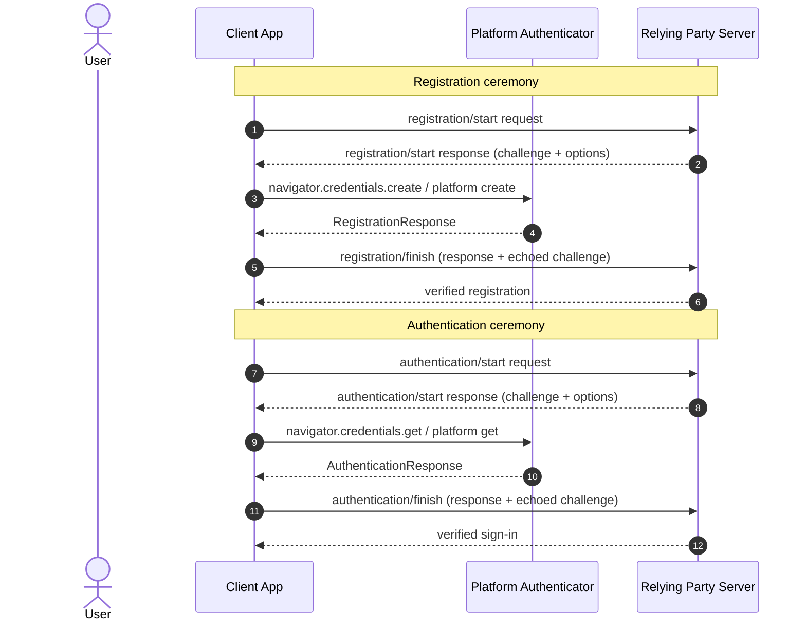
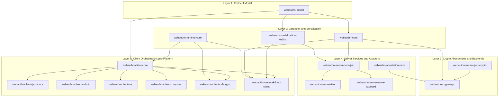

<p align="left">
  
  
  
  
</p>

# WebAuthn Kotlin Multiplatform

Standards-first Kotlin Multiplatform building blocks for WebAuthn and passkey integrations.

This project helps teams implement passwordless login without rebuilding the hardest parts from scratch. It gives you typed protocol models, strict validation, backend ceremony services, platform passkey clients, and optional transport/adaptation modules that stay close to the WebAuthn specification.

## Why This Project Exists

- WebAuthn is security-sensitive and protocol-heavy.
- Passkey products often need to share logic across backend, Android, and iOS.
- Kotlin teams usually want typed APIs, predictable validation, and flexible integration points instead of one monolithic SDK.

This repo focuses on those needs:

- Standards first: behavior is driven by WebAuthn L3 and related RFCs.
- Kotlin-first: KMP modules share the right logic instead of pushing everything into platform wrappers.
- Flexible integration: use only the modules you need, from pure model/validation all the way to Ktor routes and client transport helpers.
- Heavy lifting included: challenge/origin validation, authenticator-data parsing, signature verification boundaries, attestation policy hooks, and platform bridge logic are already here.

## What You Can Build With It

- A JVM/Ktor WebAuthn backend using typed ceremony services.
- Android and iOS passkey clients with shared Kotlin orchestration.
- A client/server setup that shares model and validation semantics instead of duplicating protocol assumptions.
- A modular stack where server, client, transport, storage, and attestation trust can be adopted separately.

## WebAuthn Core Concepts

WebAuthn has two ceremony pairs:

1. Registration (`create`)
2. Authentication (`get`)

Each pair has a server start step and a server finish step, with the platform authenticator in the middle.



Validation and trust decisions are server responsibilities: challenge/origin/type checks, authenticator data rules, signature/attestation verification, counter handling, and policy decisions.

## Repository Structure

The repository follows a layered model that keeps protocol and validation concerns separate from transport and platform adapters.



Focus modules for this documentation round:

- [`webauthn-runtime-core`](./webauthn-runtime-core/README.md): shared coroutine/failure boundary helpers for adapters.
- [`webauthn-model`](./webauthn-model/README.md): typed protocol/value contracts.
- [`webauthn-core`](./webauthn-core/README.md): standards-first ceremony validation.
- [`webauthn-client-core`](./webauthn-client-core/README.md): shared passkey orchestration and controller flows.
- [`webauthn-client-compose`](./webauthn-client-compose/README.md): Compose integration helpers over client core.
- [`webauthn-client-prf-crypto`](./webauthn-client-prf-crypto/README.md): PRF-enabled key derivation/session crypto helpers.

## How To Read Module Docs

Most module READMEs follow this baseline structure (adapted per module when needed):

- `What it provides`: the module's owned responsibilities.
- `When to use`: where it belongs in an integration.
- `How to use`: practical API snippets plus required caller responsibilities.
- `How it fits in the system`: dependency and data-flow context.
- `Pitfalls/limits`: common misuse patterns and intentional boundaries.
- `Status`: maturity and readiness signal.

Recommended adoption paths:

- Start server-side with `model -> core -> crypto-api -> server-core-jvm` (+ `server-ktor` if you want HTTP adapters).
- Start client-side with `client-core -> platform bridge` (+ `client-compose` for Compose UI).
- Add `client-prf-crypto` only when you need PRF-derived application crypto.

## Install

The coordinated release train uses one version for the full published surface plus a BOM.

```kotlin
repositories {
    google()
    mavenCentral()
}

dependencies {
    implementation(platform("io.github.szijpeter:webauthn-bom:<version>"))

    implementation("io.github.szijpeter:webauthn-server-core-jvm")
    implementation("io.github.szijpeter:webauthn-server-jvm-crypto")
    implementation("io.github.szijpeter:webauthn-client-core")
    implementation("io.github.szijpeter:webauthn-client-android")
}
```

Published to Maven Central (first public release: `0.1.0`). Maintainers can still validate publication locally with:

```bash
./gradlew publishToMavenLocal --stacktrace
```

## Quick Start Paths

### Server-first

Use:

- [`webauthn-model`](./webauthn-model/README.md)
- [`webauthn-core`](./webauthn-core/README.md)
- [`webauthn-crypto-api`](./webauthn-crypto-api/README.md)
- [`webauthn-server-jvm-crypto`](./webauthn-server-jvm-crypto/README.md)
- [`webauthn-server-core-jvm`](./webauthn-server-core-jvm/README.md)
- [`webauthn-server-ktor`](./webauthn-server-ktor/README.md) if you want route adapters
- [`webauthn-server-store-exposed`](./webauthn-server-store-exposed/README.md) if you want an Exposed-backed store implementation

### Client-first

Use:

- [`webauthn-client-core`](./webauthn-client-core/README.md)
- [`webauthn-client-json-core`](./webauthn-client-json-core/README.md) if you exchange raw JSON with a host/backend
- [`webauthn-client-android`](./webauthn-client-android/README.md)
- [`webauthn-client-ios`](./webauthn-client-ios/README.md)
- [`webauthn-client-compose`](./webauthn-client-compose/README.md) for Compose helpers
- [`webauthn-client-prf-crypto`](./webauthn-client-prf-crypto/README.md) for PRF-based key derivation and encryption helpers
- [`webauthn-network-ktor-client`](./webauthn-network-ktor-client/README.md) for the default backend contract (`HttpClient`-based API; add your preferred Ktor engine at app runtime)

### End-to-end reference app

Start with:

- [`samples/backend-ktor`](./samples/backend-ktor/README.md)
- [`samples/compose-passkey`](./samples/compose-passkey/README.md)
- [`samples/compose-passkey-ios`](./samples/compose-passkey-ios/README.md)

## Public Modules

| Module | Who it is for |
|---|---|
| [`platform:bom`](./platform/bom/README.md) | Consumers who want aligned versions across published artifacts |
| [`webauthn-cbor-core`](./webauthn-cbor-core/README.md) | Parser/crypto modules needing strict low-level CBOR byte scanning primitives |
| [`webauthn-model`](./webauthn-model/README.md) | Teams that want typed WebAuthn models and value wrappers |
| [`webauthn-runtime-core`](./webauthn-runtime-core/README.md) | Shared coroutine-safe error/cancellation boundary helpers for adapter modules |
| [`webauthn-serialization-kotlinx`](./webauthn-serialization-kotlinx/README.md) | Teams mapping JSON/CBOR DTOs to typed models |
| [`webauthn-core`](./webauthn-core/README.md) | Teams validating ceremonies and authenticator data |
| [`webauthn-crypto-api`](./webauthn-crypto-api/README.md) | Teams plugging crypto/attestation implementations into validation and server flows |
| [`webauthn-server-jvm-crypto`](./webauthn-server-jvm-crypto/README.md) | JVM backends that want Signum-first hashing, signature, and attestation verification |
| [`webauthn-server-core-jvm`](./webauthn-server-core-jvm/README.md) | JVM backends that need registration/authentication ceremony services |
| [`webauthn-server-ktor`](./webauthn-server-ktor/README.md) | Ktor backends that want ready-made WebAuthn routes |
| [`webauthn-server-store-exposed`](./webauthn-server-store-exposed/README.md) | JVM backends storing WebAuthn state through Exposed |
| [`webauthn-client-core`](./webauthn-client-core/README.md) | Shared passkey orchestration and controller-driven flows |
| [`webauthn-client-json-core`](./webauthn-client-json-core/README.md) | Apps or SDKs that need raw JSON interoperability on top of typed clients |
| [`webauthn-client-compose`](./webauthn-client-compose/README.md) | Compose apps that want remembered client/controller helpers |
| [`webauthn-client-android`](./webauthn-client-android/README.md) | Android apps using Credential Manager |
| [`webauthn-client-ios`](./webauthn-client-ios/README.md) | iOS apps using AuthenticationServices |
| [`webauthn-client-prf-crypto`](./webauthn-client-prf-crypto/README.md) | Client apps deriving crypto sessions from WebAuthn PRF extension outputs |
| [`webauthn-network-ktor-client`](./webauthn-network-ktor-client/README.md) | Clients talking to a `/webauthn/*` backend contract over Ktor (`HttpClient` contract + caller-selected engine) |
| [`webauthn-attestation-mds`](./webauthn-attestation-mds/README.md) | Backends that want optional FIDO Metadata Service trust anchors |

## Status and Current Limits

This repository is publicly released and still pre-1.0.

Current state:

- Core/server validation paths are production-leaning.
- Publish/release infrastructure is now wired for Maven Central and compatibility baselines.
- Client flows are usable on Android and iOS with shared orchestration.
- iOS external security-key support is still being hardened before it can be documented as fully ready.
- `kotlinx-serialization` remains pinned to `1.9.0` while the current Signum compatibility issue is unresolved.

## Security and Release Hygiene

- Vulnerability reporting: see [`SECURITY.md`](./SECURITY.md).
- Public-launch checklist: [`docs/PUBLIC_LAUNCH_CHECKLIST.md`](./docs/PUBLIC_LAUNCH_CHECKLIST.md).
- Maven Central maintainer guide: [`docs/MAVEN_CENTRAL.md`](./docs/MAVEN_CENTRAL.md).
- Dependency automation is handled with [`Renovate`](./.github/renovate.json).

## Maintainer Workflow

```bash
tools/agent/setup-hooks.sh
tools/agent/quality-gate.sh --mode fast --scope changed --block false
tools/agent/quality-gate.sh --mode strict --scope changed --block false
./gradlew apiCheck --stacktrace
./gradlew publishToMavenLocal --stacktrace
```

## Related Docs

- [`docs/CLIENT_FIRST_EXECUTION.md`](./docs/CLIENT_FIRST_EXECUTION.md)
- [`docs/CLIENT_API_BENCHMARKS.md`](./docs/CLIENT_API_BENCHMARKS.md)
- [`docs/IMPLEMENTATION_STATUS.md`](./docs/IMPLEMENTATION_STATUS.md)
- [`docs/ROADMAP.md`](./docs/ROADMAP.md)
- [`docs/ai/STEERING.md`](./docs/ai/STEERING.md)

License: Apache-2.0. See [`LICENSE`](./LICENSE).
