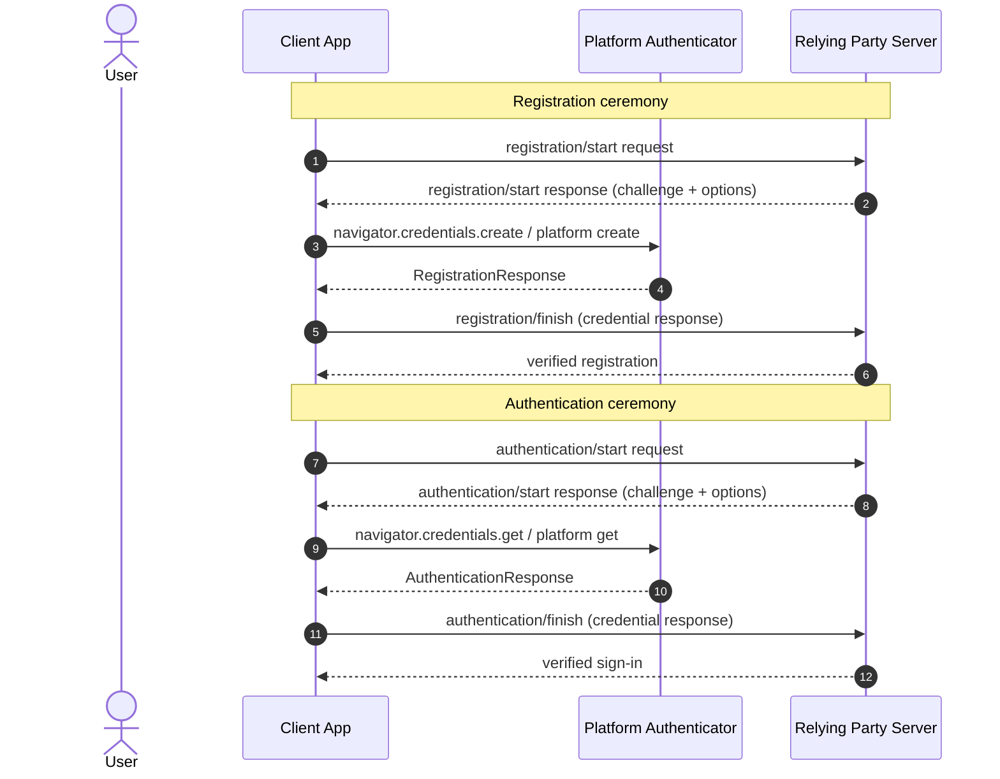
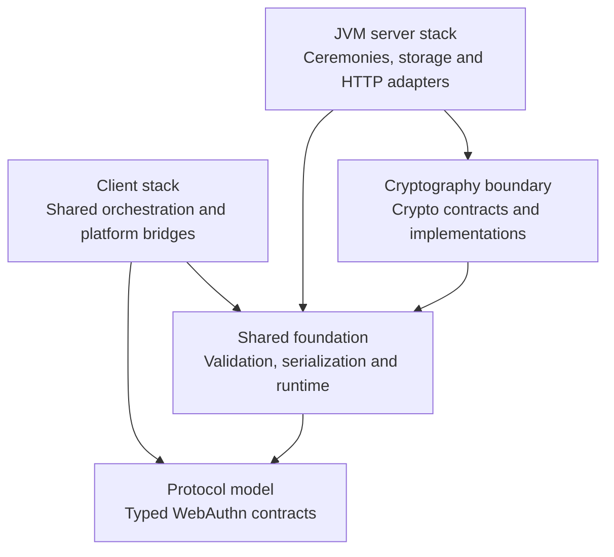

<p align="left">
  
  
  
  
</p>

# WebAuthn Kotlin Multiplatform

Standards-first Kotlin Multiplatform building blocks for WebAuthn and passkey integrations.

This project helps teams implement passwordless login without rebuilding the hardest parts from scratch. It gives you typed protocol models, strict validation, backend ceremony services, platform passkey clients, and optional transport/adaptation modules that stay close to the WebAuthn specification.

Start with the [mobile-first public documentation](https://szijpeter.github.io/webauthn-kotlin-multiplatform/) for
Android, iOS, Compose, full-stack examples, and generated API reference entry points.

## Why This Project Exists

- WebAuthn is security-sensitive and protocol-heavy.
- Passkey products often need to share logic across backend, Android, and iOS.
- Kotlin teams usually want typed APIs, predictable validation, and flexible integration points instead of one monolithic SDK.

This repo focuses on those needs:

- Standards first: behavior is driven by WebAuthn L3 and related RFCs.
- Kotlin-first: KMP modules share the right logic instead of pushing everything into platform wrappers.
- Flexible integration: use only the modules you need, from pure model/validation all the way to Ktor routes and client transport helpers.
- Heavy lifting included: challenge/origin validation, authenticator-data parsing, signature verification boundaries, attestation policy hooks, and platform bridge logic are already here.

## What You Can Build With It

- A JVM/Ktor WebAuthn backend using typed ceremony services.
- Android and iOS passkey clients with shared Kotlin orchestration or a native Swift facade.
- A client/server setup that shares model and validation semantics instead of duplicating protocol assumptions.
- A modular stack where server, client, transport, storage, and attestation trust can be adopted separately.

## Sample Recordings

| Android | iOS |
| --- | --- |
| <video src="https://github.com/user-attachments/assets/87a94b1f-692a-4b16-a674-778046e6bae2" height="300" controls></video> | <video src="https://github.com/user-attachments/assets/27ccb9c0-1d5c-41cf-9733-5b17fd501450" height="300" controls></video> |

## WebAuthn Core Concepts

WebAuthn has two ceremony pairs:

1. Registration (`create`)
2. Authentication (`get`)

Each pair has a server start step and a server finish step, with the platform authenticator in the middle.

<!-- doc-example: id=readme-mermaid-1; owner=illustrative; verify=illustrative; audience=consumer; reason=Diagram is rendered by the Markdown host -->

```mermaid
sequenceDiagram
    autonumber
    actor User
    participant App as Client App
    participant Auth as Platform Authenticator
    participant RP as Relying Party Server

    note over RP,App: Registration ceremony
    App->>RP: registration/start request
    RP-->>App: registration/start response (challenge + options)
    App->>Auth: navigator.credentials.create / platform create
    Auth-->>App: RegistrationResponse
    App->>RP: registration/finish (credential response)
    RP-->>App: verified registration

    note over RP,App: Authentication ceremony
    App->>RP: authentication/start request
    RP-->>App: authentication/start response (challenge + options)
    App->>Auth: navigator.credentials.get / platform get
    Auth-->>App: AuthenticationResponse
    App->>RP: authentication/finish (credential response)
    RP-->>App: verified sign-in
```

The finish payload carries each credential response once. The server derives ceremony type, challenge,
and origin from its signed `clientDataJSON`; clients must not echo those values as independent claims.
Validation and trust decisions are server responsibilities: challenge/origin/type checks, authenticator
data rules, signature/attestation verification, counter handling, and policy decisions.

## Repository structure

The repository follows a layered model that keeps protocol and validation concerns separate from transport and platform adapters.

<!-- doc-example: id=readme-mermaid-2; owner=illustrative; verify=illustrative; audience=consumer; reason=Diagram is rendered by the Markdown host -->

```mermaid
flowchart TB
    CLIENT["Client stack<br/>Shared orchestration and platform bridges"]
    SERVER["JVM server stack<br/>Ceremonies, storage and HTTP adapters"]
    CRYPTO["Cryptography boundary<br/>Crypto contracts and implementations"]
    FOUNDATION["Shared foundation<br/>Validation, serialization and runtime"]
    MODEL["Protocol model<br/>Typed WebAuthn contracts"]

    CLIENT --> FOUNDATION
    CLIENT --> MODEL
    SERVER --> FOUNDATION
    SERVER --> CRYPTO
    CRYPTO --> FOUNDATION
    FOUNDATION --> MODEL
```

The overview shows logical responsibility areas rather than every Gradle
dependency. See the [architecture guide](docs/architecture.md) for the
reference integration and focused core, client, and server dependency views.

### Repository areas

- `core/` contains reusable protocol, validation, runtime, serialization, and crypto contracts.
- `client/` contains typed platform operations, generic ceremony flow, platform bridges, Compose helpers, and client transport.
- `swift/` contains the native Swift package facade, compatibility baseline, and parity contract.
- `server/` contains JVM server services, Ktor/store adapters, JVM crypto, and optional trust metadata.
- `sample/` contains runnable samples and demo entry points; these modules are not published.
- `docs/site/` contains the authored public documentation and site-specific assets; the build stages
  verified repository docs and generated API reference alongside it.

### Common entry points

- [`webauthn-runtime-core`](./core/webauthn-runtime-core/README.md): shared coroutine/failure boundary helpers for adapters.
- [`webauthn-model`](./core/webauthn-model/README.md): typed protocol/value contracts.
- [`webauthn-json-api`](./core/webauthn-json-api/README.md): replaceable JSON codec boundary.
- [`webauthn-protocol`](./core/webauthn-protocol/README.md): strict codec-neutral protocol interpretation.
- [`webauthn-core`](./core/webauthn-core/README.md): standards-first ceremony validation.
- [`webauthn-client-core`](./client/webauthn-client-core/README.md): typed platform operations, raw responses, and shared error mapping.
- [`webauthn-client-flow`](./client/webauthn-client-flow/README.md): state-free ceremony flow with opaque backend state.
- [`webauthn-client-ktor`](./client/webauthn-client-ktor/README.md): codec-neutral Ktor backend transport with caller-owned engine and wire contract.
- [`webauthn-client-ktor-kotlinx`](./client/webauthn-client-ktor-kotlinx/README.md): opt-in default `/webauthn/*` Kotlinx contract.
- [`webauthn-client-defaults`](./client/webauthn-client-defaults/README.md): recommended platform composition with an explicit Kotlinx codec override seam.
- [`webauthn-client-compose`](./client/webauthn-client-compose/README.md): Compose integration.
- [`webauthn-client-prf-crypto`](./client/webauthn-client-prf-crypto/README.md): optional PRF-derived application cryptography.
- [`WebAuthn` Swift package](./swift/README.md): native Swift passkeys, capabilities, typed errors, an
  application-testable client contract, and PRF sessions over the shared implementation.

## How To Read Module Docs

Most module READMEs follow this baseline structure (adapted per module when needed):

- `What it provides`: the module's owned responsibilities.
- `When to use`: where it belongs in an integration.
- `How to use`: practical API snippets plus required caller responsibilities.
- `How it fits in the system`: dependency and data-flow context.
- `Pitfalls/limits`: common misuse patterns and intentional boundaries.
- `Status`: maturity and readiness signal.

Recommended adoption paths:

- Start server-side with `model -> core -> crypto-api -> server-core-jvm` (+ `server-ktor` if you want HTTP adapters).
- Start client-side with `client-core -> client-flow -> platform bridge` (+ `client-compose` for Compose UI).
- Add `client-prf-crypto` only when you need PRF-derived application crypto.

## Install

### Native Swift

The native Swift package is implemented but has not been released yet. Existing coordinated tags publish the
Kotlin artifacts only; they do not contain the remote manifest and XCFramework assets needed by Swift Package
Manager. Do not substitute the latest Kotlin version in a Swift dependency declaration. The first coordinated
Swift release will publish an exact install version in the [native Swift guide](./swift/README.md).

The SDK supports iOS 16+, arm64 devices, and arm64 simulators. Application services and view models can
depend on the public `PasskeyClientProtocol` while production code injects `PasskeyClient`. Continue with
the [native Swift guide](./swift/README.md) and [SwiftUI sample](./sample/swift-passkey/README.md).

### Kotlin and JVM

The coordinated release train uses one version for the full published surface. JVM and Android dependency
configurations can use the BOM; Kotlin Multiplatform common and Native source sets should put that same
version on each artifact because Java Platform constraints are not available to Native variants.

<!-- doc-example: id=readme-kotlin-1; owner=configuration; verify=consumer-compile; audience=consumer; source=documentation/consumer-smoke/repositories.gradle.kts#consumer-repositories -->
```kotlin
repositories {
    google()
    mavenCentral()
}
```

Use only the modules your app actually wires in. In Kotlin Multiplatform projects, shared modules belong in `commonMain`, while concrete platform bridges belong in the matching platform source set.

### Recommended client setup

For the default Kotlinx backend contract and recommended Android/iOS platform composition, use
`webauthn-client-flow` plus `webauthn-client-ktor-kotlinx` in common code and
`webauthn-client-defaults` in each platform source set:

<!-- doc-example: id=readme-kotlin-4; owner=configuration; verify=consumer-compile; audience=consumer; source=documentation/consumer-smoke/defaults/build.gradle.kts.template#consumer-defaults-kmp-dependencies -->
```kotlin
kotlin {
    sourceSets {
        commonMain.dependencies {
            implementation("io.github.szijpeter:webauthn-client-flow:<version>")
            implementation("io.github.szijpeter:webauthn-client-ktor-kotlinx:<version>")
        }

        androidMain.dependencies {
            implementation("io.github.szijpeter:webauthn-client-defaults:<version>")
        }

        iosMain.dependencies {
            implementation("io.github.szijpeter:webauthn-client-defaults:<version>")
        }
    }
}
```

The app still creates its own Ktor `HttpClient` and engine. The defaults artifact selects the
Android JSON implementation and platform construction only; `PasskeyFlow` leaves presentation state
and backend exception policy application-owned.

Android hosts must also add a Credential Manager provider such as
`androidx.credentials:credentials-play-services-auth`; the WebAuthn client modules provide the API
bridge but deliberately leave provider-runtime selection to the application.

### Compose your stack

Use the lower-level modules when you supply your own `WebAuthnJsonCodec`, Ktor contract codec, or
platform construction. This dependency-pure consumer fixture deliberately does not resolve
`webauthn-json-kotlinx` through the neutral client modules:

<!-- doc-example: id=readme-kotlin-2; owner=configuration; verify=consumer-compile; audience=consumer; source=documentation/consumer-smoke/client/build.gradle.kts.template#consumer-client-kmp-dependencies -->
```kotlin
kotlin {
    sourceSets {
        commonMain.dependencies {
            implementation("io.github.szijpeter:webauthn-client-core:<version>")
            implementation("io.github.szijpeter:webauthn-client-json-core:<version>")
            implementation("io.github.szijpeter:webauthn-client-flow:<version>")
            implementation("io.github.szijpeter:webauthn-client-ktor:<version>")
            implementation("io.github.szijpeter:webauthn-json-api:<version>")
        }

        androidMain.dependencies {
            implementation("io.github.szijpeter:webauthn-client-platform:<version>")
        }

        iosMain.dependencies {
            implementation("io.github.szijpeter:webauthn-client-platform:<version>")
        }
    }
}
```

JVM/Ktor server example:

<!-- doc-example: id=readme-kotlin-3; owner=configuration; verify=consumer-compile; audience=consumer; source=documentation/consumer-smoke/server/build.gradle.kts.template#consumer-server-dependencies -->
```kotlin
dependencies {
    implementation(platform("io.github.szijpeter:webauthn-bom:<version>"))
    implementation("io.github.szijpeter:webauthn-server-core-jvm")
    implementation("io.github.szijpeter:webauthn-server-jvm-crypto")
    implementation("io.github.szijpeter:webauthn-server-ktor")
    implementation("io.github.szijpeter:webauthn-server-store-exposed")
}
```

Composition notes:

- Client apps do not need `webauthn-server-*` dependencies.
- Add `webauthn-client-platform` to each platform source set that instantiates a concrete platform client.
- If you only use the shared client abstractions, `commonMain` only needs the common modules.
- Keep the explicit KMP artifact versions identical; JVM server builds can use the BOM shown below to align them.
- For a complete source set example, see [`sample/compose-passkey`](./sample/compose-passkey/README.md), [`sample/compose-passkey-android`](./sample/compose-passkey-android/README.md), and [`sample/compose-passkey-ios`](./sample/compose-passkey-ios/README.md).
- Native Swift applications should use the public [`WebAuthn` facade](./swift/README.md), not the internal generated bridge module; the guide reports release availability explicitly.

Published to Maven Central (latest version is shown in the Maven Central badge above). Maintainers can still validate publication locally with:

<!-- doc-example: id=readme-bash-1; owner=markdown; verify=syntax; audience=maintainer -->
```bash
./gradlew publishToMavenLocal --stacktrace
```

## Quick Start Paths

### Server-first

Use:

- [`webauthn-model`](./core/webauthn-model/README.md)
- [`webauthn-core`](./core/webauthn-core/README.md)
- [`webauthn-crypto-api`](./core/webauthn-crypto-api/README.md)
- [`webauthn-server-jvm-crypto`](./server/webauthn-server-jvm-crypto/README.md)
- [`webauthn-server-core-jvm`](./server/webauthn-server-core-jvm/README.md)
- [`webauthn-server-ktor`](./server/webauthn-server-ktor/README.md) if you want route adapters
- [`webauthn-server-store-exposed`](./server/webauthn-server-store-exposed/README.md) if you want an Exposed-backed store implementation

### Client-first

Use:

- [`webauthn-client-core`](./client/webauthn-client-core/README.md)
- [`webauthn-client-flow`](./client/webauthn-client-flow/README.md) for generic start/prompt/finish orchestration
- [`webauthn-client-json-core`](./client/webauthn-client-json-core/README.md) if you exchange raw JSON with a host/backend
- [`webauthn-client-platform`](./client/webauthn-client-platform/README.md)
- [`webauthn-client-defaults`](./client/webauthn-client-defaults/README.md) for the recommended batteries-included platform setup
- [`webauthn-client-compose`](./client/webauthn-client-compose/README.md) for Compose helpers
- [`webauthn-client-prf-crypto`](./client/webauthn-client-prf-crypto/README.md) for PRF-based key derivation and encryption helpers
- [`webauthn-client-ktor`](./client/webauthn-client-ktor/README.md) for codec-neutral Ktor backends
- [`webauthn-client-ktor-kotlinx`](./client/webauthn-client-ktor-kotlinx/README.md) for the default `/webauthn/*` contract
- [`WebAuthn` Swift package](./swift/README.md) for a native SwiftUI or UIKit host over the shared protocol and platform bridge

### End-to-end reference app

Start with:

- [`sample/backend-ktor`](./sample/backend-ktor/README.md)
- [`sample/compose-passkey`](./sample/compose-passkey/README.md)
- [`sample/compose-passkey-ios`](./sample/compose-passkey-ios/README.md)
- [`sample/swift-passkey`](./sample/swift-passkey/README.md)
- [`sample/passkey-cli`](./sample/passkey-cli/README.md) for a macOS-first experimental native-authenticator CLI POC

Desktop and CLI strategy notes for this repo live in [`docs/DESKTOP_CLI_STRATEGY.md`](./docs/DESKTOP_CLI_STRATEGY.md).

## Public Modules

| Module | Who it is for |
|---|---|
| [`platform:bom`](./platform/bom/README.md) | Consumers who want aligned versions across published artifacts |
| [`webauthn-cbor-core`](./core/webauthn-cbor-core/README.md) | Parser/crypto modules needing strict low-level CBOR byte scanning primitives |
| [`webauthn-model`](./core/webauthn-model/README.md) | Teams that want typed WebAuthn models and value wrappers |
| [`webauthn-json-api`](./core/webauthn-json-api/README.md) | Teams selecting a JSON implementation without exposing serializer-specific types |
| [`webauthn-protocol`](./core/webauthn-protocol/README.md) | Teams interpreting raw WebAuthn binary protocol data without selecting a codec |
| [`webauthn-runtime-core`](./core/webauthn-runtime-core/README.md) | Shared coroutine-safe error/cancellation boundary helpers for adapter modules |
| [`webauthn-json-kotlinx`](./core/webauthn-json-kotlinx/README.md) | Teams mapping JSON/CBOR DTOs to typed models |
| [`webauthn-core`](./core/webauthn-core/README.md) | Teams validating ceremonies and authenticator data |
| [`webauthn-crypto-api`](./core/webauthn-crypto-api/README.md) | Teams plugging crypto/attestation implementations into validation and server flows |
| [`webauthn-server-jvm-crypto`](./server/webauthn-server-jvm-crypto/README.md) | JVM backends that want Signum-first hashing, signature, and attestation verification |
| [`webauthn-server-core-jvm`](./server/webauthn-server-core-jvm/README.md) | JVM backends that need registration/authentication ceremony services |
| [`webauthn-server-ktor`](./server/webauthn-server-ktor/README.md) | Ktor backends that want ready-made WebAuthn routes |
| [`webauthn-server-store-exposed`](./server/webauthn-server-store-exposed/README.md) | JVM backends storing WebAuthn state through Exposed |
| [`webauthn-client-core`](./client/webauthn-client-core/README.md) | Apps and adapters that need typed platform operations, raw credential responses, capabilities, and shared error mapping |
| [`webauthn-client-flow`](./client/webauthn-client-flow/README.md) | Apps coordinating backend start/finish with opaque continuation state and application-defined output |
| [`webauthn-client-ktor`](./client/webauthn-client-ktor/README.md) | Apps adapting generic flow backends to Ktor while owning the engine and wire codec |
| [`webauthn-client-ktor-kotlinx`](./client/webauthn-client-ktor-kotlinx/README.md) | Apps using the repository's default `/webauthn/*` Kotlinx contract |
| [`webauthn-client-json-core`](./client/webauthn-client-json-core/README.md) | Apps or SDKs that need raw JSON interoperability on top of typed clients |
| [`webauthn-client-compose`](./client/webauthn-client-compose/README.md) | Compose apps that want lifecycle-aware platform clients and remembered generic flows while retaining application-owned UI state |
| [`webauthn-client-platform`](./client/webauthn-client-platform/README.md) | Android apps using Credential Manager or iOS apps using AuthenticationServices |
| [`webauthn-client-defaults`](./client/webauthn-client-defaults/README.md) | Apps that want the recommended platform setup with Kotlinx defaults and an explicit codec override |
| [`webauthn-client-prf-crypto`](./client/webauthn-client-prf-crypto/README.md) | Client apps deriving crypto sessions from WebAuthn PRF extension outputs |
| [`webauthn-attestation-mds`](./server/webauthn-attestation-mds/README.md) | Backends that want optional FIDO Metadata Service trust anchors |

## Status and Current Limits

This repository is publicly released and still pre-1.0.

Current state:

- Core/server validation paths are production-leaning.
- Publish/release infrastructure is now wired for Maven Central and compatibility baselines.
- Client flows are usable on Android and iOS with generic `PasskeyFlow` orchestration and raw platform responses.
- iOS external security-key support is still being hardened before it can be documented as fully ready.
- `kotlinx-serialization` is now on `1.10.0` together with Signum `0.12.0` and indispensable `3.20.0`; captured Android assertion-vector regressions are green on this combined dependency set.

## Security and Release Hygiene

- Vulnerability reporting: see [`SECURITY.md`](./SECURITY.md).
- Public-launch checklist: [`docs/PUBLIC_LAUNCH_CHECKLIST.md`](./docs/PUBLIC_LAUNCH_CHECKLIST.md).
- Maven Central maintainer guide: [`docs/MAVEN_CENTRAL.md`](./docs/MAVEN_CENTRAL.md).
- Dependency automation is handled with [`Renovate`](./.github/renovate.json).

## Maintainer Workflow

<!-- doc-example: id=readme-bash-2; owner=markdown; verify=syntax; audience=maintainer -->
```bash
tools/agent/setup-hooks.sh
tools/agent/quality-gate.sh --mode fast --scope changed --block false
tools/agent/quality-gate.sh --mode strict --scope changed --block false
./gradlew apiCheck --stacktrace
./gradlew publishToMavenLocal --stacktrace
```

## Related Docs

- [`docs/wiki/README.md`](./docs/wiki/README.md)
- [`docs/CLIENT_FIRST_EXECUTION.md`](./docs/CLIENT_FIRST_EXECUTION.md)
- [`docs/CLIENT_API_BENCHMARKS.md`](./docs/CLIENT_API_BENCHMARKS.md)
- [`docs/IMPLEMENTATION_STATUS.md`](./docs/IMPLEMENTATION_STATUS.md)
- [`docs/ROADMAP.md`](./docs/ROADMAP.md)
- [`docs/ai/STEERING.md`](./docs/ai/STEERING.md)

License: Apache-2.0. See [`LICENSE`](./LICENSE).
