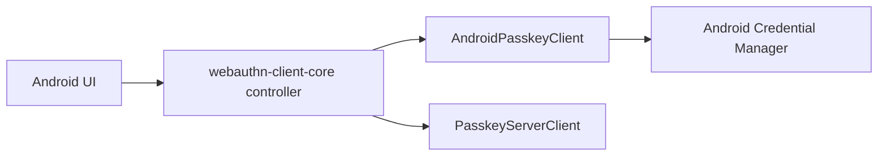

# webauthn-client-android

Android platform bridge for passkey operations using Credential Manager.

## What it provides

- `AndroidPasskeyClient`
- `AndroidRestoreCredentialClient`
- Android `PasskeyClient` implementation for registration and authentication ceremonies
- Android Restore Credentials helpers for system-managed restore keys
- A platform adapter designed to be orchestrated by `webauthn-client-core`
- Capabilities reporting via `PasskeyCapabilities.supported: Set<PasskeyCapability>` with key-based lookup

## When to use

Use this in Android apps that need real platform passkey prompts and credentials.

## How to use

```kotlin
import dev.webauthn.client.android.AndroidPasskeyClient

val client = AndroidPasskeyClient(context)
```

Real-world scenario: your shared app logic drives ceremony flow in `PasskeyController`, while `AndroidPasskeyClient` performs the platform call into Credential Manager.

For seamless sign-in after app restore, create and retrieve system-managed restore credentials with
`AndroidRestoreCredentialClient`:

```kotlin
import dev.webauthn.client.android.AndroidRestoreCredentialClient

val restoreCredentials = AndroidRestoreCredentialClient(context)

restoreCredentials.createRestoreCredential(
    options = creationOptionsFromServer,
    isCloudBackupEnabled = true,
)

restoreCredentials.getRestoreCredential(requestOptionsFromServer)

restoreCredentials.clearRestoreCredential()
```

Create the restore credential after the user signs in, retrieve it during app-data restore or first
launch on a new device, and clear it when the user signs out.

## How it fits



## Pitfalls and limits

- This module is only the Android platform adapter; network and orchestration are separate concerns.
- Reported capabilities use the shared two-type model:
  - `PasskeyCapability.Extension(WebAuthnExtension.Prf)` when PRF is supported.
  - `PasskeyCapability.Extension(WebAuthnExtension.LargeBlob)` when largeBlob is supported.
  - `PasskeyCapability.PlatformFeature("securityKey")` when cross-platform security keys are supported.
- Keep backend contract alignment with your chosen server client implementation.
- Restore credentials use the same server-side WebAuthn registration and authentication processing
  as passkeys, but store them separately from user-managed passkeys. They are system-managed and
  should not appear on a passkey management page.
- Cloud backup for restore credentials is recommended. If you intentionally disable it, users who
  restore app data from cloud backup cannot use that local-only restore key for automatic sign-in.
- If the platform reports `RP ID cannot be validated`, verify:
  - RP ID and HTTPS origin/domain alignment.
  - `/.well-known/assetlinks.json` availability.
  - Android package name and signing SHA-256 fingerprint entries in that file.

## Status

Beta, thin Android bridge on top of shared client orchestration.
