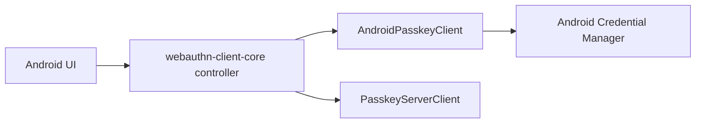

# webauthn-client-android

Android platform bridge for passkey operations using Credential Manager.

## What it provides

- `AndroidPasskeyClient`
- Android `PasskeyClient` implementation for registration and authentication ceremonies
- A platform adapter designed to be orchestrated by `webauthn-client-core`
- Capabilities reporting via `PasskeyCapabilities.supported: Set<PasskeyCapability>` with key-based lookup

## When to use

Use this in Android apps that need real platform passkey prompts and credentials.

## How to use

<!-- doc-example: id=client-webauthn-client-android-readme-kotlin-1; owner=source; verify=platform-compile; audience=consumer; source=documentation/examples/src/androidMain/kotlin/dev/webauthn/documentation/examples/AndroidClientExample.kt#android-client -->
```kotlin
import android.content.Context
import dev.webauthn.client.PasskeyClient
import dev.webauthn.client.android.AndroidPasskeyClient

fun androidPasskeyClient(context: Context): PasskeyClient {
    return AndroidPasskeyClient(context)
}
```

Real-world scenario: your shared app logic drives ceremony flow in `PasskeyController`, while `AndroidPasskeyClient` performs the platform call into Credential Manager.

## How it fits

<!-- doc-example: id=client-webauthn-client-android-readme-mermaid-1; owner=illustrative; verify=illustrative; audience=consumer; reason=Diagram is rendered by the Markdown host -->


## Pitfalls and limits

- This module is only the Android platform adapter; network and orchestration are separate concerns.
- Reported capabilities use the shared two-type model:
  - `PasskeyCapability.Extension(WebAuthnExtension.Prf)` when PRF is supported.
  - `PasskeyCapability.Extension(WebAuthnExtension.LargeBlob)` when largeBlob is supported.
  - `PasskeyCapability.PlatformFeature("securityKey")` when cross-platform security keys are supported.
- Keep backend contract alignment with your chosen server client implementation.
- If the platform reports `RP ID cannot be validated`, verify:
  - RP ID and HTTPS origin/domain alignment.
  - `/.well-known/assetlinks.json` availability.
  - Android package name and signing SHA-256 fingerprint entries in that file.

## Status

Beta, thin Android bridge on top of shared client orchestration.
