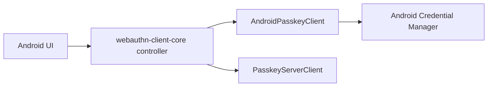

# webauthn-client-android

Android platform bridge for passkey operations using Credential Manager.

## What it provides

- `AndroidPasskeyClient`
- `AndroidCredentialSignalClient`
- Android `PasskeyClient` implementation for registration and authentication ceremonies
- Android Credential Manager signal helpers for provider-side passkey consistency hints
- A platform adapter designed to be orchestrated by `webauthn-client-core`
- Capabilities reporting via `PasskeyCapabilities.supported: Set<PasskeyCapability>` with key-based lookup

## When to use

Use this in Android apps that need real platform passkey prompts and credentials.

## How to use

```kotlin
import dev.webauthn.client.android.AndroidPasskeyClient

val client = AndroidPasskeyClient(context)
```

Real-world scenario: your shared app logic drives ceremony flow in `PasskeyController`, while `AndroidPasskeyClient` performs the platform call into Credential Manager.

For provider consistency after account or credential changes, use the Credential Manager Signal API
adapter:

```kotlin
import dev.webauthn.client.android.AndroidCredentialSignalClient

val signals = AndroidCredentialSignalClient(context)

signals.signalUnknownCredential(
    rpId = rpId,
    credentialId = staleCredentialId,
)

signals.signalAllAcceptedCredentialIds(
    rpId = rpId,
    userId = userHandle,
    credentialIds = currentCredentialIds,
)
```

Signal calls do not show UI. A successful result means Credential Manager accepted and dispatched
the signal to enabled providers; it does not guarantee a provider applied the update.

## How it fits



## Pitfalls and limits

- This module is only the Android platform adapter; network and orchestration are separate concerns.
- Reported capabilities use the shared two-type model:
  - `PasskeyCapability.Extension(WebAuthnExtension.Prf)` when PRF is supported.
  - `PasskeyCapability.Extension(WebAuthnExtension.LargeBlob)` when largeBlob is supported.
  - `PasskeyCapability.PlatformFeature("securityKey")` when cross-platform security keys are supported.
- Keep backend contract alignment with your chosen server client implementation.
- Signal API calls are best-effort provider hints. Continue to enforce credential/account state on
  the server even after a successful signal result.
- If the platform reports `RP ID cannot be validated`, verify:
  - RP ID and HTTPS origin/domain alignment.
  - `/.well-known/assetlinks.json` availability.
  - Android package name and signing SHA-256 fingerprint entries in that file.

## Status

Beta, thin Android bridge on top of shared client orchestration.
