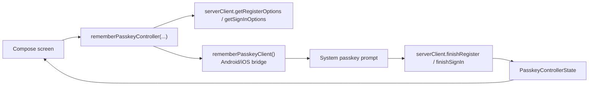

# webauthn-client-compose

Audience: Compose applications that want lifecycle-safe passkey orchestration with minimal platform-specific wiring.

## What it provides

- `rememberPasskeyClient()` to create the platform `PasskeyClient` in Compose.
- `rememberPasskeyController(...)` to retain a `PasskeyController` bound to your server client.
- A small Compose-first bridge over `webauthn-client-core`.



## When to use

Pick this module when your app UI is Compose and you want one shared way to drive register/sign-in flows without repeatedly constructing platform clients per screen.

## How to use

A realistic screen keeps `serverClient` stable, triggers controller actions from click handlers, and renders state transitions explicitly.

```kotlin
import androidx.compose.runtime.Composable
import androidx.compose.runtime.collectAsState
import androidx.compose.runtime.getValue
import androidx.compose.runtime.rememberCoroutineScope
import dev.webauthn.client.PasskeyClient
import dev.webauthn.client.PasskeyControllerState
import dev.webauthn.client.PasskeyServerClient
import dev.webauthn.client.compose.rememberPasskeyClient
import dev.webauthn.client.compose.rememberPasskeyController
import kotlinx.coroutines.launch

@Composable
fun <RegisterParams, SignInParams> PasskeyEntryScreen(
    serverClient: PasskeyServerClient<RegisterParams, SignInParams>,
    passkeyClient: PasskeyClient = rememberPasskeyClient(),
    registerParams: RegisterParams,
    signInParams: SignInParams,
) {
    val scope = rememberCoroutineScope()
    val controller = rememberPasskeyController(
        serverClient = serverClient,
        passkeyClient = passkeyClient,
    )
    val state by controller.uiState.collectAsState()

    fun onRegisterClick() = scope.launch { controller.register(registerParams) }
    fun onSignInClick() = scope.launch { controller.signIn(signInParams) }

    when (val current = state) {
        PasskeyControllerState.Idle -> Unit
        is PasskeyControllerState.InProgress -> {
            // Show loading state and disable repeated taps.
        }
        is PasskeyControllerState.Success -> {
            // Navigate or refresh session state.
        }
        is PasskeyControllerState.Failure -> {
            // Surface current.error.message in UI.
        }
    }

    // Wire onRegisterClick / onSignInClick to your Compose buttons.
}
```

Usage notes:

- Keep `serverClient` stable (for example `remember { ... }` at composition boundary).
- Keep the platform client stable when you pass one explicitly.
- Reflect `InProgress`, `Success`, and `Failure` explicitly in UI; avoid silent failures.
- Call `controller.resetToIdle()` when your UX needs a fresh post-success state.

## How it fits

- Sits on top of `webauthn-client-core`.
- Delegates platform behavior to `webauthn-client-android` / `webauthn-client-ios` via `rememberPasskeyClient()`.
- Commonly paired with `webauthn-network-ktor-client` for `/webauthn/*` backends.

## Limits

- Not a full authentication UI kit.
- Does not replace backend ceremony verification/policy decisions.
- Does not own networking retry/session policy.

## iOS targets

- Published Apple targets are `iosArm64` and `iosSimulatorArm64`.
- `iosX64` support was removed to align with upstream dependency artifacts and current CI target compatibility.

## Status

Beta, stable helper layer for Compose-first passkey flows.
