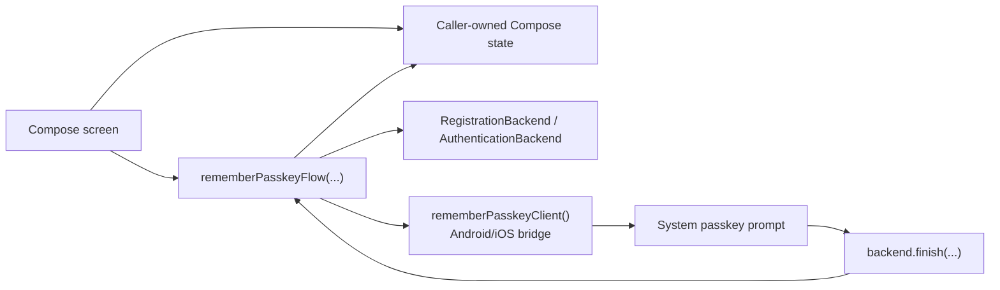

# webauthn-client-compose

Audience: Compose applications that want lifecycle-safe passkey orchestration with minimal platform-specific wiring.

## What it provides

- `rememberPasskeyClient()` to create the platform `PasskeyClient` in Compose.
- `rememberPasskeyFlow(...)` to retain a state-free `PasskeyFlow` while Compose owns screen state.
- Deprecated `rememberPasskeyController(...)` compatibility for existing controller-backed integrations.
- A small Compose-first bridge over `webauthn-client-flow`.

<!-- doc-example: id=client-webauthn-client-compose-readme-mermaid-1; owner=illustrative; verify=illustrative; audience=consumer; reason=Diagram is rendered by the Markdown host -->

```mermaid
flowchart LR
    UI["Compose screen"] --> State["Caller-owned Compose state"]
    UI --> Flow["rememberPasskeyFlow(...)"]
    Flow --> Start["RegistrationBackend / AuthenticationBackend"]
    Flow --> Platform["rememberPasskeyClient()<br/>Android/iOS bridge"]
    Platform --> Prompt["System passkey prompt"]
    Prompt --> Finish["backend.finish(...)" ]
    Finish --> Flow
    Flow --> State
```

## When to use

Pick this module when your app UI is Compose and you want one shared way to drive register/sign-in flows without repeatedly constructing platform clients per screen.

## How to use

A realistic screen keeps a typed backend stable, invokes the flow from click handlers, and renders caller-owned state explicitly.

<!-- doc-example: id=client-webauthn-client-compose-readme-kotlin-1; owner=source; verify=platform-compile; audience=consumer; source=documentation/examples/src/platformMain/kotlin/dev/webauthn/documentation/examples/ComposeClientExample.kt#compose-client -->
```kotlin
import androidx.compose.runtime.Composable
import androidx.compose.runtime.getValue
import androidx.compose.runtime.mutableStateOf
import androidx.compose.runtime.remember
import androidx.compose.runtime.rememberCoroutineScope
import androidx.compose.runtime.setValue
import dev.webauthn.client.CeremonyResult
import dev.webauthn.client.PasskeyClient
import dev.webauthn.client.PasskeyPhase
import dev.webauthn.client.RegistrationBackend
import dev.webauthn.client.compose.rememberPasskeyClient
import dev.webauthn.client.compose.rememberPasskeyFlow
import kotlinx.coroutines.launch

@Composable
fun <Input, State, Output> PasskeyRegistrationEntryScreen(
    backend: RegistrationBackend<Input, State, Output>,
    passkeyClient: PasskeyClient = rememberPasskeyClient(),
    input: Input,
) {
    val scope = rememberCoroutineScope()
    val flow = rememberPasskeyFlow(passkeyClient)
    var phase by remember { mutableStateOf<PasskeyPhase?>(null) }
    var status by remember { mutableStateOf("Ready") }

    fun onRegisterClick() = scope.launch {
        when (val result = flow.register(input, backend, onPhaseChanged = { phase = it })) {
            is CeremonyResult.Success -> status = "Registration completed"
            is CeremonyResult.Failure -> status = "Registration failed: ${result.error}"
        }
    }

    // Render phase and status; disable repeated taps while phase is non-null.
    // Wire onRegisterClick to a Compose button.
}
```

Usage notes:

- Keep backend instances stable (for example `remember { ... }` at composition boundary).
- Keep the platform client stable when you pass one explicitly.
- Own phase, result, and retry state in your screen or ViewModel; avoid silent failures.
- `PasskeyFlow` reports concurrent use as `CeremonyFailure.AlreadyInProgress`; disable duplicate taps in the UI.
- `rememberPasskeyController(...)` is deprecated and remains only as a migration seam for legacy
  `PasskeyServerClient` integrations.

## How it fits

- Sits on top of `webauthn-client-flow`.
- Delegates platform behavior to `webauthn-client-platform` via `rememberPasskeyClient()`.
- Commonly paired with `webauthn-client-ktor` for `/webauthn/*` backends.

## Limits

- Not a full authentication UI kit.
- Does not replace backend ceremony verification/policy decisions.
- Does not own networking retry/session policy.

## iOS targets

- Published Apple targets are `iosArm64` and `iosSimulatorArm64`.
- `iosX64` support was removed to align with upstream dependency artifacts and current CI target compatibility.

## Status

Beta, stable helper layer for Compose-first passkey flows.
