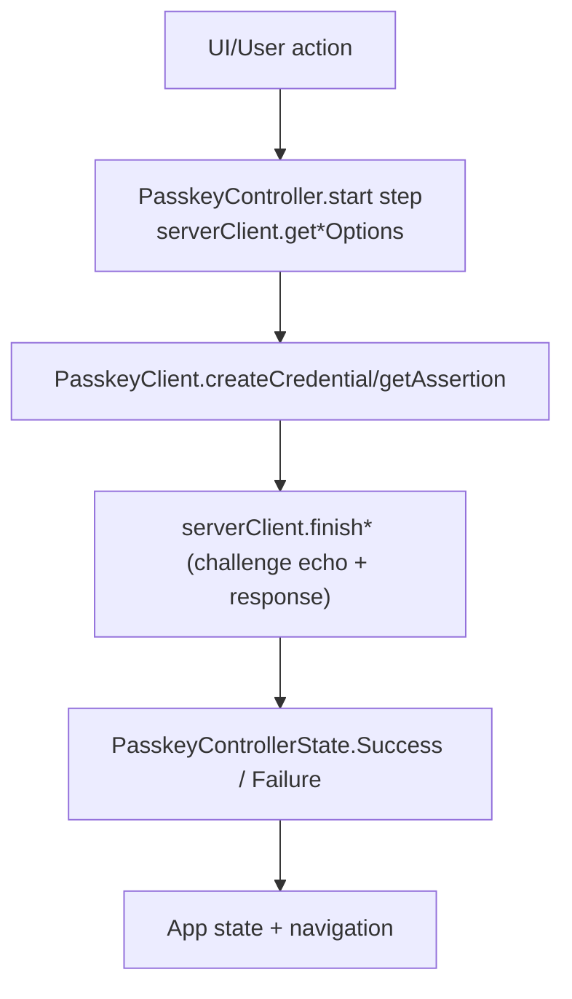

# webauthn-client-core

Audience: teams building shared passkey client orchestration across Android/iOS with one typed API surface.

## What it provides

- `PasskeyClient` abstraction for `createCredential` and `getAssertion` ceremonies.
- `DefaultPasskeyClient` error-mapped orchestration over platform bridges.
- `PasskeyController` that coordinates start -> platform prompt -> finish flow with state updates.
- Shared result/error contracts (`PasskeyResult`, `PasskeyClientError`, `PasskeyFinishResult`).
- `PasskeyCapabilities` API for querying platform support for extensions and features.



## When to use

Use this module when you want one shared ceremony flow and typed error/state handling, while leaving platform API details to `webauthn-client-android` / `webauthn-client-ios`.

## How to use

A common setup wires `PasskeyController` in a shared ViewModel/service and reacts to `uiState` transitions.

```kotlin
import dev.webauthn.client.PasskeyController
import dev.webauthn.client.PasskeyControllerState
import dev.webauthn.client.PasskeyFinishResult
import dev.webauthn.client.PasskeyServerClient
import dev.webauthn.model.AuthenticationResponse
import dev.webauthn.model.PublicKeyCredentialCreationOptions
import dev.webauthn.model.PublicKeyCredentialRequestOptions
import dev.webauthn.model.RegistrationResponse
import dev.webauthn.model.ValidationResult

class AccountServerClient : PasskeyServerClient<String, String> {
    override suspend fun getRegisterOptions(params: String): ValidationResult<PublicKeyCredentialCreationOptions> {
        TODO("Call backend /registration/start")
    }

    override suspend fun finishRegister(
        params: String,
        response: RegistrationResponse,
        challengeAsBase64Url: String,
    ): PasskeyFinishResult {
        TODO("Call backend /registration/finish")
    }

    override suspend fun getSignInOptions(params: String): ValidationResult<PublicKeyCredentialRequestOptions> {
        TODO("Call backend /authentication/start")
    }

    override suspend fun finishSignIn(
        params: String,
        response: AuthenticationResponse,
        challengeAsBase64Url: String,
    ): PasskeyFinishResult {
        TODO("Call backend /authentication/finish")
    }
}

suspend fun runSignIn(controller: PasskeyController<String, String>, userId: String) {
    controller.signIn(userId)
    when (val state = controller.uiState.value) {
        is PasskeyControllerState.Success -> {
            // Continue into authenticated app flow.
        }
        is PasskeyControllerState.Failure -> {
            // Render or log state.error.message.
        }
        else -> Unit
    }
}
```

### Create options

Use the default create path for explicit, user-initiated passkey registration:

```kotlin
val result = passkeyClient.createCredential(creationOptions)
```

Use `PasskeyCreateOptions.Conditional` after a successful password or other non-passkey sign-in
when the platform supports automatic passkey upgrades:

```kotlin
import dev.webauthn.client.PasskeyCreateOptions

val result = passkeyClient.createCredential(
    options = creationOptions,
    createOptions = PasskeyCreateOptions.Conditional,
)
```

Apps using `PasskeyController` can pass the same option through the registration ceremony:

```kotlin
controller.register(
    params = registrationParams,
    createOptions = PasskeyCreateOptions.Conditional,
)
```

Platform bridges advertise support with
`PasskeyCapability.PlatformFeature(PasskeyPlatformFeatureKeys.ConditionalCreate)`. Unsupported
bridges return `PasskeyResult.Failure(PasskeyClientError.Platform(...))` for conditional create.

### Capabilities API

Query platform support for extensions and features:

```kotlin
import dev.webauthn.client.PasskeyPlatformFeatureKeys

suspend fun inspectCapabilities(client: PasskeyClient) {
    val capabilities = client.capabilities()
    if (capabilities.supports(PasskeyCapability.Extension(WebAuthnExtension.Prf))) {
        // Platform supports PRF extension.
    }
    if (capabilities.supports(PasskeyCapability.Extension(WebAuthnExtension.LargeBlob))) {
        // Platform supports largeBlob extension.
    }
    if (capabilities.supports(PasskeyPlatformFeatureKeys.ConditionalCreate)) {
        // Platform supports automatic passkey upgrade requests.
    }
}
```

Available capabilities:
- `PasskeyCapability.Extension(WebAuthnExtension.Prf)` - HMAC secret extension (W3C prf)
- `PasskeyCapability.Extension(WebAuthnExtension.LargeBlob)` - Large blob storage extension
- `PasskeyCapability.PlatformFeature(PasskeyPlatformFeatureKeys.ConditionalCreate)` - automatic passkey upgrade create support
- `PasskeyCapability.PlatformFeature(PasskeyPlatformFeatureKeys.SecurityKey)` - Cross-platform authenticator support
- `PasskeyCapability.Extension(WebAuthnExtension.Custom("example"))` - proprietary/draft extension identifier

`PasskeyCapabilities.supports(key)` is key-based; `supports(capability)` requires an exact capability match for that key (same variant/value). Duplicate keys are rejected at construction time.

Usage notes:

- `challengeAsBase64Url` is echoed client data; server must verify it against trusted challenge state.
- Reuse a single controller per screen/session scope to avoid overlapping ceremonies.
- Prefer mapping backend rejection into actionable UX rather than generic transport failures.
- `DefaultPasskeyClient` preserves coroutine cancellation (it is rethrown and never mapped to `PasskeyResult.Failure`), while deterministic invalid-options and platform failures are returned as `PasskeyResult.Failure`.
- `IllegalArgumentException` is classified centrally as `PasskeyClientError.InvalidOptions`, while the platform bridge can still enrich the final message (for example Android RP-ID troubleshooting hints); other platform failures still flow through the platform bridge for domain-specific mapping.
- Platform-level "user canceled prompt" remains a domain error (`PasskeyClientError.UserCancelled`) when provided by platform bridge mapping.
- `PasskeyCapabilities` is a snapshot of platform hints at lookup time; construct a new instance if the underlying platform capability set changes.
- `PasskeyCapabilities` also enforces unique capability keys up front so `supports(key)` and `supports(capability)` cannot become ambiguous.

## How it fits in the system

- Uses `webauthn-runtime-core` for shared coroutine-boundary cancellation/failure handling helpers.
- Foundation for `webauthn-client-compose`, `webauthn-client-json-core`, and platform client modules.
- Pairs naturally with `webauthn-network-ktor-client` for default backend contract integration.

## Limits

- No UI toolkit or navigation policy.
- No backend validation/crypto behavior.
- Platform bridge implementation is provided by target-specific modules.

## iOS targets

- Published Apple targets are `iosArm64` and `iosSimulatorArm64`.
- `iosX64` support was removed to align with upstream dependency artifacts and current CI target compatibility.

## Status

Beta, shared orchestration layer for client passkey ceremonies.
