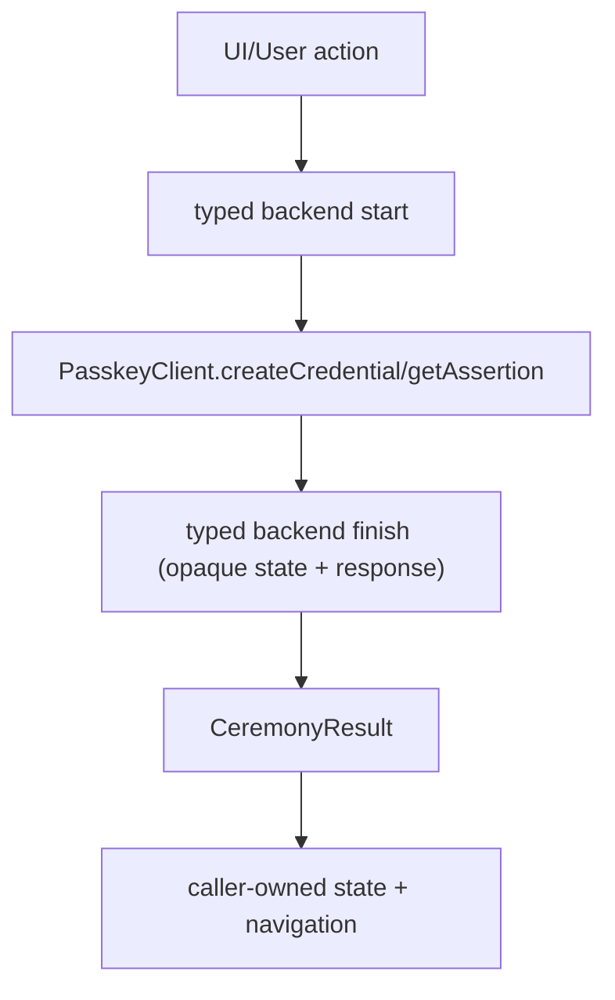

# webauthn-client-flow

Audience: teams building shared registration and authentication flows across Android/iOS.

## What it provides

- `RegistrationBackend` and `AuthenticationBackend` contracts for application-defined backend input, state, and output.
- `PasskeyFlow` for opaque backend state, generic finish output, optional phase callbacks, and explicit concurrent-operation failures.

<!-- doc-example: id=client-webauthn-client-core-readme-mermaid-1; owner=illustrative; verify=illustrative; audience=consumer; reason=Diagram is rendered by the Markdown host -->


## When to use

Use this module when you want one shared ceremony flow and typed error/state handling, while leaving platform API details to `webauthn-client-core` and `webauthn-client-platform`. Backend finish contracts receive byte-preserving raw credential responses; protocol interpretation and validation remain server-owned.

`PasskeyFlow` is the recommended non-UI-state API for new integrations. It carries backend-owned
opaque state from `start` to `finish` and returns the application-defined finish output.

## How to use

A common setup remembers or owns a `PasskeyFlow`, then maps its `CeremonyResult` into application UI state.

<!-- doc-example: id=client-webauthn-client-core-readme-kotlin-1; owner=source; verify=compile; audience=consumer; source=documentation/examples/src/commonMain/kotlin/dev/webauthn/documentation/examples/ClientCoreExample.kt#client-core-controller -->
```kotlin
import dev.webauthn.client.AuthenticationBackend
import dev.webauthn.client.CeremonyResult
import dev.webauthn.client.CeremonyStart
import dev.webauthn.client.PasskeyFinishResult
import dev.webauthn.client.PasskeyFlow
import dev.webauthn.client.RegistrationBackend
import dev.webauthn.model.RawAuthenticationResponse
import dev.webauthn.model.PublicKeyCredentialCreationOptions
import dev.webauthn.model.PublicKeyCredentialRequestOptions
import dev.webauthn.model.RawRegistrationResponse

/** Example typed backend for the shared ceremony flow. */
class AccountRegistrationBackend : RegistrationBackend<String, String, PasskeyFinishResult> {
    override suspend fun start(input: String): CeremonyStart<String, PublicKeyCredentialCreationOptions> {
        TODO("Call backend /registration/start")
    }

    override suspend fun finish(state: String, response: RawRegistrationResponse): PasskeyFinishResult {
        TODO("Call backend /registration/finish")
    }

}

class AccountAuthenticationBackend : AuthenticationBackend<String, String, PasskeyFinishResult> {
    override suspend fun start(input: String): CeremonyStart<String, PublicKeyCredentialRequestOptions> {
        TODO("Call backend /authentication/start")
    }

    override suspend fun finish(state: String, response: RawAuthenticationResponse): PasskeyFinishResult {
        TODO("Call backend /authentication/finish")
    }
}

suspend fun runSignIn(flow: PasskeyFlow, backend: AccountAuthenticationBackend, userId: String) {
    when (flow.signIn(input = userId, backend = backend)) {
        is CeremonyResult.Success -> {
            // Continue into authenticated app flow.
        }
        is CeremonyResult.Failure -> {
            // Render or log the caller-owned failure state.
        }
    }
}
```

### Capabilities API

Query platform support for extensions and features:

<!-- doc-example: id=client-webauthn-client-core-readme-kotlin-2; owner=source; verify=compile; audience=consumer; source=documentation/examples/src/commonMain/kotlin/dev/webauthn/documentation/examples/ClientCapabilitiesExample.kt#client-capabilities -->
```kotlin
import dev.webauthn.client.CapabilitySupport
import dev.webauthn.client.PasskeyCapability
import dev.webauthn.client.PasskeyClient
import dev.webauthn.model.WebAuthnExtension

suspend fun inspectCapabilities(client: PasskeyClient) {
    val capabilities = client.capabilities()
    if (
        capabilities.supportOf(PasskeyCapability.Extension(WebAuthnExtension.Prf)) ==
            CapabilitySupport.SUPPORTED
    ) {
        // Platform supports PRF extension.
    }
    if (capabilities.supports(PasskeyCapability.Extension(WebAuthnExtension.LargeBlob))) {
        // Platform supports largeBlob extension.
    }
}
```

Available capabilities:
- `PasskeyCapability.Extension(WebAuthnExtension.Prf)` - HMAC secret extension (W3C prf)
- `PasskeyCapability.Extension(WebAuthnExtension.LargeBlob)` - Large blob storage extension
- `PasskeyCapability.Platform(PlatformCapability.SecurityKey)` - Cross-platform authenticator support
- `PasskeyCapability.Extension(WebAuthnExtension.Custom("example"))` - proprietary/draft extension identifier

Use `PasskeyCapabilities.supportOf(capability)` when callers need to distinguish `SUPPORTED`,
`UNSUPPORTED`, and `UNKNOWN`; `supports(capability)` returns `true` only for `SUPPORTED`.

Usage notes:

- `challengeAsBase64Url` is echoed client data; server must verify it against trusted challenge state.
- Reuse a single controller per screen/session scope to avoid overlapping ceremonies.
- Prefer mapping backend rejection into actionable UX rather than generic transport failures.
- `DefaultPasskeyClient` preserves coroutine cancellation (it is rethrown and never mapped to `PasskeyResult.Failure`), while deterministic invalid-options and platform failures are returned as `PasskeyResult.Failure`.
- `IllegalArgumentException` is classified centrally as `PasskeyClientError.InvalidOptions`, while the platform bridge can still enrich the final message (for example Android RP-ID troubleshooting hints); other platform failures still flow through the platform bridge for domain-specific mapping.
- Platform-level "user canceled prompt" remains a domain error (`PasskeyClientError.UserCancelled`) when provided by platform bridge mapping.
- `PasskeyCapabilities` is a snapshot of platform hints at lookup time; construct a new instance if the underlying platform capability set changes.
- `PasskeyCapabilities` also enforces unique capability keys up front so `supports(key)` and `supports(capability)` cannot become ambiguous.

## How it fits in the system

- Uses `webauthn-runtime-core` for shared coroutine-boundary cancellation/failure handling helpers.
- Foundation for `webauthn-client-compose`, `webauthn-client-json-core`, and platform client modules.
- Pairs naturally with `webauthn-client-ktor` for default backend contract integration.

## Limits

- No UI toolkit or navigation policy.
- No backend validation/crypto behavior.
- Platform bridge implementation is provided by target-specific modules.

## iOS targets

- Published Apple targets are `iosArm64` and `iosSimulatorArm64`.
- `iosX64` support was removed to align with upstream dependency artifacts and current CI target compatibility.

## Status

Beta, shared orchestration layer for client passkey ceremonies.
