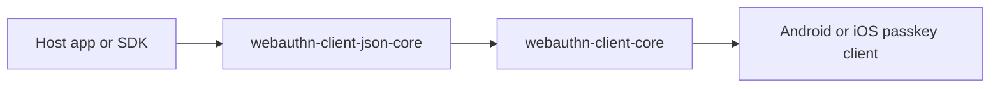

# webauthn-client-json-core

JSON interoperability layer on top of typed client orchestration.

## What it provides

- `withJsonSupport(...)` extension for `PasskeyClient`
- `KotlinxPasskeyJsonMapper` integration point
- JSON-first boundary support while retaining typed core orchestration

## When to use

Use this when your host/backend boundary exchanges raw WebAuthn JSON payloads and your app still wants typed internal flow control.

## How to use

<!-- doc-example: id=client-webauthn-client-json-core-readme-kotlin-1; owner=source; verify=consumer-compile; audience=consumer; source=documentation/examples/src/commonMain/kotlin/dev/webauthn/documentation/examples/JsonClientExample.kt#json-client -->
```kotlin
import dev.webauthn.client.JsonPasskeyClient
import dev.webauthn.client.KotlinxPasskeyJsonMapper
import dev.webauthn.client.PasskeyClient
import dev.webauthn.client.withJsonSupport

fun jsonClient(passkeyClient: PasskeyClient): JsonPasskeyClient {
    return passkeyClient.withJsonSupport(KotlinxPasskeyJsonMapper())
}
```

Real-world scenario: an SDK surface accepts and returns JSON strings, but delegates actual ceremony orchestration to typed client logic internally.

## How it fits

<!-- doc-example: id=client-webauthn-client-json-core-readme-mermaid-1; owner=illustrative; verify=illustrative; audience=consumer; reason=Diagram is rendered by the Markdown host -->


## Pitfalls and limits

- JSON convenience does not remove trust-boundary validation needs on the server.
- JSON entrypoints use the same validated DTO mapping surface as the typed client APIs; malformed request JSON still fails as `InvalidOptions`.
- Keep mapper and model versions aligned with BOM to avoid shape drift.

## iOS targets

- Published Apple targets are `iosArm64` and `iosSimulatorArm64`.
- `iosX64` support was removed to align with upstream dependency artifacts and current CI target compatibility.

## Status

Beta, optional JSON interop layer.
