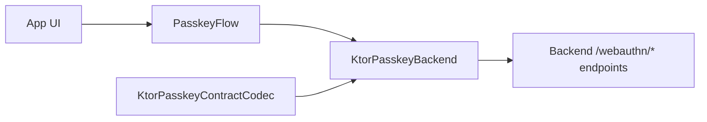

# webauthn-client-ktor

Codec-neutral Ktor transport for typed passkey backends.

The default `/webauthn/…` contract is in the
`webauthn-client-ktor-kotlinx` companion artifact.

## What it provides

- `KtorPasskeyBackend`, a typed `RegistrationBackend`/`AuthenticationBackend` transport
- `KtorPasskeyContractCodec`, the serialization boundary for backend contracts
- `KtorPasskeyRoutes` for path overrides when your backend keeps the default payload semantics
- Start/finish HTTP call wiring for registration and authentication
- A drop-in transport module for client orchestration layers
- Public `HttpClient`-based constructor with transitive `ktor-client-core` export for consumer compile safety

## When to use

Use this when your app already uses Ktor client and you want to provide the backend's serialization
contract. For the default `/webauthn/…` contract with Kotlinx Serialization, add
`webauthn-client-ktor-kotlinx`.

## How to use

<!-- doc-example: id=client-webauthn-client-ktor-readme-kotlin-1; owner=source; verify=compile; audience=consumer; source=documentation/examples/src/commonMain/kotlin/dev/webauthn/documentation/examples/NetworkClientExample.kt#network-client -->
```kotlin
import dev.webauthn.network.KtorPasskeyBackend
import dev.webauthn.network.KtorPasskeyContractCodec
import io.ktor.client.HttpClient

fun <RegistrationInput, AuthenticationInput, RegistrationOutput, AuthenticationOutput> serverClient(
    httpClient: HttpClient,
    codec: KtorPasskeyContractCodec<RegistrationInput, AuthenticationInput, RegistrationOutput, AuthenticationOutput>,
): KtorPasskeyBackend<RegistrationInput, AuthenticationInput, RegistrationOutput, AuthenticationOutput> {
    return KtorPasskeyBackend(
        httpClient = httpClient,
        endpointBase = "https://example.com",
        codec = codec,
    )
}
```

Real-world scenario: a mobile app uses `PasskeyFlow` for platform ceremonies, then delegates start/finish HTTP calls to this client.

## How it fits

<!-- doc-example: id=client-webauthn-client-ktor-readme-mermaid-1; owner=illustrative; verify=illustrative; audience=consumer; reason=Diagram is rendered by the Markdown host -->


## Pitfalls and limits

- Route/path assumptions are explicit; if your backend payloads differ, implement
  `KtorPasskeyContractCodec` rather than patching the transport.
- You still need to choose/install an engine dependency (`ktor-client-cio`, Darwin, etc.) in your app runtime.
- Retry, timeout, auth headers, and observability remain caller-owned through the provided `HttpClient`.

## iOS targets

- Published Apple targets are `iosArm64` and `iosSimulatorArm64`.
- `iosX64` support was removed to align with upstream dependency artifacts and current CI target compatibility.

## Status

Codec-neutral typed transport with explicit backend-contract support.
