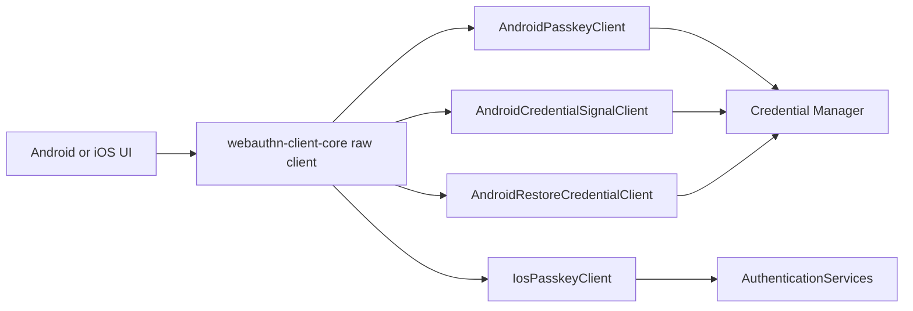

# webauthn-client-platform

Kotlin Multiplatform platform bridge for passkey operations. Its Android source set uses Credential
Manager; its iOS source set uses AuthenticationServices.

## What it provides

- `AndroidPasskeyClient`
- `AndroidCredentialSignalClient`
- `AndroidRestoreCredentialClient`
- `IosPasskeyClient`
- Android and iOS `PasskeyClient` implementations that return byte-preserving raw registration and authentication responses
- A platform adapter designed to be orchestrated by `webauthn-client-core`
- Typed capability reporting via `PasskeyCapabilities.supportOf(...)` and `CapabilitySupport`
- Conditional passkey creation on Android and iOS 18+ through the shared
  `PasskeyCreateOptions.Conditional` contract
- Android Restore Credentials create/get/clear operations with raw WebAuthn responses
- Android credential-state signals for server/provider reconciliation

## When to use

Use this in Android or iOS apps that need real platform passkey prompts and credentials.

## How to use

### Android

<!-- doc-example: id=client-webauthn-client-platform-readme-kotlin-1; owner=source; verify=platform-compile; audience=consumer; source=documentation/examples/src/androidMain/kotlin/dev/webauthn/documentation/examples/AndroidClientExample.kt#android-client -->
```kotlin
import android.app.Activity
import dev.webauthn.client.PasskeyClient
import dev.webauthn.client.android.AndroidPasskeyClient
import dev.webauthn.serialization.KotlinxWebAuthnJsonCodec

fun androidPasskeyClient(activity: Activity): PasskeyClient {
    return AndroidPasskeyClient.forActivity(activity, KotlinxWebAuthnJsonCodec())
}
```

Real-world scenario: your shared app logic receives the raw response and sends it to its server trust boundary, while `AndroidPasskeyClient` performs the platform call into Credential Manager.

For Android restore-after-transfer flows, use the same explicit codec boundary:

<!-- doc-example: id=client-webauthn-client-platform-readme-kotlin-3; owner=source; verify=platform-compile; audience=consumer; source=documentation/examples/src/androidMain/kotlin/dev/webauthn/documentation/examples/AndroidRestoreCredentialExample.kt#android-restore-client -->
```kotlin
import android.app.Activity
import dev.webauthn.client.PasskeyResult
import dev.webauthn.client.android.AndroidRestoreCredentialClient
import dev.webauthn.model.PublicKeyCredentialCreationOptions
import dev.webauthn.model.PublicKeyCredentialRequestOptions
import dev.webauthn.model.RawAuthenticationResponse
import dev.webauthn.model.RawRegistrationResponse
import dev.webauthn.serialization.KotlinxWebAuthnJsonCodec

suspend fun exerciseRestoreCredentials(
    activity: Activity,
    creationOptions: PublicKeyCredentialCreationOptions,
    requestOptions: PublicKeyCredentialRequestOptions,
): Triple<
    PasskeyResult<RawRegistrationResponse>,
    PasskeyResult<RawAuthenticationResponse>,
    PasskeyResult<Unit>,
> {
    val restoreCredentials = AndroidRestoreCredentialClient(
        context = activity.applicationContext,
        codec = KotlinxWebAuthnJsonCodec(),
    )

    return Triple(
        restoreCredentials.createRestoreCredential(creationOptions),
        restoreCredentials.getRestoreCredential(requestOptions),
        restoreCredentials.clearRestoreCredential(),
    )
}
```

Create the restore credential after a successful sign-in, attempt retrieval during app-data restore
or first launch, and clear it during sign-out. Registration and authentication results stay raw and
must pass through the same backend trust boundary as ordinary passkey responses.

For provider-side credential reconciliation, send best-effort signals only after the server has
made the authoritative account-state decision:

<!-- doc-example: id=client-webauthn-client-platform-readme-kotlin-4; owner=source; verify=platform-compile; audience=consumer; source=documentation/examples/src/androidMain/kotlin/dev/webauthn/documentation/examples/AndroidCredentialSignalExample.kt#android-credential-signals -->
```kotlin
import android.app.Activity
import dev.webauthn.client.PasskeyResult
import dev.webauthn.client.android.AndroidCredentialSignalClient
import dev.webauthn.model.CredentialId
import dev.webauthn.model.RpId
import dev.webauthn.model.UserHandle

suspend fun reconcileCredentialManager(
    activity: Activity,
    rpId: RpId,
    userHandle: UserHandle,
    acceptedCredentialIds: List<CredentialId>,
    unknownCredentialId: CredentialId,
): Triple<PasskeyResult<Unit>, PasskeyResult<Unit>, PasskeyResult<Unit>> {
    val signals = AndroidCredentialSignalClient(activity.applicationContext)
    return Triple(
        signals.signalAllAcceptedCredentialIds(rpId, userHandle, acceptedCredentialIds),
        signals.signalUnknownCredential(rpId, unknownCredentialId),
        signals.signalCurrentUserDetails(
            rpId = rpId,
            userId = userHandle,
            name = "demo@example.com",
            displayName = "Demo User",
        ),
    )
}
```

Signal success means Credential Manager accepted and dispatched well-formed parameters. It does not
prove that any provider applied the update, so server-side credential enforcement remains required.

### iOS

<!-- doc-example: id=client-webauthn-client-platform-readme-kotlin-2; owner=source; verify=platform-compile; audience=consumer; source=documentation/examples/src/iosMain/kotlin/dev/webauthn/documentation/examples/IosClientExample.kt#ios-client -->
```kotlin
import dev.webauthn.client.PasskeyClient
import dev.webauthn.client.ios.IosPasskeyClient
import dev.webauthn.client.ios.PasskeyPresentationAnchorProvider

fun iosPasskeyClient(anchorProvider: PasskeyPresentationAnchorProvider): PasskeyClient {
    return IosPasskeyClient(anchorProvider)
}
```

## How it fits

<!-- doc-example: id=client-webauthn-client-platform-readme-mermaid-1; owner=illustrative; verify=illustrative; audience=consumer; reason=Diagram is rendered by the Markdown host -->


## Pitfalls and limits

- This module contains the platform adapters; network and orchestration are separate concerns.
- Android applications must include a Credential Manager provider, normally
  `androidx.credentials:credentials-play-services-auth`, in the host application. This module owns
  the API bridge but does not select a provider runtime.
- Android requires an explicit `WebAuthnJsonCodec` and offers `forActivity(activity, codec)` for explicit UI ownership; the `Context` constructor retains
  automatic foreground-activity tracking for clients that outlive a screen.
- iOS accepts a `PasskeyPresentationAnchorProvider`, including a mutable provider for apps whose
  foreground window changes.
- Reported capabilities use the shared two-type model:
  - `PasskeyCapability.Extension(WebAuthnExtension.Prf)` when PRF is supported.
  - `PasskeyCapability.Extension(WebAuthnExtension.LargeBlob)` when largeBlob is supported.
  - `PasskeyCapability.Platform(PlatformCapability.SecurityKey)` when cross-platform security keys are supported.
  - `PasskeyCapability.Platform(PlatformCapability.ConditionalCreate)` when conditional creation is supported.
- Conditional creation is intended for automatic passkey upgrades after a successful non-passkey
  sign-in or sign-up. Keep explicit user-initiated registration on `createCredential(options)`.
- Restore Credentials are Android-only and system-managed. Keep them separate from user-managed
  passkeys in product UI, prefer cloud backup unless local-only recovery is intentional, and do not
  claim device-transfer coverage without exercising Android backup/restore or restored first launch.
- Restore Credentials require Android 9+, Google Play services core 24220000+, and
  `androidx.credentials` 1.5+ (this repository uses 1.6). The platform supports one restore account
  per application, so multi-account products must select a single primary or most-recent account.
- Restore keys can use the same WebAuthn verification path as passkeys, but the application server
  should record their restore purpose separately from user-managed passkeys so lifecycle and UI
  policy cannot confuse the two credential types.
- Credential signals are best-effort provider hints. Rate-limit application orchestration: Android
  documents a maximum of 10 relying-party signal calls in a 120-second window.
- Credential-signal `origin` values are only for browsers or privileged apps acting on behalf of
  another application. Ordinary apps should leave `origin` null. On Android 14+, a non-null origin
  also requires `android.permission.CREDENTIAL_MANAGER_SET_ORIGIN`; otherwise the request fails.
- Apple exposes analogous reports through Swift `ASCredentialDataManager`, but the type is not
  available in the current Kotlin/Native AuthenticationServices bindings. The Compose iOS host
  demonstrates a sample-owned Swift bridge rather than adding an uncallable shared library API.
- Android maps conditional creation to Credential Manager's `isConditional` and
  `preferImmediatelyAvailableCredentials` flags. A provider may report that no create option is
  available; this is a valid conditional outcome, not permission to show an explicit prompt.
  Android reporting this capability as `SUPPORTED` means the bridge can issue that conditional
  request; it is not a runtime probe that every installed credential provider will accept it.
- iOS maps conditional creation to AuthenticationServices' conditional registration request style
  on iOS 18+. Cross-platform security-key attachment is rejected for this mediation mode.
- Keep backend contract alignment with your chosen server client implementation.
- If the platform reports `RP ID cannot be validated`, verify:
  - RP ID and HTTPS origin/domain alignment.
  - `/.well-known/assetlinks.json` availability.
  - Android package name and signing SHA-256 fingerprint entries in that file.
- iOS supports `iosArm64` and `iosSimulatorArm64`; `iosX64` is not published.

## Status

Beta, thin Android/iOS bridge on top of shared raw-response client orchestration.
