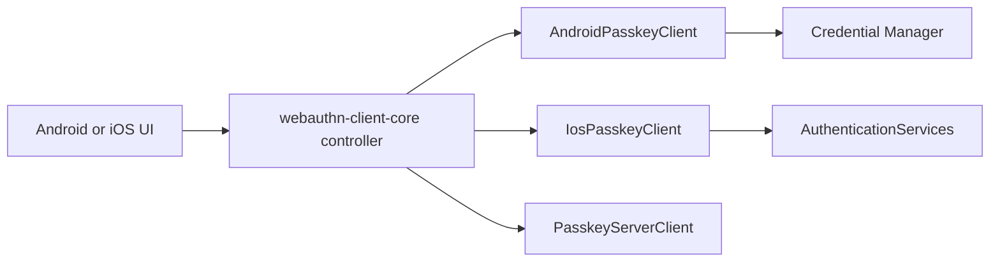

# webauthn-client-platform

Kotlin Multiplatform platform bridge for passkey operations. Its Android source set uses Credential
Manager; its iOS source set uses AuthenticationServices.

## What it provides

- `AndroidPasskeyClient`
- `IosPasskeyClient`
- Android and iOS `PasskeyClient` implementations that return byte-preserving raw registration and authentication responses
- A platform adapter designed to be orchestrated by `webauthn-client-core`
- Typed capability reporting via `PasskeyCapabilities.supportOf(...)`

## When to use

Use this in Android or iOS apps that need real platform passkey prompts and credentials.

## How to use

### Android

<!-- doc-example: id=client-webauthn-client-platform-readme-kotlin-1; owner=source; verify=platform-compile; audience=consumer; source=documentation/examples/src/androidMain/kotlin/dev/webauthn/documentation/examples/AndroidClientExample.kt#android-client -->
```kotlin
import android.app.Activity
import dev.webauthn.client.PasskeyClient
import dev.webauthn.client.android.AndroidPasskeyClient

fun androidPasskeyClient(activity: Activity): PasskeyClient {
    return AndroidPasskeyClient.forActivity(activity)
}
```

Real-world scenario: your shared app logic drives ceremony flow in `PasskeyController`, while `AndroidPasskeyClient` performs the platform call into Credential Manager.

### iOS

<!-- doc-example: id=client-webauthn-client-platform-readme-kotlin-2; owner=source; verify=platform-compile; audience=consumer; source=documentation/examples/src/iosMain/kotlin/dev/webauthn/documentation/examples/IosClientExample.kt#ios-client -->
```kotlin
import dev.webauthn.client.PasskeyClient
import dev.webauthn.client.ios.IosPasskeyClient
import dev.webauthn.client.ios.PasskeyPresentationAnchorProvider

fun iosPasskeyClient(anchorProvider: PasskeyPresentationAnchorProvider): PasskeyClient {
    return IosPasskeyClient(anchorProvider)
}
```

## How it fits

<!-- doc-example: id=client-webauthn-client-platform-readme-mermaid-1; owner=illustrative; verify=illustrative; audience=consumer; reason=Diagram is rendered by the Markdown host -->


## Pitfalls and limits

- This module contains the platform adapters; network and orchestration are separate concerns.
- Android offers `forActivity(activity)` for explicit UI ownership; the `Context` constructor retains
  automatic foreground-activity tracking for clients that outlive a screen.
- iOS accepts a `PasskeyPresentationAnchorProvider`, including a mutable provider for apps whose
  foreground window changes.
- Reported capability values have explicit `SUPPORTED`, `UNSUPPORTED`, or `UNKNOWN` status:
  - `PasskeyCapability.Extension(WebAuthnExtension.Prf)` for PRF.
  - `PasskeyCapability.Extension(WebAuthnExtension.LargeBlob)` for largeBlob.
  - `PasskeyCapability.Platform(PlatformCapability.SecurityKey)` for cross-platform security keys.
- iOS reports security-key support from its dedicated AuthenticationServices bridge; Android reports it
  as `UNKNOWN` because Credential Manager does not expose a separate security-key capability probe.
- A provider with no matching credential is reported as `PasskeyClientError.NoCredential`; other provider failures expose a stable message without leaking OS exception objects.
- Keep backend contract alignment with your chosen server client implementation.
- If the platform reports `RP ID cannot be validated`, verify:
  - RP ID and HTTPS origin/domain alignment.
  - `/.well-known/assetlinks.json` availability.
  - Android package name and signing SHA-256 fingerprint entries in that file.
- iOS supports `iosArm64` and `iosSimulatorArm64`; `iosX64` is not published.

## Status

Beta, thin Android/iOS bridge on top of shared raw-response client orchestration.
