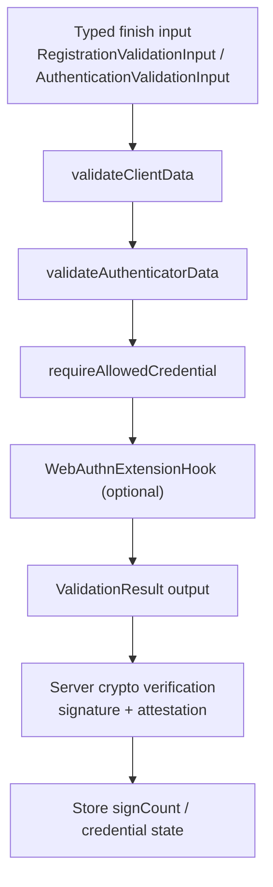

# webauthn-core

Audience: teams validating WebAuthn ceremonies before crypto verification and persistence updates.

## What it provides

- Validation for `clientData` expectations (`type`, `challenge`, `origin`, optional related origins).
- Validation for `authenticatorData` flags and signature counter progression.
- Allow-list enforcement for authentication (`allowCredentials`) via credential ID checks.
- Extension hook contracts for optional L3 extension checks.
- Composable per-extension validation hooks (`PrfExtensionHook`, `LargeBlobExtensionHook`).
- `CompositeExtensionHook` for mix-and-match extension validation pipelines.

<!-- doc-example: id=core-webauthn-core-readme-mermaid-1; owner=illustrative; verify=illustrative; audience=consumer; reason=Diagram is rendered by the Markdown host -->


## Where it fits in a real ceremony

Use `webauthn-core` in server finish endpoints after parsing transport payloads into model types and before signature/attestation verification. It gives you standards-aligned preconditions and typed output values (`credentialId`, `signCount`, extension outputs) for downstream steps.

## How to use

A practical authentication finish path usually chains core validation, allow-list checks, extension checks, then crypto verification and persistence.

<!-- doc-example: id=core-webauthn-core-readme-kotlin-1; owner=source; verify=consumer-compile; audience=consumer; source=documentation/examples/src/commonMain/kotlin/dev/webauthn/documentation/examples/CoreValidationExample.kt#core-validation -->
```kotlin
import dev.webauthn.core.AuthenticationValidationInput
import dev.webauthn.core.WebAuthnCoreValidator
import dev.webauthn.core.WebAuthnExtensionHook
import dev.webauthn.core.WebAuthnExtensionValidator
import dev.webauthn.model.CredentialId
import dev.webauthn.model.ExperimentalWebAuthnL3Api
import dev.webauthn.model.ValidationResult

@OptIn(ExperimentalWebAuthnL3Api::class)
suspend fun validateAssertionForFinish(
    input: AuthenticationValidationInput,
    allowedCredentialIds: Set<CredentialId>,
    extensionHook: WebAuthnExtensionHook = WebAuthnExtensionValidator,
): ValidationResult<Long> {
    val core = WebAuthnCoreValidator.validateAuthentication(input)
    if (core is ValidationResult.Invalid) return core

    val output = (core as ValidationResult.Valid).value

    val allow = WebAuthnCoreValidator.requireAllowedCredential(
        response = input.response,
        allowedCredentialIds = allowedCredentialIds,
    )
    if (allow is ValidationResult.Invalid) return allow

    val ext = extensionHook.validateAuthenticationExtensions(
        inputs = input.options.extensions,
        outputs = output.extensions,
    )
    if (ext is ValidationResult.Invalid) return ext

    // Continue with crypto signature verification and then persist output.signCount.
    return ValidationResult.Valid(output.signCount)
}
```

Important API behavior:

- `validateRegistration(...)` / `validateAuthentication(...)` return typed outputs for downstream persistence.
- `allowedOrigins` only broadens origin acceptance when explicitly provided.
- `previousSignCount` must come from server-trusted credential state.
- `ChallengeSession.userName` is nullable so discoverable (username-less) authentication ceremonies can be represented without synthetic identity fields.
- `CompositeExtensionHook` preserves invalid outcomes even when a hook returns `ValidationResult.Invalid(emptyList())`.
- Kotlin consumers that enable `-Xreturn-value-checker=check` are warned when core validation or extension-hook results are ignored.
- This module does not verify signatures or attestation statements.

## Composable extension hooks

Each L3 extension ships as a standalone `WebAuthnExtensionHook` implementation:

| Hook | Extension | Spec Section | Notes |
|------|-----------|-------------|-------|
| `PrfExtensionHook` | HMAC Secret (prf) | §9.2.1 | Authentication validates global `eval` requirements only; per-credential `evalByCredential` checks require selected credential ID |
| `LargeBlobExtensionHook` | Large blob storage | §9.2.2 | |

`WebAuthnExtensionValidator` includes both by default. For custom pipelines, use `CompositeExtensionHook`:

<!-- doc-example: id=core-webauthn-core-readme-kotlin-2; owner=source; verify=consumer-compile; audience=consumer; source=documentation/examples/src/commonMain/kotlin/examples/Composite.kt#composite-extension -->
```kotlin
import dev.webauthn.core.CompositeExtensionHook
import dev.webauthn.core.PrfExtensionHook
import dev.webauthn.model.AuthenticationExtensionsClientInputs
import dev.webauthn.model.AuthenticationExtensionsClientOutputs
import dev.webauthn.model.ValidationResult

@OptIn(ExperimentalWebAuthnL3Api::class)
fun validatePrfOnly(
    inputs: AuthenticationExtensionsClientInputs?,
    outputs: AuthenticationExtensionsClientOutputs?,
): ValidationResult<Unit> {
    val prfOnly = CompositeExtensionHook([PrfExtensionHook])
    return prfOnly.validateAuthenticationExtensions(inputs, outputs)
}
```

## Pitfalls and limits

- No storage/challenge lifecycle management.
- No JSON/CBOR parsing or transport DTO mapping.
- No crypto backend execution (delegated to `webauthn-crypto-api` implementations).

## iOS targets

- Published Apple targets are `iosArm64` and `iosSimulatorArm64`.
- `iosX64` support was removed to align with upstream dependency artifacts and current CI target compatibility.

## Status

Production-leaning validation engine.
