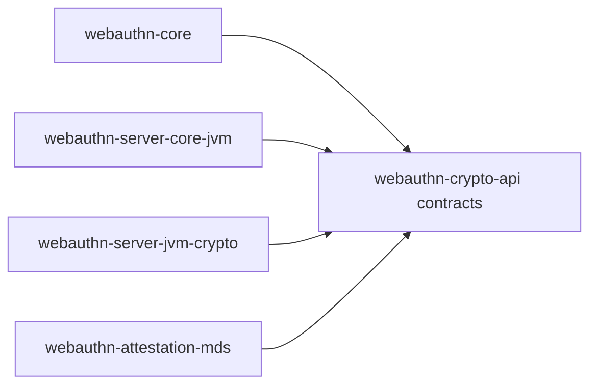

# webauthn-crypto-api

Contract layer for cryptographic and trust operations used by validation and ceremony services.

## What it provides

- `RpIdHasher`, `SignatureVerifier`, `AttestationVerifier`, `TrustAnchorSource` contracts
- A vendor-neutral seam between validation/orchestration and concrete crypto backends
- A stable place to plug your own cryptography or trust policy implementation

## When to use

- You are implementing custom crypto or attestation behavior.
- You want server logic to depend on interfaces, not provider details.
- You are building an alternative to `webauthn-server-jvm-crypto`.

## How to use

```kotlin
import dev.webauthn.crypto.RpIdHasher
import dev.webauthn.model.RpIdHash

// Example wiring only.
// Production implementations must SHA-256 hash the RP ID bytes first.
val hasher = RpIdHasher { rpId ->
    val rpIdSha256 = sha256(rpId.encodeToByteArray())
    RpIdHash.fromBytes(rpIdSha256)
}
```

Real-world scenario: multi-tenant backends can swap verifier and trust-anchor strategy per tenant while keeping ceremony services unchanged.

## How it fits



## Pitfalls and limits

- Contract ownership stays here; concrete security posture is in your implementation.
- Returning invalid hashes, signature checks, or trust anchors will weaken validation guarantees.

## Status

Beta, vendor-agnostic contract layer.
