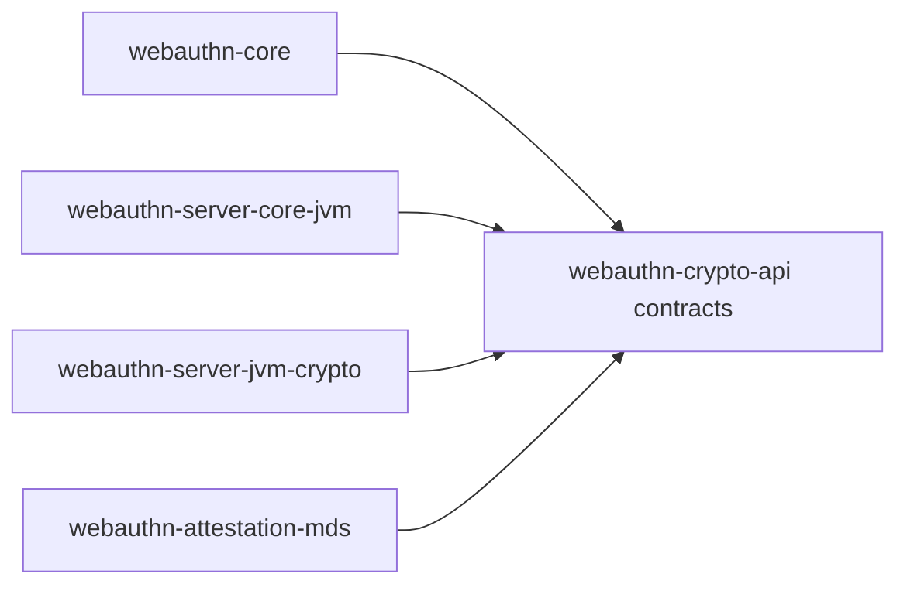

# webauthn-crypto-api

Contract layer for cryptographic and trust operations used by validation and ceremony services.

## What it provides

- `RpIdHasher`, `SignatureVerifier`, `AttestationVerifier`, `TrustAnchorSource` contracts
- A vendor-neutral seam between validation/orchestration and concrete crypto backends
- A stable place to plug your own cryptography or trust policy implementation

## When to use

- You are implementing custom crypto or attestation behavior.
- You want server logic to depend on interfaces, not provider details.
- You are building an alternative to `webauthn-server-jvm-crypto`.

## How to use

<!-- doc-example: id=core-webauthn-crypto-api-readme-kotlin-1; owner=source; verify=consumer-compile; audience=consumer; source=documentation/examples/src/jvmMain/kotlin/dev/webauthn/documentation/examples/CryptoExample.kt#crypto-rp-id-hasher -->
```kotlin
import dev.webauthn.crypto.RpIdHasher
import dev.webauthn.model.RpIdHash

fun rpIdHasher(sha256: (ByteArray) -> ByteArray): RpIdHasher {
    return RpIdHasher { rpId ->
        val rpIdSha256 = sha256(rpId.encodeToByteArray())
        RpIdHash.fromBytes(rpIdSha256)
    }
}
```

Real-world scenario: multi-tenant backends can swap verifier and trust-anchor strategy per tenant while keeping ceremony services unchanged.

## How it fits

<!-- doc-example: id=core-webauthn-crypto-api-readme-mermaid-1; owner=illustrative; verify=illustrative; audience=consumer; reason=Diagram is rendered by the Markdown host -->


## Pitfalls and limits

- Contract ownership stays here; concrete security posture is in your implementation.
- Returning invalid hashes, signature checks, or trust anchors will weaken validation guarantees.
- Kotlin consumers that enable `-Xreturn-value-checker=check` are warned when crypto or trust results are ignored.

## Status

Beta, vendor-agnostic contract layer.
