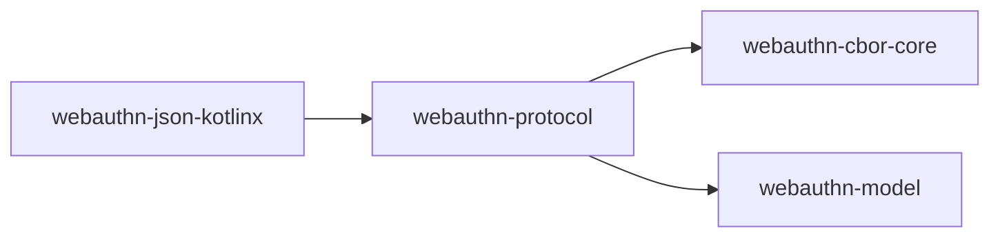

# webauthn-protocol

Audience: integrators and adapters that need strict WebAuthn binary protocol interpretation without selecting a JSON or CBOR object codec.

## What it provides

- Parsing of authenticator-data bytes into typed WebAuthn model values
- Structural extraction of `authData` from a CBOR attestation object
- Validation errors expressed through the neutral `webauthn-model` result types

## When to use

Use this module at the boundary between untrusted raw credential bytes and clean
WebAuthn protocol models. It depends only on `webauthn-model` and
`webauthn-cbor-core`; it does not require `kotlinx.serialization`.

## How to use

<!-- doc-example: id=core-webauthn-protocol-readme-kotlin-1; owner=source; verify=compile; audience=consumer; source=documentation/examples/src/commonMain/kotlin/dev/webauthn/documentation/examples/ProtocolExample.kt#protocol-authenticator-data -->
```kotlin
fun parseAuthenticatorData(bytes: ByteArray): ValidationResult<ParsedAuthenticatorData> {
    return WebAuthnProtocolParser.parseAuthenticatorData(bytes)
}
```

For registration responses, call `extractAuthenticatorData` on the raw
attestation object before parsing the returned immutable `Base64UrlBytes` value.
The caller remains responsible for ceremony policy and attestation verification.

## How it fits in the system

<!-- doc-example: id=core-webauthn-protocol-readme-mermaid-1; owner=illustrative; verify=illustrative; audience=consumer; reason=Diagram is rendered by the Markdown host -->


Arrows point from a consuming module to its direct dependency. JSON implementations may use the
protocol parser, while the parser itself remains independent of any serialization implementation.

## Status

Beta, public protocol interpretation module.
