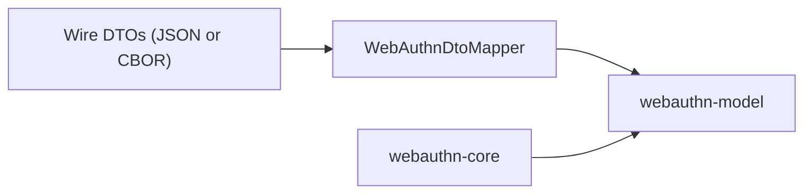

# webauthn-serialization-kotlinx

Serialization and mapping helpers between wire DTOs and typed WebAuthn domain models.

## What it provides

- `WebAuthnDtoMapper` mapping between DTO and `webauthn-model`
- `kotlinx.serialization`-based DTO support
- Authenticator data and CBOR/COSE-related conversion helpers used by higher layers

## When to use

Use this when your boundary is JSON/CBOR but your application code should stay typed.

## How to use

<!-- doc-example: id=core-webauthn-serialization-kotlinx-readme-kotlin-1; owner=source; verify=consumer-compile; audience=consumer; source=documentation/examples/src/commonMain/kotlin/dev/webauthn/documentation/examples/SerializationExample.kt#serialization-mapper -->
```kotlin
import dev.webauthn.model.PublicKeyCredentialRequestOptions
import dev.webauthn.model.ValidationResult
import dev.webauthn.serialization.PublicKeyCredentialRequestOptionsDto
import dev.webauthn.serialization.WebAuthnDtoMapper

fun decodeRequestOptions(
    dto: PublicKeyCredentialRequestOptionsDto,
): ValidationResult<PublicKeyCredentialRequestOptions> {
    return WebAuthnDtoMapper.toModel(dto)
}

fun encodeRequestOptions(
    model: PublicKeyCredentialRequestOptions,
): PublicKeyCredentialRequestOptionsDto {
    return WebAuthnDtoMapper.fromModel(model)
}
```

Real-world scenario: parse backend JSON into typed model objects, run validation/business logic, then map back to DTOs for responses.

## How it fits

<!-- doc-example: id=core-webauthn-serialization-kotlinx-readme-mermaid-1; owner=illustrative; verify=illustrative; audience=consumer; reason=Diagram is rendered by the Markdown host -->


## Pitfalls and limits

- Mapper validation is strict by design; malformed wire data should be handled as untrusted input.
- Low-level CBOR traversal relies on `webauthn-cbor-core` strict scanner primitives shared with JVM crypto parsing.
- Canonical response DTO mapping emits standards-shaped WebAuthn response JSON fields (`type = "public-key"` and `clientExtensionResults`, including empty extension objects when no outputs are present).
- `residentKey` is the authoritative creation-options field; legacy `requireResidentKey` payloads are now rejected explicitly instead of being mapped.
- Credential descriptors in `excludeCredentials`/`allowCredentials` must use `type = "public-key"`; mismatched types are rejected with explicit validation errors.
- `allowCredentials: null` is accepted only as a compatibility decode shim and normalized to an empty list; canonical JSON should still treat `allowCredentials` as an optional sequence (not `null`).
- Keep model and mapper versions aligned (BOM recommended).

## iOS targets

- Published Apple targets are `iosArm64` and `iosSimulatorArm64`.
- `iosX64` support was removed to align with upstream dependency artifacts and current CI target compatibility.

## Status

Beta, strict mapper validation with CBOR/COSE handling.
