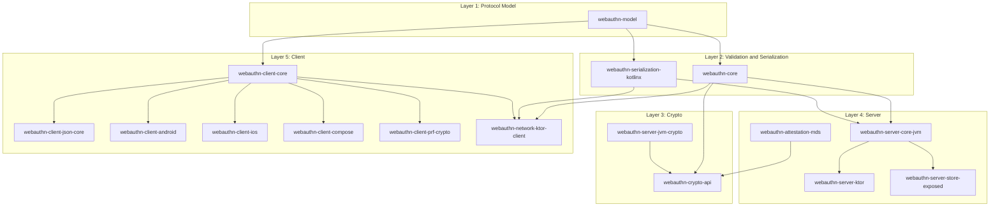

# Architecture Overview

## Goals

- Standards-first WebAuthn L3 behavior.
- Strict separation of concerns:
  - model and validation
  - protocol/core logic
  - crypto implementation
  - transport and platform adapters
- Dependency minimization with optional feature modules.

## Layering

`webauthn-model` has no dependencies on the rest of the codebase.

## Backend runtime

V1 backend target is Kotlin/JVM. Core ceremony services are in `webauthn-server-core-jvm` and stay framework-agnostic.

## Framework adapters

Ktor adapter modules are intentionally thin wrappers around core services.

`webauthn-network-ktor-client` keeps `io.ktor.client.HttpClient` in its public contract, so the module publishes `ktor-client-core` as an API dependency for consumer compile compatibility while leaving engine selection to host apps.

## Experimental Level 3 API surface

Extension APIs that may evolve are marked with `@ExperimentalWebAuthnL3Api`.
