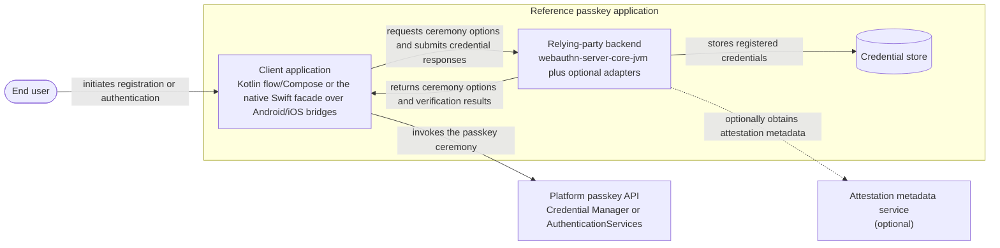
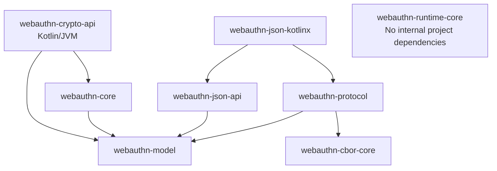
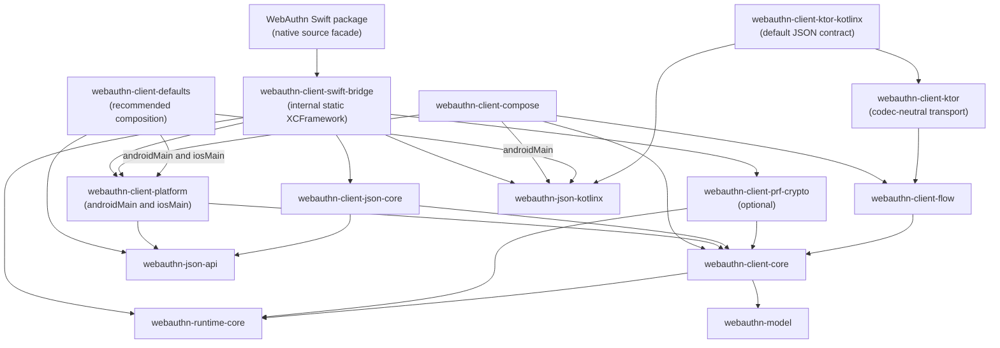
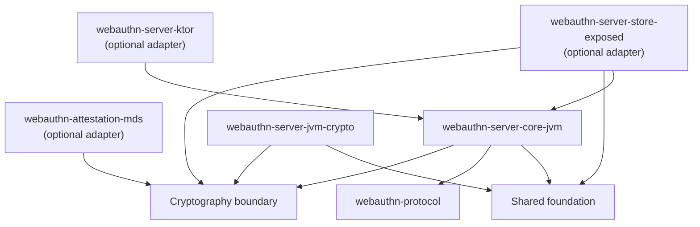

# Architecture

## Design goals

- Standards-first WebAuthn L3 behavior.
- Strict separation between protocol model, shared foundation, cryptography, client orchestration, and JVM server services.
- Thin platform and transport adapters with optional features kept out of the core path.
- Architecture documentation that explains both repository structure and real application adoption.

## How to read the diagrams

The repository overview shows logical responsibility relationships. The focused
module diagrams show direct internal Gradle project dependencies for a selected
slice. In module diagrams, arrows point from the consumer to its dependency.

External Maven dependencies are omitted. Optional adapters are labelled
explicitly. The diagrams are intentionally curated rather than exhaustive.

## Repository overview

The [repository overview in the root README](../README.md#repository-structure)
shows the five logical responsibility areas. It intentionally omits individual
projects, samples, documentation utilities, and transitive dependencies.

## Reference integration

This view shows where the library is used in a typical passkey application. The
SDK is represented inside the client and backend descriptions rather than as a
separate runtime system.

<!-- doc-example: id=docs-architecture-mermaid-1; owner=illustrative; verify=illustrative; audience=consumer; reason=Diagram is rendered by the Markdown host -->

```mermaid
flowchart LR
    USER([End user])

    subgraph APPLICATION["Reference passkey application"]
        CLIENT["Client application<br/>Kotlin flow/Compose or the native Swift facade over Android/iOS bridges"]
        BACKEND["Relying-party backend<br/>webauthn-server-core-jvm plus optional adapters"]
        STORE[("Credential store")]
    end

    PLATFORM["Platform passkey API<br/>Credential Manager or AuthenticationServices"]
    MDS["Attestation metadata service<br/>(optional)"]

    USER -->|initiates registration or authentication| CLIENT
    CLIENT -->|requests ceremony options and submits credential responses| BACKEND; BACKEND -->|returns ceremony options and verification results| CLIENT
    CLIENT -->|invokes the passkey ceremony| PLATFORM
    BACKEND -->|stores registered credentials| STORE
    BACKEND -. optionally obtains attestation metadata .-> MDS
```

## Shared foundation

The shared foundation keeps protocol contracts, validation, serialization,
runtime helpers, and cryptographic contracts separated.

<!-- doc-example: id=docs-architecture-mermaid-2; owner=illustrative; verify=illustrative; audience=consumer; reason=Diagram is rendered by the Markdown host -->

```mermaid
flowchart TB
    CRYPTO_API["webauthn-crypto-api<br/>Kotlin/JVM"]
    CORE["webauthn-core"]
    SERIALIZATION["webauthn-json-kotlinx"]
    JSON_API["webauthn-json-api"]
    PROTOCOL["webauthn-protocol"]
    CBOR["webauthn-cbor-core"]
    MODEL["webauthn-model"]
    RUNTIME["webauthn-runtime-core<br/>No internal project dependencies"]

    CRYPTO_API --> CORE
    CRYPTO_API --> MODEL
    CORE --> MODEL
    SERIALIZATION --> JSON_API
    SERIALIZATION --> PROTOCOL
    JSON_API --> MODEL
    PROTOCOL --> MODEL
    PROTOCOL --> CBOR
```

The isolated runtime node is intentional. It communicates that this module has
no internal project dependencies without inventing an edge.

## Client stack

`webauthn-client-core` owns typed platform-operation contracts, shared input validation, and error
classification. `webauthn-client-flow` owns application-neutral start/prompt/finish orchestration,
opaque backend-state forwarding, and concurrency rejection. JSON, Android, iOS, Compose, PRF, and
network modules build around those boundaries. Platform bridges use the neutral codec API only where
an OS integration requires JSON and return byte-preserving raw responses. The native `WebAuthn` Swift
package is a Swift-owned source facade over a narrow internal XCFramework; generated Kotlin types do not
belong in the public Swift API.

<!-- doc-example: id=docs-architecture-mermaid-3; owner=illustrative; verify=illustrative; audience=consumer; reason=Diagram is rendered by the Markdown host -->

```mermaid
flowchart TB
    SWIFT["WebAuthn Swift package<br/>(native source facade)"]
    SWIFT_BRIDGE["webauthn-client-swift-bridge<br/>(internal static XCFramework)"]
    COMPOSE["webauthn-client-compose"]
    PLATFORM["webauthn-client-platform<br/>(androidMain and iosMain)"]
    JSON["webauthn-client-json-core"]
    PRF["webauthn-client-prf-crypto<br/>(optional)"]
    DEFAULTS["webauthn-client-defaults<br/>(recommended composition)"]
    KTOR_KOTLINX["webauthn-client-ktor-kotlinx<br/>(default JSON contract)"]
    KTOR["webauthn-client-ktor<br/>(codec-neutral transport)"]
    FLOW["webauthn-client-flow"]
    CLIENT_CORE["webauthn-client-core"]
    JSON_API["webauthn-json-api"]
    JSON_KOTLINX["webauthn-json-kotlinx"]
    RUNTIME["webauthn-runtime-core"]
    MODEL["webauthn-model"]

    SWIFT --> SWIFT_BRIDGE
    SWIFT_BRIDGE --> PLATFORM
    SWIFT_BRIDGE --> JSON
    SWIFT_BRIDGE --> PRF
    SWIFT_BRIDGE --> JSON_KOTLINX
    SWIFT_BRIDGE --> RUNTIME

    COMPOSE --> CLIENT_CORE
    COMPOSE --> FLOW
    COMPOSE --> PLATFORM
    COMPOSE -->|androidMain| JSON_KOTLINX

    DEFAULTS -->|androidMain and iosMain| PLATFORM
    DEFAULTS --> JSON_API
    DEFAULTS --> JSON_KOTLINX

    PLATFORM --> CLIENT_CORE
    PLATFORM --> JSON_API

    JSON --> CLIENT_CORE
    JSON --> JSON_API

    PRF --> CLIENT_CORE
    PRF --> RUNTIME

    KTOR_KOTLINX --> KTOR
    KTOR_KOTLINX --> JSON_KOTLINX

    KTOR --> FLOW

    FLOW --> CLIENT_CORE

    CLIENT_CORE --> RUNTIME
    CLIENT_CORE --> MODEL
```

External libraries, platform APIs, source-set details, and samples are
intentionally omitted from this module dependency view.

The view focuses on direct project dependencies among published client modules.
Platform adapters remain separate from shared typed behavior, and optional features remain outside
the core path. Target-labelled edges represent source-set-specific project dependencies.

For platform-specific behavior, see the reference integration and module
READMEs. For runnable adoption paths, see the sample documentation.

## JVM server stack

The server core remains framework-agnostic and depends on the neutral protocol
layer rather than a JSON implementation. Ktor, Exposed, and metadata support
are optional adapters around the core and cryptographic boundaries.

<!-- doc-example: id=docs-architecture-mermaid-4; owner=illustrative; verify=illustrative; audience=consumer; reason=Diagram is rendered by the Markdown host -->

```mermaid
flowchart TB
    KTOR["webauthn-server-ktor<br/>(optional adapter)"]
    STORE["webauthn-server-store-exposed<br/>(optional adapter)"]
    MDS["webauthn-attestation-mds<br/>(optional adapter)"]
    SERVER_CORE["webauthn-server-core-jvm"]
    PROTOCOL["webauthn-protocol"]
    JVM_CRYPTO["webauthn-server-jvm-crypto"]
    FOUNDATION["Shared foundation"]
    CRYPTO["Cryptography boundary"]

    KTOR --> SERVER_CORE

    STORE --> SERVER_CORE
    STORE --> FOUNDATION
    STORE --> CRYPTO

    MDS --> CRYPTO

    SERVER_CORE --> FOUNDATION
    SERVER_CORE --> PROTOCOL
    SERVER_CORE --> CRYPTO

    JVM_CRYPTO --> FOUNDATION
    JVM_CRYPTO --> CRYPTO
```

## Distribution and samples

| Project | Role |
| --- | --- |
| `platform:bom` | Aligns versions across the published WebAuthn artifacts as `webauthn-bom`. |
| `platform:constraints` | Internal dependency constraints used by the build. It is not published. |
| `WebAuthn` Swift package | Swift source facade plus a checksum-pinned static XCFramework prepared for the first coordinated GitHub release; it is currently unreleased. |
| `webauthn-client-swift-bridge` | Internal Kotlin/Native distribution module. Swift consumers must not import it directly. |
| `sample:*` | Runnable backend, client, Android, native Swift, iOS, Compose, and CLI examples. Samples are not published runtime libraries. |
| `documentation:*` | Documentation example and verification tooling. These projects are not part of the published SDK surface. |
| `docs/site` | Mobile-first public documentation authored for the generated site. The staging task adds allowlisted repository guides, sample pages, module indexes, and Dokka output without changing the published SDK surface. |

The published modules remain grouped under `core/`, `client/`, and `server/` by
responsibility. Distribution projects and samples are intentionally omitted
from the overview because they explain packaging and adoption rather than the
reusable library architecture.

The public documentation pipeline is a distribution layer over those sources. `docsSiteStage`
selects and rewrites allowlisted content, the root Dokka task aggregates published modules, and
`docsSiteBuild` assembles both into one validated static site. Generated site files remain build
artifacts; authored content and the source allowlist stay reviewable in the repository. The root
build owns these tasks and resolves their scripts and inputs from the repository root, so their
behavior does not depend on the directory from which Gradle was invoked.

## Dependency rules

- `webauthn-model` remains independent of the rest of the repository.
- `webauthn-json-api` is the serialization-library-neutral JSON contract; implementations such as `webauthn-json-kotlinx` depend on it.
- `webauthn-protocol` interprets raw WebAuthn binary data using only the model and strict CBOR scanner; codecs depend on it rather than owning protocol parsing.
- `webauthn-client-core` owns typed platform-operation validation and error classification; Android and iOS source sets remain thin bridges that return raw output.
- `webauthn-client-flow` depends only on client-core and keeps backend state/output generic; transport and UI modules build over it.
- `webauthn-client-ktor` adapts flow backends to caller-owned Ktor transport without choosing an engine or serializer; `webauthn-client-ktor-kotlinx` is the opt-in default JSON contract.
- `webauthn-client-defaults` selects the recommended Kotlinx/platform composition without changing the replaceable lower-level seams.
- The public Swift facade owns Swift values, actors, errors, presentation-window semantics, and CryptoKit
  PRF sessions; its internal bridge delegates protocol validation, JSON mapping, passkey ceremonies, and
  PRF request/result mapping to the existing Kotlin modules through primitive boundary values. Deterministic
  HKDF vectors keep the native and Kotlin derivation contracts aligned.
- Coordinated Swift package tags and Maven artifacts use one version once published; the release-tag manifest is checksum-pinned to its matching XCFramework asset. Existing Kotlin-only tags are not Swift package releases.
- `webauthn-server-core-jvm` remains framework-agnostic; Ktor and Exposed are adapters.
- `webauthn-crypto-api` stays vendor-neutral; implementations belong behind the crypto boundary.
- Optional adapters must not become hidden prerequisites of core modules.
- Direct project dependencies shown here must be checked against the owning `build.gradle.kts` whenever the module graph changes.

## Diagram maintenance

Architecture diagrams are maintained directly as Mermaid blocks beside their
supporting prose.

Keep each diagram focused on one concern. Prefer a small curated view over a
complete repository dependency graph. Module dependency arrows point from the
consumer to its dependency, and optional modules must be labelled explicitly.

When changing a diagram:

1. Check direct project dependencies against the relevant `build.gradle.kts` files.
2. Run `./gradlew docsUpdate docsCheck --stacktrace`.
3. Run `tools/agent/quality-gate.sh --mode strict --scope changed --block true`.
4. Inspect the rendered diagram on GitHub for readability and edge crossings.
