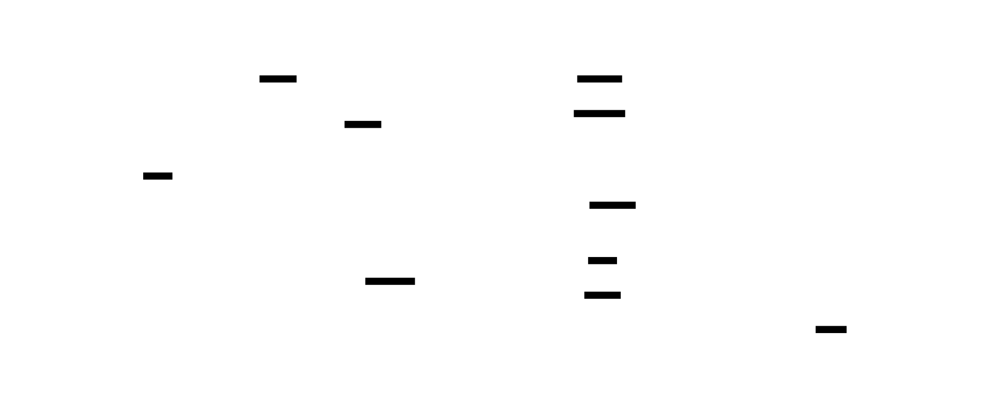
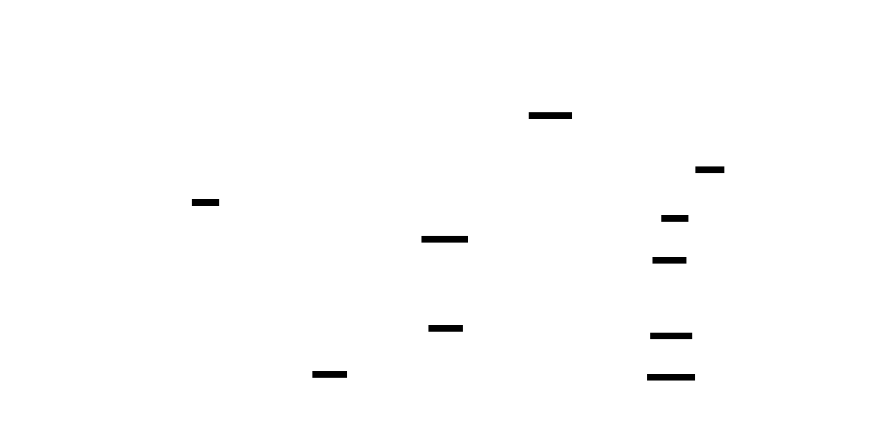
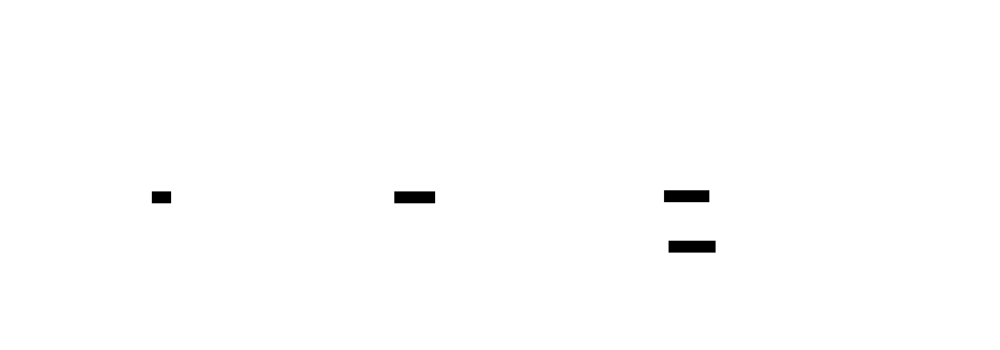

# D2 Diagram Pilot

This pilot evaluates [D2](https://d2lang.com/) against the repository's most overloaded
diagram: the root module architecture. The source is D2, the output is checked-in SVG, and
the comparison uses the repository's current Mermaid renderer (`mmdc`).

## Why D2 is being tested

D2 is a general-purpose diagram language rather than an architecture model. Its useful
advantages here are first-class containers, a modern visual system, themeable SVG output,
ELK and Dagre layouts, icons/tooltips/links, and a local CLI. The trade-off is that D2 does
not decide architecture scope for us: we must choose the right view rather than dumping the
entire Gradle graph into a prettier renderer.

## Rendered comparison

### The current all-module graph versus a readable architecture overview

| Current Mermaid | D2 with ELK (recommended) | D2 with Dagre (rejected) |
| --- | --- | --- |
|  |  |  |

The D2 version deliberately changes the *view*, not the underlying facts. It keeps five
layers and the decisions an adopter needs while replacing the unreadable full edge set with
ten labelled relationships. The complete dependency graph still exists in Gradle; it is not
an effective README diagram.

ELK is the preferred D2 layout for this repository: it preserves left-to-right flow and
keeps clusters coherent. The generated Dagre variant is included as negative evidence—its
cross-cluster routing is worse for this graph.

### Exact focused view: core dependencies


The focused diagram retains every current dependency among the seven core/crypto modules.
This is the right place for exact edges: the node count is small enough to inspect in review.

### Addition: adopter integration context



This new view separates how a consumer integrates the library from how the library itself is
implemented. It has no current equivalent in the documentation.

## Recommended repository workflow

```d2
vars: {
  d2-config: {
    layout-engine: elk
    theme-id: 4
  }
}
```

- Keep editable sources in `docs/d2/` and commit generated SVGs next to them.
- Use ELK as the default layout; include a deliberate Dagre test only when the graph is
  straightforward and directional.
- Maintain an orientation diagram plus focused views. Never use D2 to publish the complete
  cross-module dependency graph.
- Use D2 for static architecture and integration diagrams; retain Mermaid for tiny flows
  where GitHub-native fenced rendering is more valuable than visual styling.

## Scorecard

| Criterion | Score | Evidence |
| --- | ---: | --- |
| Visual quality for architecture overviews | 5/5 | Layer containers, typography, labelled edges, and SVG theme are materially clearer. |
| Visual quality for exact focused graphs | 4/5 | Core dependency view remains readable with every edge. |
| Visual quality for the complete graph | 2/5 | Better than Mermaid, but still too dense; this is a view-design problem. |
| Source reviewability | 4/5 | Small declarative sources, formatting, and deterministic CLI renders. |
| GitHub/doc delivery | 3/5 | Checked-in SVG works; no GitHub-native fence support. |
| CI integration | 4/5 | One local CLI command produces SVG; a future gate can verify changed `.d2` sources. |
| Architecture semantics | 3/5 | Flexible but intentionally unopinionated; the review must keep abstractions honest. |

## Reproduce

```bash
D2_BIN=d2 tools/agent/render-d2-pilot.sh
```

The script compiles every D2 source, produces the ELK and Dagre overview renders, and
refreshes the Mermaid reference asset. It intentionally is not yet a required quality gate.
