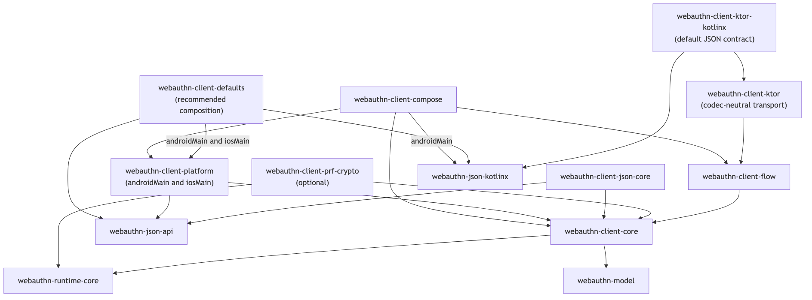

# Architecture diagram comparison

This is the historical comparison that preceded the full migration in PR #287.
The approved editorial overview now appears in the root README; all 30 public
diagrams use the maintained [diagram collection](../../diagrams/README.md).
The sources and baseline below preserve the original comparison evidence.

The original overview came from the second Mermaid block in the root README at
base commit `206212b77e8e4f4856dbab64669f7a6034cdb2b9`. These frozen artifacts are
not the production authoring pipeline. Current sources, ownership, deterministic
exports, site staging, and release checks are documented in the collection.

## Before and after

The baseline is a local render of the **unmodified Mermaid source**, not a
GitHub screenshot. Both Mermaid variants use CLI 11.12.0, its default/dark themes,
a 960-pixel viewport and 2× scale. GitHub may use another Mermaid version or theme.
Click the previews for the original resolution.

| Existing Mermaid | Editorial proposal |
| --- | --- |
|  |  |
|  |  |

Open [comparison.html](comparison.html) locally for the full comparison, or
[editorial.html](editorial.html) for the responsive diagram. GitHub shows HTML
source rather than executing these files; the images above work in Markdown.

## Mermaid-only control

The control retains Mermaid, adds explicit line breaks, uses longer edge rank
hints to align the client and server, and gives the foundation a thicker border.
It uses the same default/dark renderer themes as the baseline. No new nodes or
layout-only relationships are introduced.

| Refined Mermaid, light | Refined Mermaid, dark |
| --- | --- |
|  |  |

Sources: [before.mmd](before.mmd), [refined.mmd](refined.mmd).

## Phone layout

The editorial HTML selects the portrait layout at widths up to 720 CSS pixels.
The portrait diagram uses a 400×1000 viewBox; the desktop uses 960×600. Portrait
width is capped at 480 CSS pixels. This trades additional scrolling for legible
labels and separately traceable relationships. Embedded static images do not
automatically select the portrait layout.

| Light | Dark |
| --- | --- |
|  |  |

## Fidelity and design decisions

| Property | Result |
| --- | --- |
| Nodes | All five retained, with their complete original descriptions. |
| Relationships | All six retained, in the original direction. None added, merged or dropped. |
| Meaning | Logical repository responsibilities, not an exhaustive Gradle dependency graph. |
| Shared foundation | The sole accent-filled node; descriptions remain secondary to names. |
| Routing | Separately attached, rounded orthogonal paths in the editorial version. |
| Mobile | Same nodes and arrows in a separately authored portrait arrangement. |
| Accessible description | Both HTML diagrams and all SVG exports have unique title/description IDs. |
| Fonts | Existing docs-site system stack, with Helvetica/Arial fallbacks; no remote font dependency. |

The palette is copied from
[the docs-site stylesheet](../../site/assets/stylesheets/extra.css): white/slate
paper, blue accent and the existing foreground/muted roles. The public site's
computed font stack was checked during the spike. The layout uses larger labels
than Diagram Design's standard document preset; the phone layout also reduces
the outer margin to retain reading space. These are deliberate adaptations.

The source uses [Diagram Design 2.6.21](https://github.com/cathrynlavery/diagram-design/tree/562dbdf93ff3c3da630be4f90f4f6c2548175058)
architecture/import guidance and template structure. See
[THIRD_PARTY_NOTICES.md](THIRD_PARTY_NOTICES.md) for its MIT notice. No plugin,
renderer service, or new project dependency is installed by this spike.

## Reproduce and validate

Run from the repository root. Python exports the HTML's SVGs without fetching
assets, and checks node labels and directed-edge metadata against both Mermaid
sources. This is a content/staleness check; it does not prove visual routing.

<!-- doc-example: id=architecture-visuals-export; owner=markdown; verify=syntax; audience=contributor -->
```bash
python3 docs/experiments/architecture-visuals/export.py
python3 docs/experiments/architecture-visuals/export.py --check
```

The following commands use an already installed Mermaid CLI 11.12.0. They do not
install or update software.

<!-- doc-example: id=architecture-visuals-mermaid; owner=markdown; verify=syntax; audience=contributor -->
```bash
cd docs/experiments/architecture-visuals
mmdc -q -i before.mmd -o assets/before-light.png -w 960 -s 2 -b '#ffffff' -t default
mmdc -q -i before.mmd -o assets/before-dark.png -w 960 -s 2 -b '#1d242d' -t dark
mmdc -q -i refined.mmd -o assets/refined-light.png -w 960 -s 2 -b '#ffffff' -t default
mmdc -q -i refined.mmd -o assets/refined-dark.png -w 960 -s 2 -b '#1d242d' -t dark
```

Validation: all sources preserve the five labels and six relationships; the
upstream Diagram Design self-check and label-mask geometry check pass. Rendered
light/dark desktop and phone views are inspected separately. Repository checks
are `docsUpdate`, `docsCheck`, and fast/strict changed-scope quality gates.

## Migration outcome

The overview's hand-authored layout was promoted. Dense client and public
architecture graphs were split into focused views, and sequence/state diagrams
were migrated with their message order and error/cancellation paths preserved.
The production collection owns updates and CI checks. This directory remains
before/after evidence and is excluded from public-site staging.

## Dense client graph migration

The client baseline below is rendered from the original 13-node, 19-edge source
at the same base commit, using Mermaid CLI 11.12.0. The maintained replacement
splits that graph into three focused panels. Context nodes can repeat across
panels; all 19 relationships appear exactly once, including source-set labels.

| Original client graph | Maintained client views |
| --- | --- |
|  |  |

Historical source: [client-before.mmd](client-before.mmd). Current semantics and
reviewed geometry live in the maintained collection.
