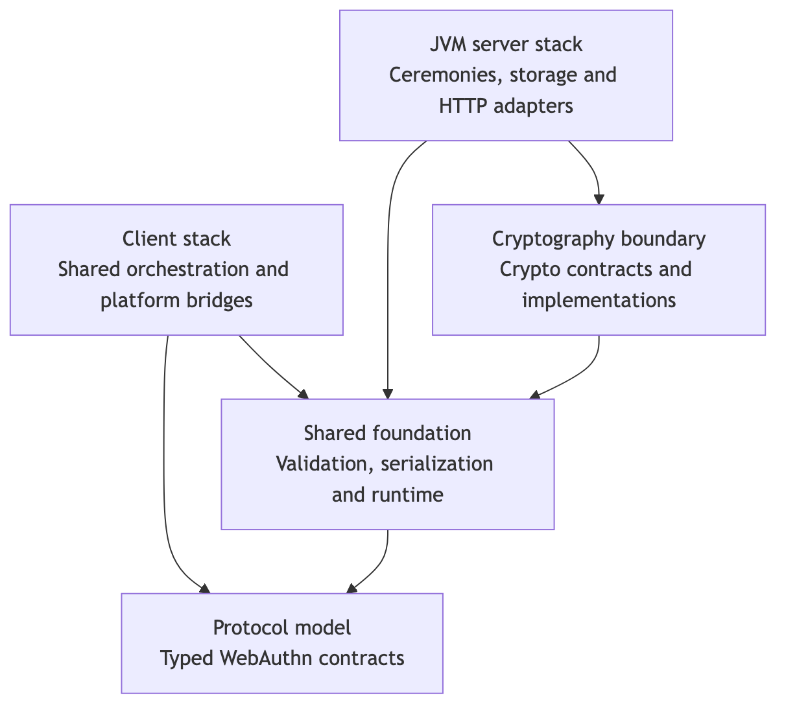
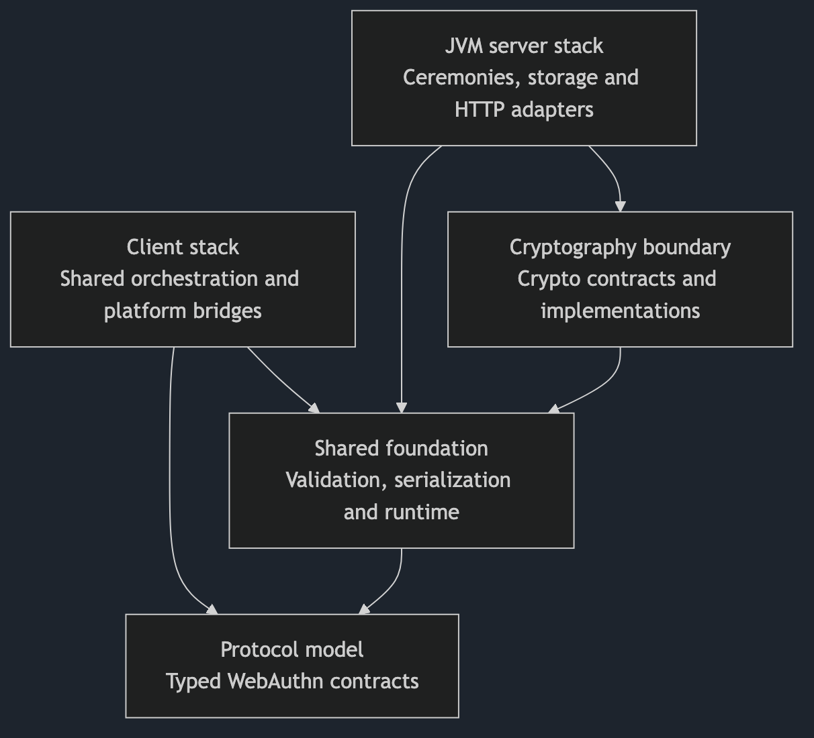
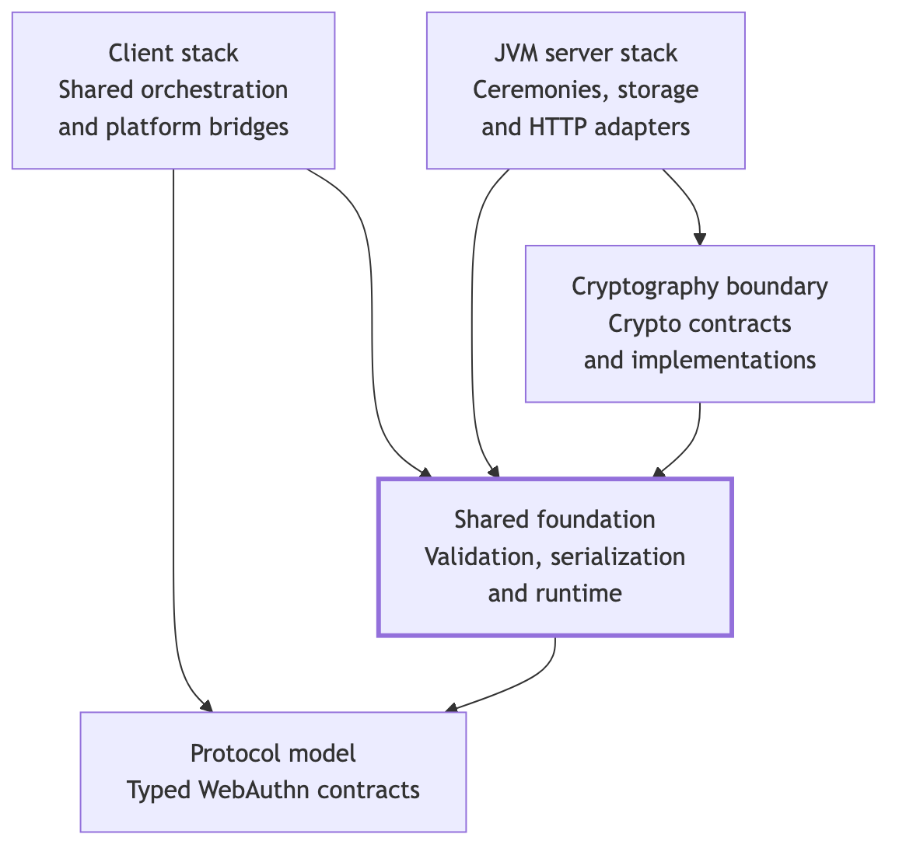
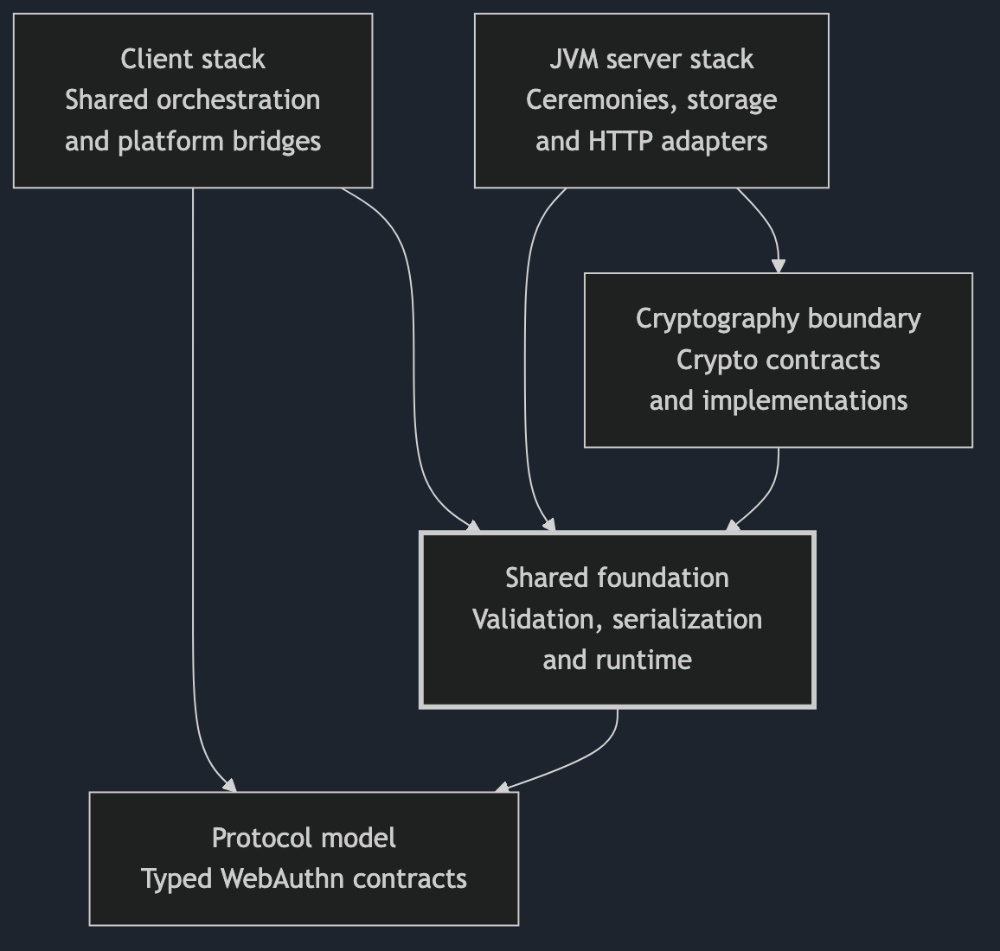

# Architecture diagram comparison

This review-only spike compares the existing README repository overview with a
refined Mermaid version and a Diagram Design editorial redraw. It does not
replace the public README, architecture guide, or generated documentation site.

The source is the second Mermaid block in [README.md](../../../README.md), at
base commit `206212b77e8e4f4856dbab64669f7a6034cdb2b9`. The experiment implements
the requested Diagram Design trial; the repository's Mermaid requirement still
governs published architecture documentation. Promoting the editorial assets
would require a separate, explicit policy decision.

## Before and after

The baseline is a local render of the **unmodified Mermaid source**, not a
GitHub screenshot. Both Mermaid variants use CLI 11.12.0, its default/dark themes,
a 960-pixel viewport and 2× scale. GitHub may use another Mermaid version or theme.
Click the previews for the original resolution.

| Existing Mermaid | Editorial proposal |
| --- | --- |
|  |  |
|  |  |

Open [comparison.html](comparison.html) locally for the full comparison, or
[editorial.html](editorial.html) for the responsive diagram. GitHub shows HTML
source rather than executing these files; the images above work in Markdown.

## Mermaid-only control

The control retains Mermaid, adds explicit line breaks, uses longer edge rank
hints to align the client and server, and gives the foundation a thicker border.
It uses the same default/dark renderer themes as the baseline. No new nodes or
layout-only relationships are introduced.

| Refined Mermaid, light | Refined Mermaid, dark |
| --- | --- |
|  |  |

Sources: [before.mmd](before.mmd), [refined.mmd](refined.mmd).

## Phone layout

The editorial HTML selects the portrait layout at widths up to 720 CSS pixels.
The portrait diagram uses a 400×1000 viewBox; the desktop uses 960×600. Portrait
width is capped at 480 CSS pixels. This trades additional scrolling for legible
labels and separately traceable relationships. Embedded static images do not
automatically select the portrait layout.

| Light | Dark |
| --- | --- |
|  |  |

## Fidelity and design decisions

| Property | Result |
| --- | --- |
| Nodes | All five retained, with their complete original descriptions. |
| Relationships | All six retained, in the original direction. None added, merged or dropped. |
| Meaning | Logical repository responsibilities, not an exhaustive Gradle dependency graph. |
| Shared foundation | The sole accent-filled node; descriptions remain secondary to names. |
| Routing | Separately attached, rounded orthogonal paths in the editorial version. |
| Mobile | Same nodes and arrows in a separately authored portrait arrangement. |
| Accessible description | Both HTML diagrams and all SVG exports have unique title/description IDs. |
| Fonts | Existing docs-site system stack, with Helvetica/Arial fallbacks; no remote font dependency. |

The palette is copied from
[the docs-site stylesheet](../../site/assets/stylesheets/extra.css): white/slate
paper, blue accent and the existing foreground/muted roles. The public site's
computed font stack was checked during the spike. The layout uses larger labels
than Diagram Design's standard document preset; the phone layout also reduces
the outer margin to retain reading space. These are deliberate adaptations.

The source uses [Diagram Design 2.6.21](https://github.com/cathrynlavery/diagram-design/tree/562dbdf93ff3c3da630be4f90f4f6c2548175058)
architecture/import guidance and template structure. See
[THIRD_PARTY_NOTICES.md](THIRD_PARTY_NOTICES.md) for its MIT notice. No plugin,
renderer service, or new project dependency is installed by this spike.

## Reproduce and validate

Run from the repository root. Python exports the HTML's SVGs without fetching
assets, and checks node labels and directed-edge metadata against both Mermaid
sources. This is a content/staleness check; it does not prove visual routing.

<!-- doc-example: id=architecture-visuals-export; owner=markdown; verify=syntax; audience=contributor -->
```bash
python3 docs/experiments/architecture-visuals/export.py
python3 docs/experiments/architecture-visuals/export.py --check
```

The following commands use an already installed Mermaid CLI 11.12.0. They do not
install or update software.

<!-- doc-example: id=architecture-visuals-mermaid; owner=markdown; verify=syntax; audience=contributor -->
```bash
cd docs/experiments/architecture-visuals
mmdc -q -i before.mmd -o assets/before-light.png -w 960 -s 2 -b '#ffffff' -t default
mmdc -q -i before.mmd -o assets/before-dark.png -w 960 -s 2 -b '#1d242d' -t dark
mmdc -q -i refined.mmd -o assets/refined-light.png -w 960 -s 2 -b '#ffffff' -t default
mmdc -q -i refined.mmd -o assets/refined-dark.png -w 960 -s 2 -b '#1d242d' -t dark
```

Validation: all sources preserve the five labels and six relationships; the
upstream Diagram Design self-check and label-mask geometry check pass. Rendered
light/dark desktop and phone views are inspected separately. Repository checks
are `docsUpdate`, `docsCheck`, and fast/strict changed-scope quality gates.

## Recommendation

The editorial layout gives this small overview clearer hierarchy and deliberate
routing, plus a useful phone presentation. The Mermaid control improves the
starting layout with considerably less maintenance. Keep the experiment scoped:
one successful overview does not validate dense dependency or security-flow
diagrams. The 13-node client graph needs decomposition before any similar redraw.

If the editorial approach is adopted later, retain Mermaid as the semantic
source, decide which authored assets enter the site, and make explicit who
updates both layouts and checks exports when the source changes. This experiment
does not add those responsibilities to normal builds or CI.
