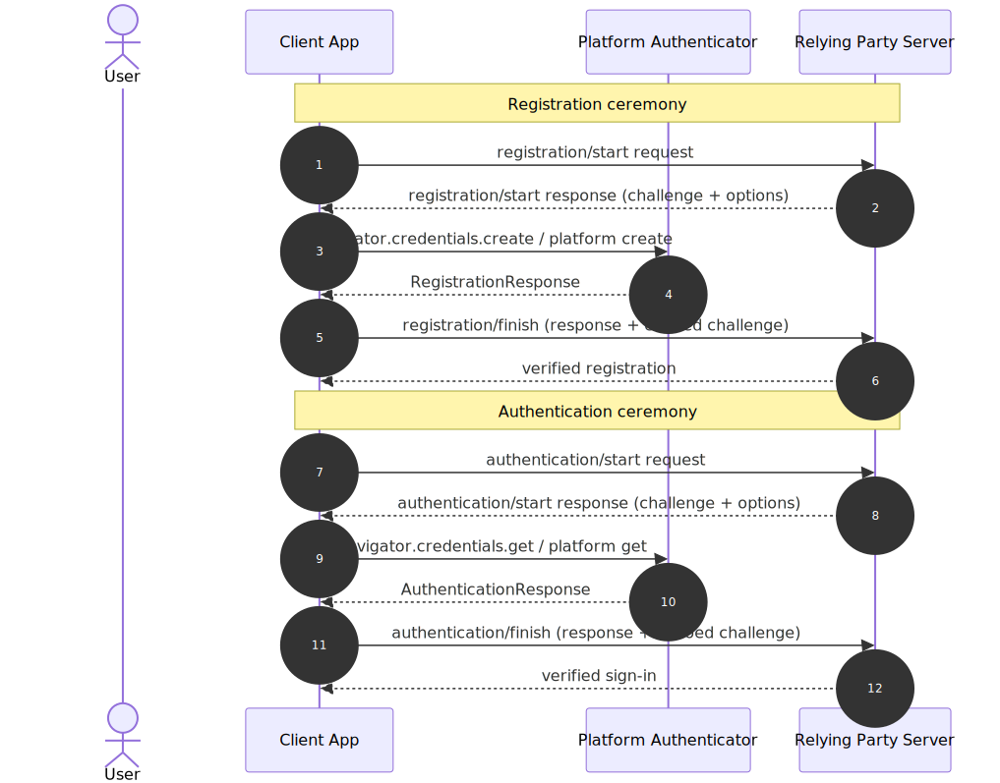
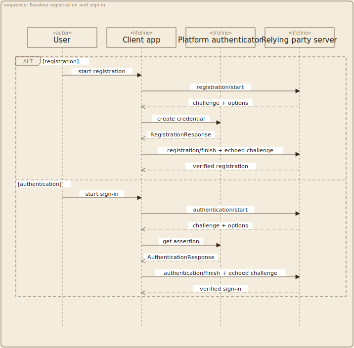
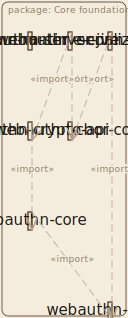
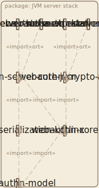
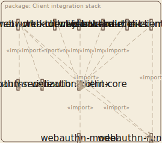
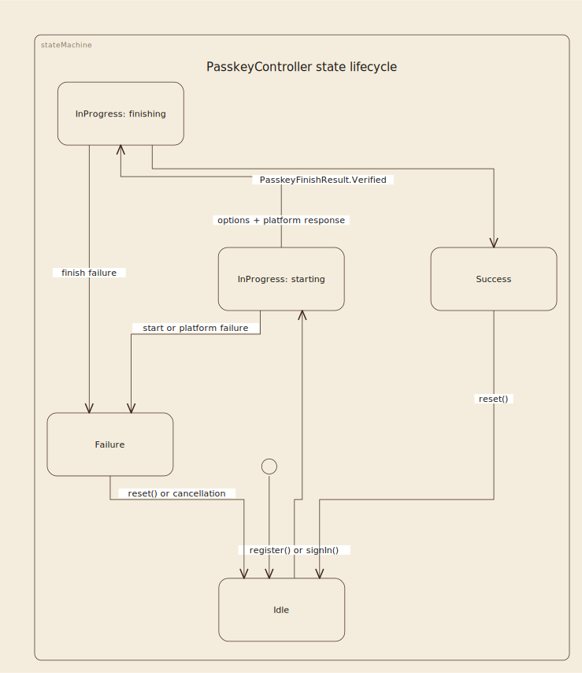
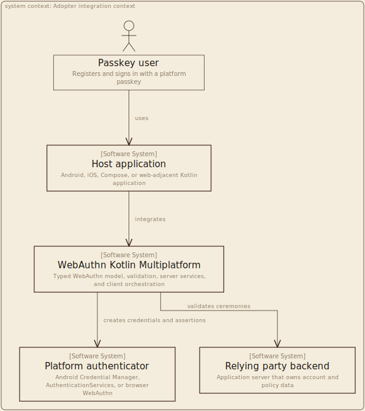

# kUML Diagram Pilot

This is an evidence-only pilot for richer diagrams in the WebAuthn Kotlin Multiplatform
documentation. It does not replace Mermaid, alter the build, or change the documentation
policy. The `src/` files are editable Kotlin models; `assets/` contains their checked-in
SVG renders so GitHub can display the result without a kUML renderer.

## What this tests

The current diagrams are intentionally useful but several have accumulated enough nodes or
parallel concepts that a generic flowchart stops communicating hierarchy well. The pilot
tests kUML where it supplies a materially different visual language:

- a UML sequence for the two WebAuthn ceremonies;
- three focused UML package views instead of one 19-module dependency map; and
- a UML state machine for the controller's real state surface.

The images below are generated from kUML `v0.31.0` source. The matching Mermaid SVGs are
generated locally by the repository's existing `mmdc` renderer. This makes the comparison
reproducible rather than relying on screenshots.

## Current feature set: what is useful here

The `v0.31.0` release is substantially more than a UML renderer. This assessment separates
features that can improve this repository from ones that would create model-maintenance
obligations without a documentation benefit.

| kUML capability checked | Potential use here | Pilot result / recommendation |
| --- | --- | --- |
| Typed Kotlin DSL plus CLI render and validate | Versioned source, parseable diagrams, and a renderer that can fail in CI. | Useful for a small, curated model set. All six pilot sources validate successfully. |
| UML sequence diagrams | Ceremony and backend interaction documentation. | Strong candidate; the rendered ceremony comparison is credible. |
| UML state/activity diagrams | Controller, PRF, and validation/error lifecycles. | Strong for the controller state addition; add only where a lifecycle has branches or recovery semantics. |
| C4 context/container/component views | Adoption and deployment boundaries. | Strong for the new adopter context; keep module dependency graphs out of C4. |
| UML package diagrams | Published-module dependency maps. | Not ready in this release: long module names overflow nodes and the grid renderer fails. |
| Markdown preprocessor | Replacing fences with inline or linked assets. | Do not use for GitHub Markdown now; checked-in SVG references are simpler and keep source in a separate model file. |
| Gradle plugin (`dev.kuml`) | Cached `render`, `validate`, and `generate` tasks. | Do not adopt yet: the released `0.31.0` marker/artifact is not resolvable from the published repositories. |
| Reverse engineering and Kotlin/Java/SQL code generation | Fast diagrams from implementation. | Do not use as documentation source of truth; raw generated models would be noisy and could misrepresent public architecture. |
| SysML, BPMN, ERM, animation, XMI, and LLM/MCP integrations | Domain/process modelling beyond the current docs. | Out of scope for this library until a concrete standards, ceremony, or deployment need arises. |

## Side-by-side evidence

### Ceremony

| Current Mermaid | kUML candidate |
| --- | --- |
|  |  |

The candidate makes the two alternatives explicit with a UML `alt` fragment and preserves
numbered request/response order. The current Mermaid diagram is already readable; this is a
style/semantic upgrade, not a decisive reason to migrate it alone.

### Repository architecture

| Current Mermaid: one global dependency graph | kUML candidate: core foundation |
| --- | --- |
|  |  |

The global Mermaid graph is accurate but makes focused questions—"what belongs to core?",
"what is server-only?", or "what can a mobile app adopt?"—hard to answer. The kUML option
uses three small package views with the same dependency information:

| Core foundation | JVM server stack | Client integration stack |
| --- | --- | --- |
|  |  |  |

The released renderer exposes an important counterexample here: package labels currently do
not influence node sizing, so long published-module names overflow their boxes in all three
views. The advertised `--layout grid` alternative also fails on these package diagrams with
missing-node errors. These renders are retained as negative evidence: kUML is not ready to
replace the repository architecture diagram today.

### New view: controller state machine



This is an addition rather than a replacement. It is derived from `PasskeyController` and
`PasskeyControllerState` and communicates reset/cancellation paths that the current linear
flowchart in the client-core README does not show.

### New view: adopter integration context



This C4 system-context view is a better fit than a package diagram for answering the
adopter-level question: where do the host app, platform authenticator, backend, and this
library meet?

## Exact inventory and migration recommendation

| Current location | Diagram | Current form | kUML fit | Recommendation |
| --- | --- | --- | --- | --- |
| `README.md` | Registration and authentication ceremony | Mermaid sequence | Strong: UML sequence with fragments | Pilot replacement shown; decide by reviewer preference. |
| `README.md` | Repository structure | 19-node Mermaid flowchart | Strong only when split into package/C4 views | Pilot replacement shown as three focused package views; retain a compact Mermaid overview if inline GitHub navigation matters. |
| `docs/architecture.md` | Layering | Near-duplicate of README repository structure | Strong only when consolidated | Do not create a second kUML model; point it to the canonical architecture view if the pilot graduates. |
| `client/webauthn-client-android/README.md` | Android bridge flow | 5-node Mermaid flowchart | Weak | Keep Mermaid. |
| `client/webauthn-client-compose/README.md` | Compose controller flow | 7-node Mermaid flowchart | Weak | Keep Mermaid; a state diagram is only justified for controller state, not this UI wiring. |
| `client/webauthn-client-core/README.md` | Controller happy path | 5-node Mermaid flowchart | Strong as an additional state machine | Keep the flowchart and add the pilot's state-machine view if adopted. |
| `client/webauthn-client-ios/README.md` | iOS bridge flow | 5-node Mermaid flowchart | Weak | Keep Mermaid. |
| `client/webauthn-client-json-core/README.md` | JSON facade flow | 4-node Mermaid flowchart | Weak | Keep Mermaid. |
| `client/webauthn-client-prf-crypto/README.md` | PRF key lifecycle | 9-node Mermaid flowchart | Medium: state/activity can expose lifecycle invariants | Keep Mermaid now; add a kUML state view only if the zeroization/error lifecycle needs specification-level precision. |
| `client/webauthn-network-ktor-client/README.md` | Client transport flow | 4-node Mermaid flowchart | Weak | Keep Mermaid. |
| `core/webauthn-cbor-core/README.md` | CBOR consumers | 3-node Mermaid flowchart | Weak | Keep Mermaid. |
| `core/webauthn-core/README.md` | Validation pipeline | 7-node Mermaid flowchart | Medium: activity diagram could show validation branches | Keep Mermaid unless the documentation expands to success/failure branches. |
| `core/webauthn-crypto-api/README.md` | Crypto contract consumers | 4-node Mermaid flowchart | Weak | Keep Mermaid. |
| `core/webauthn-model/README.md` | Typed-boundary flow | 7-node Mermaid flowchart | Medium: class/package diagram could clarify types | Keep Mermaid; use kUML only for a future public-model class map, not as a direct rewrite. |
| `core/webauthn-serialization-kotlinx/README.md` | DTO mapping | 3-node Mermaid flowchart | Weak | Keep Mermaid. |
| `platform/bom/README.md` | BOM adoption | 5-node Mermaid flowchart | Weak | Keep Mermaid. |
| `server/webauthn-attestation-mds/README.md` | MDS trust chain | 5-node Mermaid flowchart | Medium: sequence/activity can model refresh and failure behavior | Keep Mermaid now; add kUML only when cache/refresh semantics are documented. |
| `server/webauthn-server-core-jvm/README.md` | Server service composition | 4-node Mermaid flowchart | Weak | Keep Mermaid. |
| `server/webauthn-server-jvm-crypto/README.md` | JVM crypto boundary | 3-node Mermaid flowchart | Weak | Keep Mermaid. |
| `server/webauthn-server-ktor/README.md` | Ktor request path | 4-node Mermaid flowchart | Weak | Keep Mermaid. |
| `server/webauthn-server-store-exposed/README.md` | Store wiring | 4-node Mermaid flowchart | Weak | Keep Mermaid. |

There are 21 current Mermaid diagrams: 2 in the root README, 1 in
`docs/architecture.md`, and 18 module README diagrams. The inventory deliberately does not
recommend a tool-driven rewrite of the 14 small (three-to-five node) diagrams: it would add
an asset-generation dependency without improving understanding.

## Candidate additions where a diagram would materially help

| Location | New diagram | Why it earns its maintenance cost | Best form |
| --- | --- | --- | --- |
| `client/webauthn-client-core/README.md` | Controller lifecycle | Makes the real `Idle` / `InProgress` / `Success` / `Failure` states and reset path visible. | kUML UML state diagram |
| `docs/architecture.md` | Canonical package dependency views | Replaces the repeated all-module graph with core, server, and client views. | kUML package diagrams |
| `server/webauthn-server-core-jvm/README.md` | Registration failure path | Security readers need to see where challenge, origin, attestation, and persistence failures terminate. | kUML activity diagram, only when those branches are documented in detail |
| `core/webauthn-model/README.md` | Public typed-boundary model | Helps explain the relationship between option, response, wrapper, and validation-result types. | kUML UML class diagram, generated from a curated model—not a raw reverse-engineered dump |
| `client/webauthn-client-prf-crypto/README.md` | PRF session lifecycle | Makes key derivation, in-memory use, zeroization, and error exits reviewable as a lifecycle. | kUML UML state/activity diagram |
| `sample/*` integration guides | Client/server deployment example | Helps adopters distinguish a runnable sample from a published library. | kUML C4 container diagram |

## Integration findings and recommended shape

The maintainer recommends three first-party paths: CLI, Gradle plugin, and Markdown
preprocessing. For this repository, use a **checked-in source + checked-in SVG** workflow:

1. Keep editable `*.kuml.kts` sources in `docs/kuml/`.
2. Render them to tracked `docs/kuml/assets/*.svg`; GitHub displays these without a custom
   fence renderer.
3. Validate/re-render only the changed kUML sources in a dedicated script and CI job.
4. Keep Mermaid for small README-local flows and for diagrams that benefit from GitHub's
   interactive fenced rendering.

The pilot uses SVG plus the `elegant` theme. SVG keeps text crisp and reviewable; `elegant`
is less product-branded than kUML's default `kuml` theme. The released config DSL uses
`render { themes { default = "elegant" } }`; the current handbook's `theme = ...` example
does not compile against `v0.31.0`. Keep the default ELK layered layout for the diagrams it
can render. Do not rely on the advertised `kuml.grid` engine for package diagrams yet: this
pilot reproduces a missing-node rendering failure with `v0.31.0`.

Do **not** wire kUML into this repository's main Gradle build yet. The documented
`dev.kuml` Gradle plugin is the intended long-term integration, but its marker and artifact
for the released `0.31.0` are not currently resolvable from the Gradle Plugin Portal/Maven
Central. The pilot therefore uses the released CLI surface and keeps the production build
unaffected. Re-evaluate the plugin only after the maintainer publishes a resolvable version
and supports a stable release cadence.

## Reproduce

Prerequisites: Java 21+ and kUML `v0.31.0`. The maintainer documents Homebrew, a direct
release ZIP, and source builds. Render with the project configuration:

```bash
KUML_BIN=kuml tools/agent/render-kuml-pilot.sh
```

The script validates and renders every `src/*.kuml.kts` file plus the two Mermaid reference
assets from the root README. The pilot deliberately does not make this a required quality
gate until a follow-up decision accepts the external toolchain dependency.

## Decision criteria

Graduate the limited kUML track only if reviewers agree that the focused package diagrams
and controller state diagram improve comprehension enough to justify tracked generated SVGs
and a new renderer. Keep Mermaid as the default for small flows either way. Do not make
kUML a blanket replacement.
