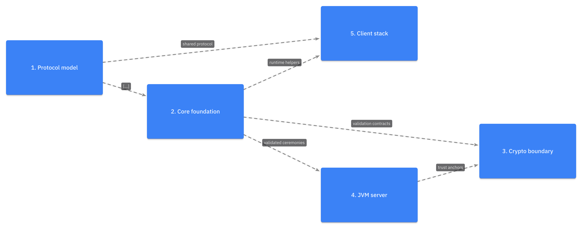
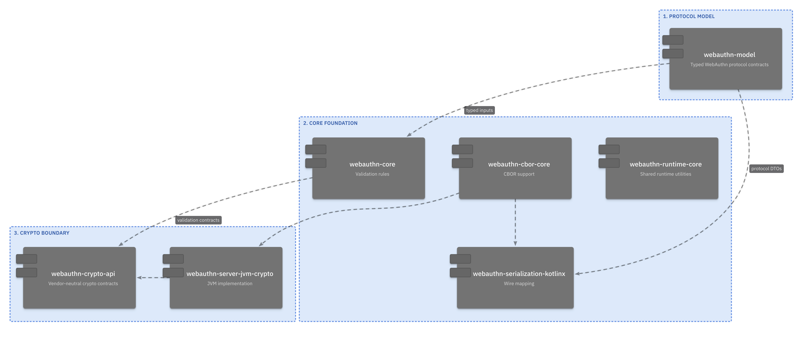
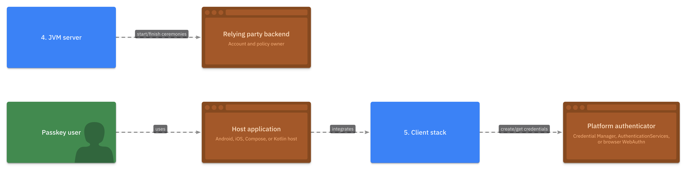

# LikeC4 Diagram Pilot

This pilot evaluates [LikeC4](https://likec4.dev/) as an architecture-model alternative
to the root Mermaid dependency graph. Unlike D2, LikeC4 defines a model once and projects
purpose-specific views from it. The pilot uses `v1.58.0`, Graphviz `dot` layout, and exported
PNG assets from LikeC4's Playwright-based renderer.

## What LikeC4 adds

- A single architecture model with many named views, including scoped and extendable views.
- Interactive navigation from high-level system orientation to focused module views.
- A generated static documentation site as well as PNG/JPEG, Mermaid, D2, DOT, PlantUML, and
  Draw.io exports.
- A first-party GitHub Action for website builds and image exports.

That is valuable when this repository needs a maintained architecture portal. It is heavier
than D2 or Mermaid for a few README diagrams because it brings a Node.js/Playwright toolchain.

## Rendered comparison

### Repository orientation: one model, one deliberately small view

| Current Mermaid | LikeC4 overview |
| --- | --- |
|  |  |

The LikeC4 overview intentionally renders only the five architecture layers and the
relationships an adopter needs. The full Gradle dependency graph remains authoritative but
is not a public overview diagram.

### Focused core view, generated from the same architecture model



### Addition: adopter integration context



## Model and view design

`src/architecture.c4` keeps all elements and relationships in one `model` block. Its three
views use explicit `include` predicates and per-view `autoLayout`:

| View | Intended question | Scope |
| --- | --- | --- |
| `repository_overview` | What are the five major responsibility layers? | Top-level layer elements only. |
| `core_dependencies` | How do the protocol, core, serialization, CBOR, and crypto modules depend on one another? | A focused exact subset. |
| `adopter_context` | Where do the host app, platform authenticator, backend, and library meet? | Consumer-facing integration surface. |

This model/view separation is the central advantage over generic diagram languages: the
repository can add a new focused view without duplicating elements or inventing a new diagram
source each time.

## Recommended repository workflow

- Keep the LikeC4 model in `docs/likec4/`; define views by the question they answer.
- Build the static site for interactive exploration, and export the few PNGs required by
  GitHub README files.
- Use local Graphviz (`--use-dot`) for large diagrams; LikeC4's bundled WASM layout is useful
  for quick local use but the native binary is the tested workflow here.
- Pin the LikeC4 CLI and its browser/runtime in CI. The official action can build the site or
  export images, but that is an additional Node/Playwright supply-chain surface.
- Do not model every Kotlin type or Gradle configuration. Keep the model at architectural
  responsibilities and public integration boundaries.

## Scorecard

| Criterion | Score | Evidence |
| --- | ---: | --- |
| Visual quality for architecture overviews | 4/5 | Clear layer orientation with labelled relationships; the web view is more useful than the static image. |
| Visual quality for focused dependencies | 4/5 | One model can create a detailed view without duplicating elements. |
| Visual quality for the complete graph | 3/5 | Better view control, but a complete module graph is still an anti-pattern for a README. |
| Architecture semantics | 5/5 | First-class model, named views, scopes, hierarchy, and navigation. |
| Source reviewability | 4/5 | Dedicated DSL is readable and separates model from views. |
| GitHub/doc delivery | 2/5 | GitHub needs committed PNG/SVG assets; no native fence renderer. |
| CI integration | 3/5 | First-party action exists, but PNG export requires Playwright and the tested layout uses Graphviz. |
| Long-term architecture portal | 5/5 | Static site, interactive drill-down, and many export formats are a real advantage. |
| Adoption cost | 2/5 | Node, Playwright, and a more deliberate model-maintenance practice are required. |

## Reproduce

```bash
tools/agent/render-likec4-pilot.sh
```

The script pins LikeC4, validates the model, exports PNGs, builds a static site as a smoke
test, and refreshes the Mermaid reference asset. It is intentionally not a required quality
gate until the repository chooses the extra toolchain.
