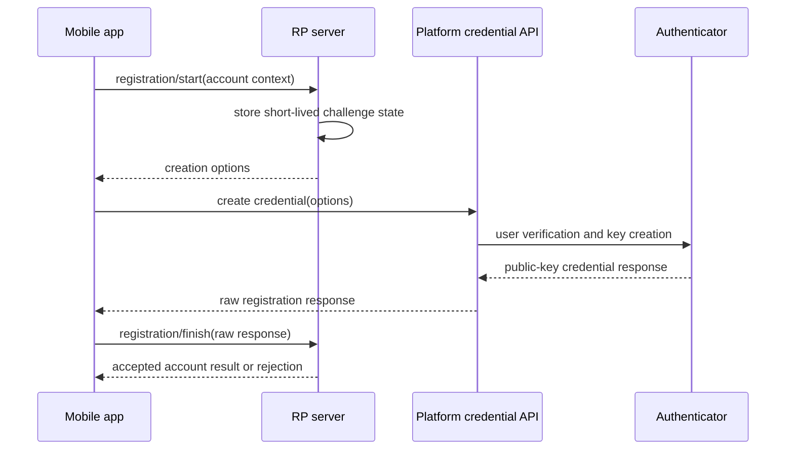

# Registration and authentication

WebAuthn defines two server-authoritative ceremonies. The authenticator creates or uses a credential, but the relying-party server decides whether the signed result satisfies its challenge, origin, RP ID, account, and policy constraints.

## Registration

<!-- doc-example: id=site-ceremonies-registration-1; owner=illustrative; verify=illustrative; audience=consumer; reason=Conceptual WebAuthn registration sequence -->

The private key stays with the authenticator. The server stores the public credential and its account binding after validation.

## Authentication

The server creates an assertion challenge. The authenticator signs authenticator data together with the hash of the exact `clientDataJSON`. The server resolves the credential, verifies the signature and signed context, applies ownership and policy, consumes ceremony state, and only then establishes a product session.

## Identified versus discoverable

An identified flow starts with an account hint and normally restricts `allowCredentials`. A discoverable flow starts without a username, lets the authenticator select a resident credential, and resolves the authoritative account after receiving the credential. Neither mode permits the client to assert account ownership.

## Cancellation and retries

User cancellation is expected control flow. A retry should start a fresh ceremony unless your backend explicitly supports safe reuse; never replay a signed response against a new challenge or silently resubmit a consumed finish request.
