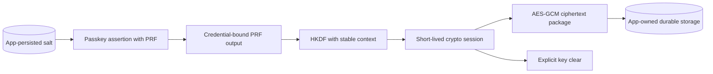

# PRF application crypto

The PRF extension can derive stable credential-bound output during an authentication ceremony. The optional `webauthn-client-prf-crypto` module turns that output into a short-lived AES-256 key session through HKDF-SHA256 and provides AES-GCM helpers.

## Ownership model

<!-- doc-example: id=site-prf-ownership-1; owner=illustrative; verify=illustrative; audience=consumer; reason=Shows application ownership around the PRF crypto helper -->

The application owns salt generation and persistence, stable context naming, associated data, ciphertext storage, key/session lifetime, recovery, credential migration, and fallback behavior. The module does not provide account recovery or a secure enclave policy.

## Safe sequence

1. Probe `PasskeyCapability.Extension(WebAuthnExtension.Prf)` at runtime.
2. Load or generate a per-policy salt and persist it independently of the ephemeral session.
3. Authenticate with PRF evaluation requested.
4. Keep the returned crypto session provisional until the server verifies the assertion. Clear it on rejection, cancellation, or a stale completion.
5. Use a stable, versioned derivation context. Encrypt with meaningful associated data and persist the complete `PrfCiphertext` package.
6. Clear the session in `finally` and on logout, actual backgrounding, and host disposal as appropriate. Temporary inactivity while the OS presents authentication is a different lifecycle event.

## Durable encrypted-note contract

The current demos keep salts and ciphertext in memory. They do not reopen encrypted data after process restart.
A durable recipe needs an app-owned contract and provider qualification before it becomes a demo feature.

A record must carry a schema version, stable derivation context, RP and application scope, the credential
association, PRF evaluation salt, nonce, authentication tag, ciphertext, and all associated-data bytes.
Bind the version, scope, credential association, and derivation inputs into authenticated associated data
using an unambiguous encoding; reconstruct and check those bytes when reopening the record. Treat salt and credential metadata as private application data even though
neither is the encryption key. Never persist the derived key, PRF output, or plaintext.

Validate the version, scope, canonical encodings, and size bounds before requesting authentication or
allocating large buffers. For a bounded example, allow a 32-byte salt, 12-byte GCM nonce, 16-byte tag,
16 KiB plaintext, and a 32 KiB serialized record. Reject unsupported versions and malformed data without
rewriting the file. Only the credential associated with the saved record may reopen it; an ordinary
successful sign-in with another passkey does not establish access to that ciphertext.

Use a fixed app-private filename and a platform atomic replacement primitive. Serialize save/delete
operations, keep the last valid record if replacement fails, and prevent an obsolete save from recreating
a deleted note. Define whether encrypted records participate in OS backup; a ciphertext backup is useful
only while its original credential and derivation inputs remain available. Deletion needs an explicit
user action and must not silently remove records that fail validation.

Before delivery, verify this matrix on each supported host:

| Case | Required result |
| --- | --- |
| Restart and authenticate with the saved credential | Same derivation inputs reopen the note after server verification. |
| Different credential or key | No plaintext is returned and the original record remains intact. |
| Changed scope, salt, metadata, ciphertext, or tag | Validation or authenticated decryption fails; no partial plaintext is shown. |
| Unsupported version, malformed encoding, or oversized record | Fail before authentication and leave stored bytes intact. |
| Missing record | Show an empty state without implying recoverable data exists. |
| Interrupted replacement | Reopening observes the previous complete record or the new complete record. |
| Delete during a pending save or authentication | The record stays deleted and late completion cannot restore a session. |
| Credential loss or replacement | Explain that the old encrypted data may be unrecoverable; never silently downgrade encryption. |

The feasibility assessment keeps this feature deferred until repeated PRF evaluation with the same
credential is qualified across restart on the intended Android and physical iPhone providers, and the
storage contract has a security review. This does not require a new vault, database, crypto backend,
or published library storage API.

## Migration and recovery

Version salts, contexts, and ciphertext formats. Decide how encrypted data migrates when a user adds, removes, or replaces passkeys. If the only usable credential disappears, derived data may be unrecoverable. A fallback that silently downgrades protection is not a recovery design.

## Platform limits

PRF requires runtime platform and authenticator support and can have a higher OS minimum than base passkey ceremonies. Check the generated [platform support matrix](../reference/platform-support.md) and test with the exact production provider and device mix.

The module's staged [artifact page](../reference/modules/webauthn-client-prf-crypto.md) contains a compile-checked end-to-end example.
