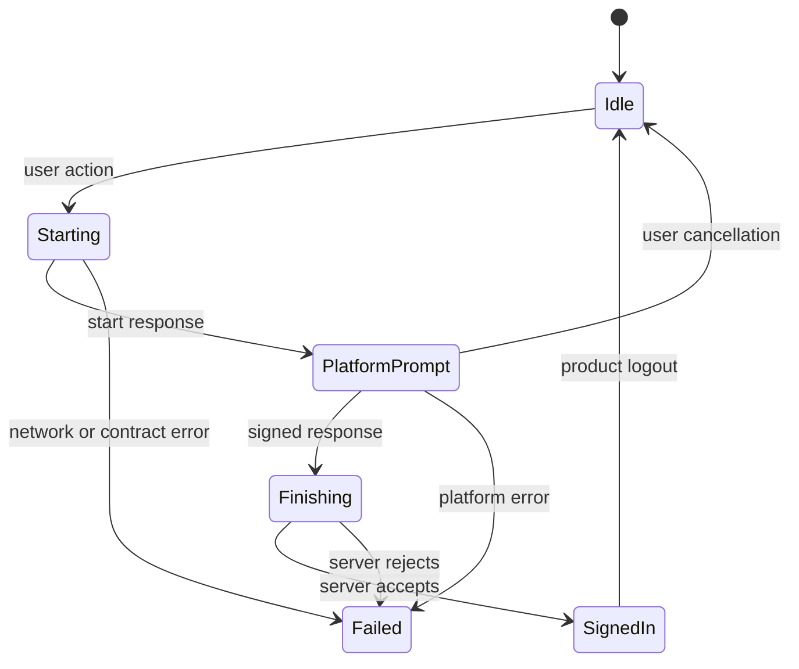

# Compose Multiplatform

The Compose adapter creates and remembers a passkey client and flow without placing product state inside the library. Use it at a stable screen or feature boundary and keep the active ceremony visible to users.

## Lifecycle model

<!-- doc-example: id=site-compose-lifecycle-1; owner=illustrative; verify=illustrative; audience=consumer; reason=Shows the lifecycle ownership split between Compose UI and passkey libraries -->


Your UI should disable duplicate actions while a ceremony is active, expose cancellation as a normal outcome, and avoid retaining response payloads in logs or saveable UI state.

## Minimal state wiring

The repository sample keeps the flow stable across recomposition and leaves coordinator, session, and presentation state in the app.

<!-- doc-example: id=site-compose-kotlin-1; owner=sample; verify=sample-build; audience=consumer; source=sample/compose-passkey/src/commonMain/kotlin/dev/webauthn/samples/composepasskey/ui/screens/auth/AuthRoute.kt#compose-sample-auth-route -->
```kotlin
    val flow = rememberPasskeyFlow(passkeyClient)
    val scope = rememberCoroutineScope()
    val coordinator = remember(config, debugLogs, sessionStore, credentialSignalClient) {
        AuthDemoCoordinator(
            config = config,
            debugLogs = debugLogs,
            sessionStore = sessionStore,
            credentialSignalClient = credentialSignalClient,
        )
    }
    var state by remember { mutableStateOf<DemoCeremonyState>(DemoCeremonyState.Idle) }
    val canRegister by coordinator.canRegister.collectAsState()
    val actionsEnabled = areCeremonyActionsEnabled(state)
```

## Integration rules

- Construct platform-dependent objects only when their host is ready.
- Launch ceremonies from a user gesture in a lifecycle-aware coroutine.
- Let coroutine cancellation propagate; do not remap it to a platform failure.
- Prevent concurrent register/sign-in calls for the same screen state.
- Keep raw WebAuthn responses, PRF outputs, and session secrets out of snapshots and analytics.
- Treat previews as static UI contracts, not platform-prompt proof.

For a runnable host, open the staged [Compose passkey sample](../guides/samples/compose-passkey.md). For deeper state guidance, see [Compose lifecycle and UI state](../guides/compose-lifecycle.md).
