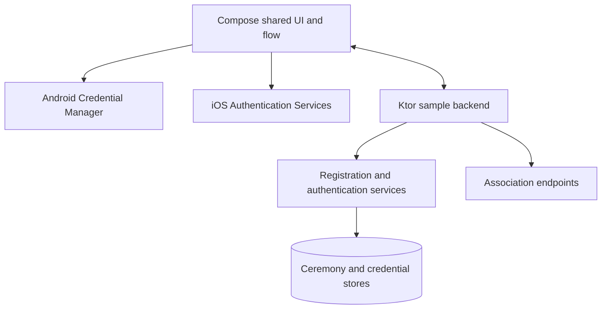

# Full mobile + backend sample

The repository includes a Compose Multiplatform app, Android and iOS hosts, and a Ktor backend. This is the fastest way to observe the complete registration and authentication boundary before integrating individual modules.

## Topology

<!-- doc-example: id=site-full-stack-topology-1; owner=illustrative; verify=illustrative; audience=consumer; reason=Shows the runnable sample components and network flow -->


## Local Android path

Start the backend:

<!-- doc-example: id=site-full-stack-bash-1; owner=markdown; verify=syntax; audience=consumer -->
```bash
./gradlew :sample:backend-ktor:run
```

Install the Android host against the emulator's host alias. On Android 17, direct private-network endpoints require the platform's local-network permission; the committed sample requests it only when the flag below is enabled.

<!-- doc-example: id=site-full-stack-bash-2; owner=markdown; verify=syntax; audience=consumer -->
```bash
WEBAUTHN_DEMO_ENDPOINT=http://10.0.2.2:8080 \
WEBAUTHN_DEMO_REQUEST_LOCAL_NETWORK_PERMISSION=true \
./gradlew :sample:compose-passkey-android:installDebug
```

The base libraries and the PRF-enabled sample intentionally have different Android minimums. Read the generated [platform support matrix](../reference/platform-support.md).

## Physical-device path

Use the repository helper to start the server with a public HTTPS tunnel and synchronize local sample settings:

<!-- doc-example: id=site-full-stack-bash-3; owner=markdown; verify=syntax; audience=consumer -->
```bash
./sample/backend-ktor/start-server.sh
```

For iOS, open the committed Xcode project, configure your signing team and bundle ID, and run it on a physical device. Complete ceremonies require a domain association that matches that signed identity.

## What to exercise

1. Register a new passkey.
2. Sign out locally and authenticate with the registered passkey.
3. Cancel a prompt and confirm the UI returns to idle.
4. Repeat or replay a finish request and confirm the server rejects it.
5. Observe capability results before enabling PRF-dependent actions.
6. Review logs without enabling sensitive HTTP body logging.

Detailed operational notes live in the staged [Compose app guide](../guides/samples/compose-passkey.md) and [backend sample guide](../guides/samples/backend-ktor.md).
