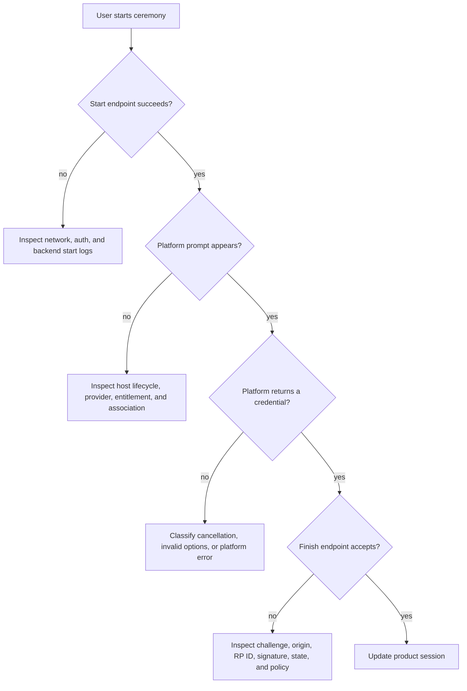

# Mobile troubleshooting

Diagnose the first failing boundary. A generic “passkey error” often hides whether the failure occurred before the platform prompt, inside the platform API, in transport, or during authoritative server validation.

## Boundary-first flow

<!-- doc-example: id=site-troubleshooting-flow-1; owner=illustrative; verify=illustrative; audience=consumer; reason=Decision flow for locating a mobile passkey failure -->

## Collect safe evidence

Capture the platform, OS version, Android package or iOS bundle identity, signing environment, RP ID, endpoint host, result category, and the first causal server or platform error. Do not capture raw attestation objects, authenticator data, signatures, PRF output, cookies, bearer tokens, or full request/response bodies in shared logs.

## Frequent causes

### The prompt never appears

Check the foreground host, Activity/window availability, configured provider, device lock, account state, entitlements, and association files. If start options are malformed, the client can reject them before prompting.

### Registration works but authentication does not

Confirm the credential is stored under the account being queried, the authentication allow-list or discoverable-credential policy is intentional, and the server resolves the returned credential ID to the correct user and RP.

### Works locally, fails on production domain

Fetch the deployed association documents over HTTPS, verify redirects and content type behavior, and compare the exact signed app identity. Also compare production RP ID and allowed origins with the values used to generate the ceremony.

### Cancellation becomes an error banner

Preserve the typed cancellation outcome through shared Kotlin and the host facade. Reset active UI state without automatic retry.

### Finish is rejected

Inspect server-side validation. Common boundaries include expired or consumed ceremony state, challenge mismatch, unexpected origin, RP ID hash mismatch, credential/account mismatch, signature failure, and policy rejection.
