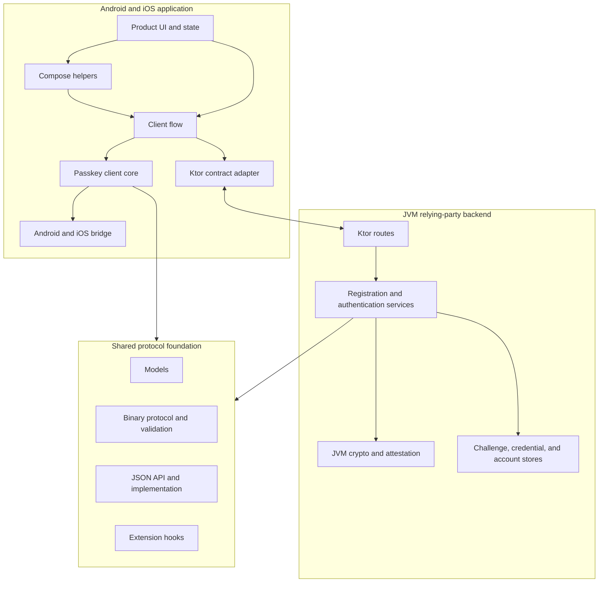

# Architecture

The repository uses replaceable layers. The recommended mobile stack follows the main path; lower-level modules remain available for custom transports, codecs, verification, and persistence.

<!-- doc-example: id=site-architecture-1; owner=illustrative; verify=illustrative; audience=consumer; reason=Public module-layer architecture with mobile-first reading order -->

## Dependency direction

High-level modules depend inward on neutral contracts. Default implementations are opt-in where replacement is useful: Kotlinx JSON, Ktor payloads, JVM crypto, and Exposed stores do not need to become mandatory dependencies of every lower layer.

## Trust direction

The platform returns untrusted raw credential data. The mobile flow transports it without becoming a verifier. Server services decode signed client data, bind it to one-time state, perform cryptographic verification, apply account and policy checks, and only then return an application output.

## Generated detail

Use the [artifact catalog](modules.md) for per-module responsibilities and the [API reference](api.md) for symbols and signatures.
