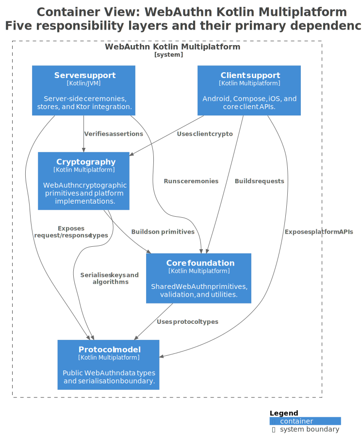
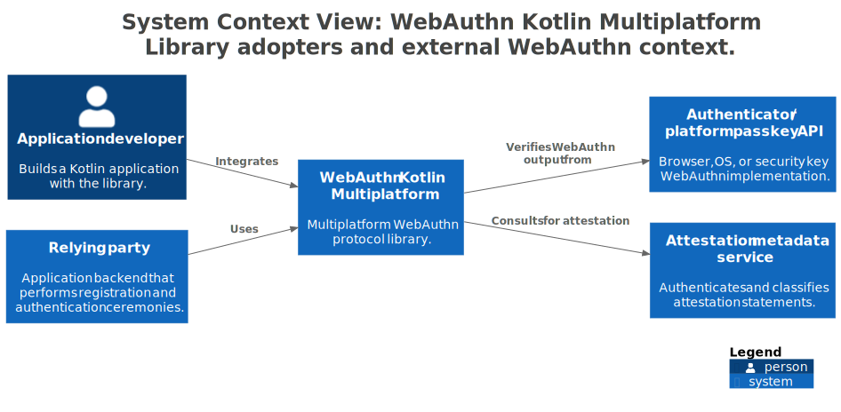
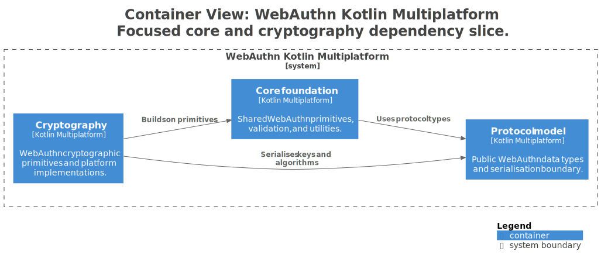

# Structurizr DSL diagram pilot

This pilot evaluates Structurizr as **architecture-as-code**, using C4-style
elements and relationships rather than using a graph language as a drawing
format. It intentionally tests both outputs that matter in a pull request:
the static C4-PlantUML export committed below and the browser-native Structurizr
workspace used for exploration.

## Rendered comparison

| Current Mermaid module graph | Structurizr container overview |
| --- | --- |
|  |  |
| Exact module graph, but it mixes every concern in one drawing. | Five C4 containers with typed technology and relationship labels. Better system vocabulary, though the auto-layout is not inherently more decorative. |

| Structurizr system context | Structurizr focused core slice |
| --- | --- |
|  |  |
| Keeps the relying party, platform authenticator, and metadata service out of the repository topology view. | A three-container dependency slice for protocol model, foundation, and cryptography. |

## What was actually tested

- `src/workspace.dsl` validates with **Structurizr CLI 2025.11.09**.
- The render script exports the same DSL as C4-PlantUML, renders SVG with
  PlantUML, and regenerates the Mermaid baseline.
- Structurizr's direct CLI export is intentionally not described as a native
  SVG renderer: its own documentation puts browser-native PNG/SVG output in a
  headless-browser workflow. The committed assets are therefore explicitly
  labelled `Structurizr DSL + C4-PlantUML export` in review discussion.
- The model expresses a **logical architecture**, not a line-by-line Gradle
  module graph. That is a feature for system-level views and a limitation for
  module dependency auditing.

## Reproduce

Install the Structurizr CLI and PlantUML, then run:

```bash
STRUCTURIZR_CLI=/path/to/structurizr.sh tools/agent/render-structurizr-pilot.sh
```

The script needs Mermaid CLI only to regenerate the current baseline. It
leaves no PlantUML intermediate files in the committed asset directory.

## Scorecard

| Criterion | Result | Evidence / implication |
| --- | --- | --- |
| System/context communication | **5/5** | People, external systems, and technology can be first-class model elements. |
| Logical architecture semantics | **5/5** | C4 element types and relationships make the source a useful architecture record. |
| Polished static overview | **3/5** | The C4-PlantUML export is clean but not visually richer than D2 or LikeC4's browser experience. |
| Exact Gradle-module dependency view | **2/5** | The semantic model deliberately abstracts many modules; modelling every module would reproduce graph density. |
| Interactive exploration | **5/5** | Structurizr's native workspace supports view navigation and richer documentation; static SVG does not convey that benefit. |
| GitHub review delivery | **3/5** | Committed static assets work in a PR; a full interactive workspace needs hosting or a local runtime. |
| CI / hermeticity | **2/5** | CLI plus PlantUML is reproducible, but native browser exports require a browser runtime and current local tooling is heavier. |
| Project maturity / governance | **5/5** | Long-lived, C4-led ecosystem with strong modelling discipline. |
| Adoption cost | **2/5** | Highest learning and operational cost of the pilots; only justified if the architecture model becomes a maintained product. |

## Bottom line

Use Structurizr when the goal is a durable C4 architecture model with context,
container, component, and documentation views. Do not choose it merely to make
the existing all-module Mermaid graph prettier in GitHub.
