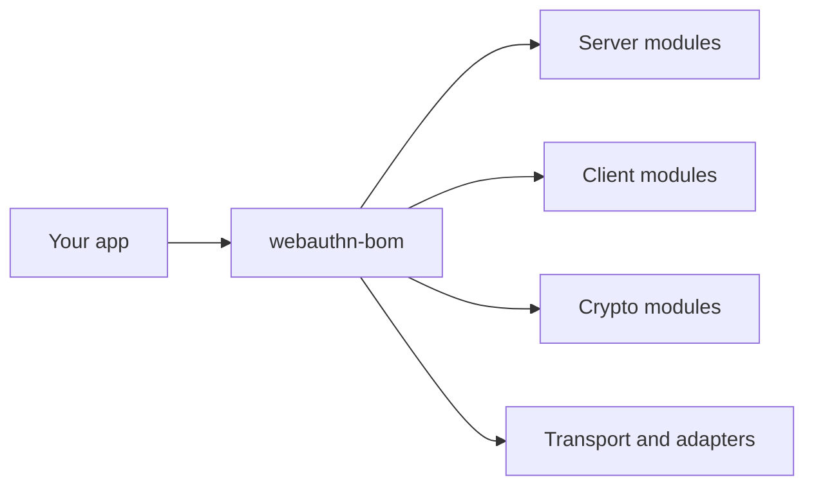

# webauthn-bom

This BOM aligns versions across published WebAuthn Kotlin Multiplatform artifacts so mixed-module apps stay on one tested release train.

## What it provides

- A single platform dependency: `io.github.szijpeter:webauthn-bom:<version>`
- Version alignment for server, client, crypto, transport, and adapter modules
- Safer upgrades when you consume multiple WebAuthn artifacts together
- Alignment for shared runtime/foundation artifacts used across modules, including:
  - `io.github.szijpeter:webauthn-cbor-core`
  - `io.github.szijpeter:webauthn-runtime-core`

## When to use

Use this by default in JVM or Android dependency configurations when your project depends on two or more
WebAuthn artifacts. Kotlin Multiplatform common and Native source sets should use the same explicit release
version on each coordinate because Java Platform constraints are not available to Native variants.

Skip it only when you intentionally pin every artifact version manually.

## How to use

<!-- doc-example: id=platform-bom-readme-kotlin-1; owner=configuration; verify=consumer-compile; audience=consumer; source=documentation/consumer-smoke/server/build.gradle.kts.template#consumer-server-dependencies -->
```kotlin
dependencies {
    implementation(platform("io.github.szijpeter:webauthn-bom:<version>"))
    implementation("io.github.szijpeter:webauthn-server-core-jvm")
    implementation("io.github.szijpeter:webauthn-server-jvm-crypto")
    implementation("io.github.szijpeter:webauthn-server-ktor")
}
```

## Fit in the system

<!-- doc-example: id=platform-bom-readme-mermaid-1; owner=illustrative; verify=illustrative; audience=consumer; reason=Diagram is rendered by the Markdown host -->


## Pitfalls and limits

- BOM aligns versions in compatible JVM and Android configurations; it does not add transitive runtime features by itself.
- Use explicit coordinated versions in Kotlin Multiplatform common and Native source sets.
- If you override one artifact version explicitly, you can reintroduce skew.

## Status

Release-train alignment artifact for the public surface.
