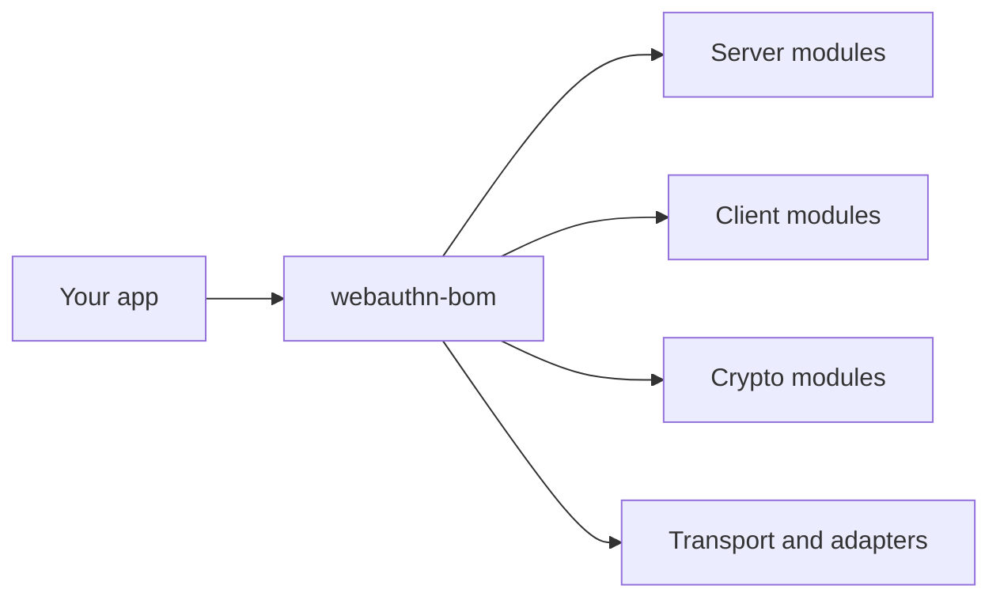

# webauthn-bom

This BOM aligns versions across published WebAuthn Kotlin Multiplatform artifacts so mixed-module apps stay on one tested release train.

## What it provides

- A single platform dependency: `io.github.szijpeter:webauthn-bom:<version>`
- Version alignment for server, client, crypto, transport, and adapter modules
- Safer upgrades when you consume multiple WebAuthn artifacts together

## When to use

Use this by default when your project depends on two or more WebAuthn artifacts.

Skip it only when you intentionally pin every artifact version manually.

## How to use

```kotlin
dependencies {
    implementation(platform("io.github.szijpeter:webauthn-bom:<version>"))

    implementation("io.github.szijpeter:webauthn-server-core-jvm")
    implementation("io.github.szijpeter:webauthn-server-jvm-crypto")
    implementation("io.github.szijpeter:webauthn-client-core")
    implementation("io.github.szijpeter:webauthn-client-android")
}
```

## Fit in the system



## Pitfalls and limits

- BOM aligns versions; it does not add transitive runtime features by itself.
- If you override one artifact version explicitly, you can reintroduce skew.

## Status

Release-train alignment artifact for the public surface.
