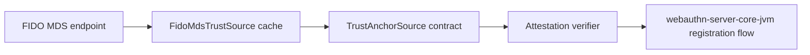

# webauthn-attestation-mds

Optional FIDO Metadata Service trust-source integration for attestation verification.

## What it provides

- `FidoMdsTrustSource`
- Metadata fetch + cache refresh workflow
- `TrustAnchorSource` implementation that can plug into attestation verification

## When to use

Use this when your backend wants attestation trust rooted in FIDO MDS metadata instead of only local trust anchors.

## How to use

```kotlin
import dev.webauthn.attestation.mds.FidoMdsTrustSource

suspend fun buildTrustSource(): FidoMdsTrustSource {
    val trustSource = FidoMdsTrustSource(
        httpClient = httpClient,
        metadataUrl = metadataUrl,
        nowEpochSeconds = { System.currentTimeMillis() / 1000 },
    )

    // Required first load: cache starts empty until an initial refresh.
    trustSource.refreshIfStale(maxAgeSeconds = 0)
    return trustSource
}
```

Real-world scenario: regulated environments can enforce attestation policy from fresh MDS metadata while keeping ceremony orchestration unchanged.

## How it fits



## Pitfalls and limits

- Initial refresh is mandatory before first use.
- Cache lifecycle and refresh policy are operational decisions you must own.
- This module is optional; attestation strategy stays deployment-specific.

## Status

Beta, optional trust-source module.
