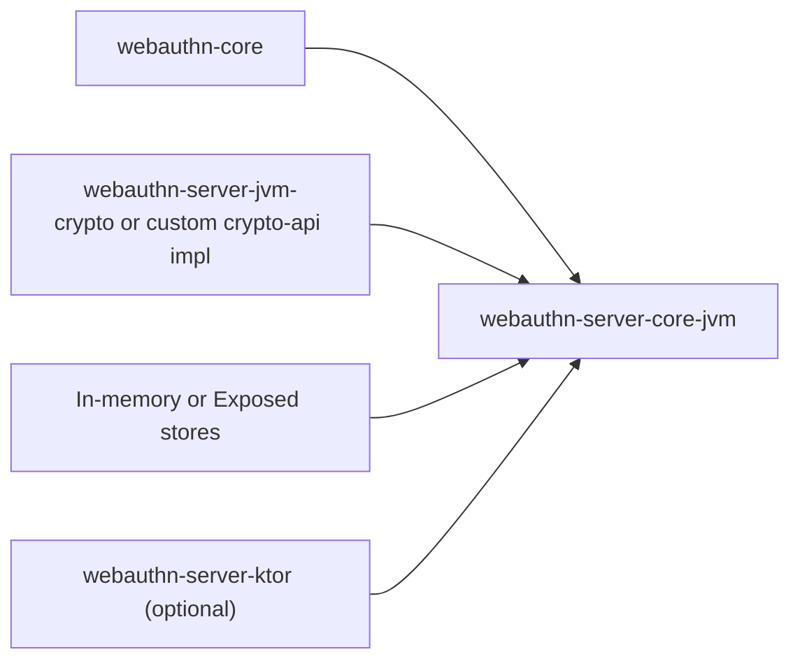

# webauthn-server-core-jvm

Typed JVM ceremony services and store contracts for WebAuthn registration and authentication.

## What it provides

- `RegistrationService` and `AuthenticationService`
- Challenge, credential, and user-account store interfaces
- In-memory store implementations for development/testing
- Ceremony orchestration decoupled from web framework concerns
- Unified authentication start semantics:
  - `AuthenticationStartRequest.userName != null`: identified-account flow with populated `allowCredentials`
  - `AuthenticationStartRequest.userName == null`: discoverable flow with empty `allowCredentials`

## When to use

Use this when you want to implement WebAuthn server flows in JVM/Kotlin, with or without Ktor adapters.

## How to use

```kotlin
import dev.webauthn.server.AuthenticationService
import dev.webauthn.server.InMemoryChallengeStore
import dev.webauthn.server.InMemoryCredentialStore
import dev.webauthn.server.InMemoryUserAccountStore
import dev.webauthn.server.RegistrationService
import dev.webauthn.server.crypto.JvmRpIdHasher
import dev.webauthn.server.crypto.JvmSignatureVerifier
import dev.webauthn.server.crypto.StrictAttestationVerifier

val challengeStore = InMemoryChallengeStore()
val credentialStore = InMemoryCredentialStore()
val userStore = InMemoryUserAccountStore()

val registrationService = RegistrationService(
    challengeStore = challengeStore,
    credentialStore = credentialStore,
    userAccountStore = userStore,
    attestationVerifier = StrictAttestationVerifier(),
    rpIdHasher = JvmRpIdHasher(),
)

val authenticationService = AuthenticationService(
    challengeStore = challengeStore,
    credentialStore = credentialStore,
    userAccountStore = userStore,
    signatureVerifier = JvmSignatureVerifier(),
    rpIdHasher = JvmRpIdHasher(),
)
```

Real-world scenario: run start/finish ceremonies in your backend service layer, then expose them via Ktor routes or your own HTTP transport.

## How it fits



## Pitfalls and limits

- Services depend on correctly implemented store semantics (challenge expiry, credential lookup, counter updates).
- Registration and authentication keep shared fail-fast origin/session handling internally, so callers should expect matching origin-mismatch behavior across both ceremony types.
- `RegistrationService.finish()` now returns a typed validation error when the user disappears between start and finish instead of throwing from the user store lookup.
- Authentication challenge sessions allow nullable `userName` for discoverable ceremonies, while named-mode finish still enforces credential ownership for the resolved account.
- This module does not define your HTTP contract by itself.

## Status

Beta, production-leaning ceremony orchestration.
