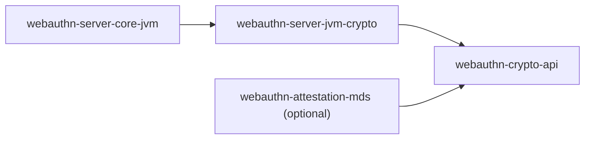

# webauthn-server-jvm-crypto

Default JVM crypto backend for the server stack.

## What it provides

- `JvmRpIdHasher`
- `JvmSignatureVerifier`
- `StrictAttestationVerifier`
- Signum-first implementation choices for hashing/signature/attestation paths

## When to use

Use this when you want production-leaning JVM defaults instead of implementing `webauthn-crypto-api` yourself.

## How to use

<!-- doc-example: id=server-webauthn-server-jvm-crypto-readme-kotlin-1; owner=source; verify=consumer-compile; audience=consumer; source=documentation/examples/src/jvmMain/kotlin/dev/webauthn/documentation/examples/ServerCryptoExample.kt#server-jvm-crypto -->
```kotlin
import dev.webauthn.crypto.AttestationVerifier
import dev.webauthn.crypto.RpIdHasher
import dev.webauthn.crypto.SignatureVerifier
import dev.webauthn.server.crypto.JvmRpIdHasher
import dev.webauthn.server.crypto.JvmSignatureVerifier
import dev.webauthn.server.crypto.StrictAttestationVerifier

/** Default JVM cryptographic dependencies for server ceremonies. */
data class ServerCrypto(
    val rpIdHasher: RpIdHasher,
    val signatureVerifier: SignatureVerifier,
    val attestationVerifier: AttestationVerifier,
)

fun serverCrypto(): ServerCrypto {
    val rpIdHasher = JvmRpIdHasher()
    val signatureVerifier = JvmSignatureVerifier()
    val attestationVerifier = StrictAttestationVerifier(signatureVerifier = signatureVerifier)
    return ServerCrypto(rpIdHasher, signatureVerifier, attestationVerifier)
}
```

Real-world scenario: wire these defaults into `RegistrationService` and `AuthenticationService` so your backend can verify assertions immediately without custom crypto plumbing.

## How it fits

<!-- doc-example: id=server-webauthn-server-jvm-crypto-readme-mermaid-1; owner=illustrative; verify=illustrative; audience=consumer; reason=Diagram is rendered by the Markdown host -->


## Pitfalls and limits

- This module is JVM-specific and not a multiplatform crypto abstraction.
- Attestation CBOR parsing depends on shared strict scanner primitives from `webauthn-cbor-core`.
- If you need non-default trust policy, compose with custom `TrustAnchorSource` or verifier implementations.

## Status

Beta, Signum-first JVM backend crypto.
