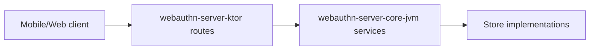

# webauthn-server-ktor

Ktor route adapters for the JVM ceremony services.

## What it provides

- `installWebAuthnRoutes(...)` route wiring
- Default `/webauthn/*` endpoint contract for start/finish flows
- Thin transport layer on top of `RegistrationService` and `AuthenticationService`

## When to use

Use this when your backend is Ktor-based and you want ready-made WebAuthn routes instead of hand-rolling each endpoint.

## How to use

<!-- doc-example: id=server-webauthn-server-ktor-readme-kotlin-1; owner=source; verify=consumer-compile; audience=consumer; source=documentation/examples/src/jvmMain/kotlin/dev/webauthn/documentation/examples/KtorServerExample.kt#ktor-routes -->
```kotlin
import dev.webauthn.server.AuthenticationService
import dev.webauthn.server.RegistrationService
import dev.webauthn.server.ktor.installWebAuthnRoutes
import io.ktor.server.application.Application

fun Application.installPasskeyRoutes(
    registrationService: RegistrationService,
    authenticationService: AuthenticationService,
) {
    installWebAuthnRoutes(registrationService, authenticationService)
}
```

Real-world scenario: ship passkey backend endpoints quickly, while keeping policy and persistence in `webauthn-server-core-jvm`.

## How it fits

<!-- doc-example: id=server-webauthn-server-ktor-readme-mermaid-1; owner=illustrative; verify=illustrative; audience=consumer; reason=Diagram is rendered by the Markdown host -->


## Pitfalls and limits

- Route shape is opinionated; use custom routes if your API contract differs.
- `POST /webauthn/authentication/start` uses a single payload shape with optional `userName`:
  - present `userName`: identified-account flow
  - omitted/null `userName`: discoverable flow
- Authentication-start payloads intentionally do not include `userHandle`.
- Registration-start payloads accept optional `residentKey` (`discouraged`, `preferred`, `required`) and pass it through to server-core options assembly.
- Security still depends on your deployment controls (TLS, auth/session, CSRF posture).

## Status

Beta, thin Ktor transport adapter.
