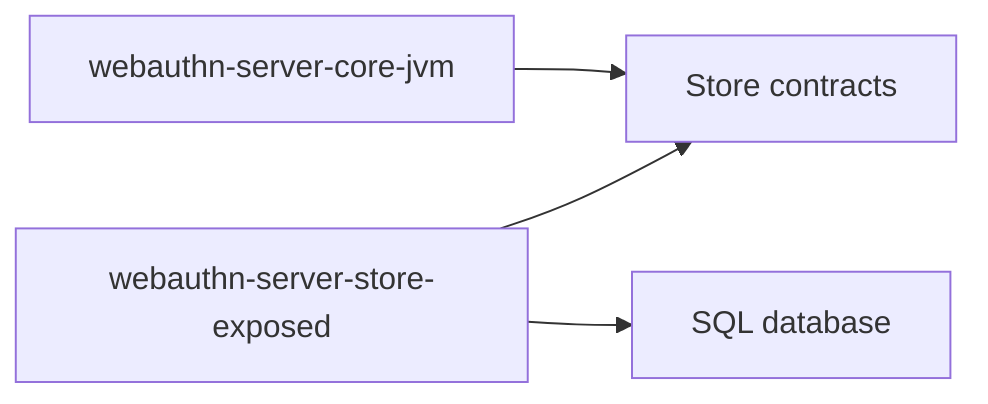

# webauthn-server-store-exposed

Exposed-backed persistence adapters for server-core store contracts.

## What it provides

- `ExposedChallengeStore`
- `ExposedCredentialStore`
- `ExposedUserAccountStore`
- `initializeWebAuthnSchema(database)` bootstrap helper

## When to use

Use this when your JVM backend already uses Exposed/JDBC and you want persistent WebAuthn state.

## How to use

<!-- doc-example: id=server-webauthn-server-store-exposed-readme-kotlin-1; owner=source; verify=consumer-compile; audience=consumer; source=documentation/examples/src/jvmMain/kotlin/dev/webauthn/documentation/examples/ExposedStoreExample.kt#exposed-stores -->
```kotlin
import dev.webauthn.server.ChallengeStore
import dev.webauthn.server.CredentialStore
import dev.webauthn.server.UserAccountStore
import dev.webauthn.server.store.exposed.ExposedChallengeStore
import dev.webauthn.server.store.exposed.ExposedCredentialStore
import dev.webauthn.server.store.exposed.ExposedUserAccountStore
import dev.webauthn.server.store.exposed.initializeWebAuthnSchema
import org.jetbrains.exposed.v1.jdbc.Database

/** Stores required by the server ceremony services. */
data class PasskeyStores(
    val challenges: ChallengeStore,
    val credentials: CredentialStore,
    val users: UserAccountStore,
)

fun passkeyStores(database: Database): PasskeyStores {
    initializeWebAuthnSchema(database)
    return PasskeyStores(
        challenges = ExposedChallengeStore(database),
        credentials = ExposedCredentialStore(database),
        users = ExposedUserAccountStore(database),
    )
}
```

Real-world scenario: replace in-memory stores in production so ceremonies survive process restarts and can scale horizontally.

## How it fits

<!-- doc-example: id=server-webauthn-server-store-exposed-readme-mermaid-1; owner=illustrative; verify=illustrative; audience=consumer; reason=Diagram is rendered by the Markdown host -->


## Pitfalls and limits

- You still own migrations, backup, and operational DB concerns.
- Schema/bootstrap is not a substitute for full lifecycle migration tooling in mature deployments.

## Status

Beta, contract-tested Exposed storage adapter.
