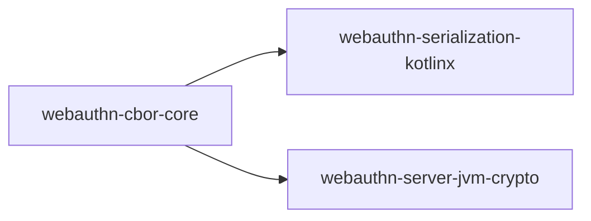

# webauthn-cbor-core

Audience: maintainers and advanced integrators needing strict CBOR byte-scanning primitives shared by parser modules.

## What it provides

- Shared strict CBOR byte-scanning helpers
- Support utilities reused by serialization and JVM crypto modules

## When to use

Use this module when a parser/validator needs low-level strict CBOR traversal utilities (header/length reads, item skipping, typed value extraction) without depending on higher-level DTO mappers.

## How it fits in the system

## Stability expectations

- APIs are public and intended for reuse by parser modules.
- Semantics remain strict by design (minimal-encoding rejection and overflow-safe bounds checks).

## Status

Beta, shared CBOR parser primitive module.
