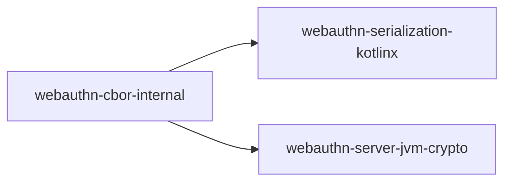

# webauthn-cbor-internal

Maintainer-focused internal CBOR helper module.

## What it provides

- Shared internal CBOR byte-scanning helpers
- Support utilities reused by serialization and JVM crypto modules

## Intended use

This module is published only to satisfy transitive dependency resolution for public artifacts.
Direct app usage is not recommended.

## Internal dependency role

## Stability expectations

- API stability is not guaranteed.
- Maintainers can change internal contracts as needed for upstream modules.

## Status

Published internal helper module.
