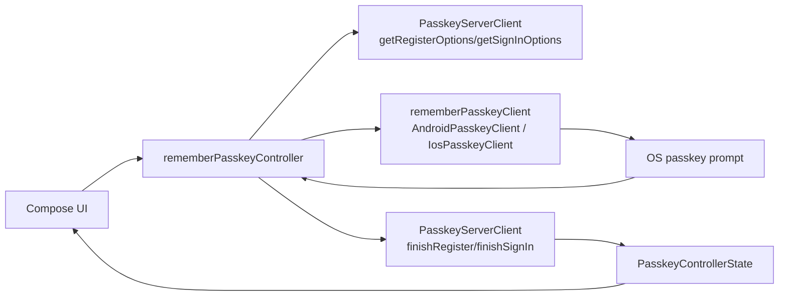

# webauthn-client-compose

Audience: Compose apps that want remembered passkey clients and controller helpers.

## What it provides

- `rememberPasskeyClient()` to create a platform `PasskeyClient` in Compose.
- `rememberPasskeyController(...)` to create and retain a `PasskeyController` bound to your server client.
- Android/iOS `actual` platform wiring behind one Compose-facing API.



## UI integration pattern

Use this module when your app UI is Compose-based and you want lifecycle-safe passkey orchestration without manually wiring platform bridges on each screen.

## How to use

A realistic screen binds controller state to UI and triggers register/sign-in actions from button callbacks.

```kotlin
import androidx.compose.runtime.Composable
import androidx.compose.runtime.collectAsState
import androidx.compose.runtime.getValue
import androidx.compose.runtime.rememberCoroutineScope
import dev.webauthn.client.PasskeyControllerState
import dev.webauthn.client.PasskeyServerClient
import dev.webauthn.client.compose.rememberPasskeyController
import kotlinx.coroutines.launch

@Composable
fun <R, S> PasskeyScreen(
    serverClient: PasskeyServerClient<R, S>,
    registerParams: R,
    signInParams: S,
) {
    val scope = rememberCoroutineScope()
    val controller = rememberPasskeyController(serverClient = serverClient)
    val uiState by controller.uiState.collectAsState()

    val busy = uiState is PasskeyControllerState.InProgress

    // Example event handlers
    fun onRegisterClick() = scope.launch { controller.register(registerParams) }
    fun onSignInClick() = scope.launch { controller.signIn(signInParams) }

    // Render busy/success/error states from uiState in your Compose UI tree.
}
```

Practical notes:

- Keep `serverClient` stable (for example `remember(...)`) to avoid unnecessary controller recreation.
- Render explicit UX for `InProgress`, `Success`, and `Failure` states.
- `rememberPasskeyClient()` can be used directly when you need raw `PasskeyClient` operations outside controller flows.

## Module fit

- Thin Compose adapter on top of `webauthn-client-core`.
- Delegates to `webauthn-client-android` on Android and `webauthn-client-ios` on iOS.
- Commonly paired with `webauthn-network-ktor-client` for default `/webauthn/*` backend contracts.

## Limits

- Does not replace backend ceremony verification or policy checks.
- Does not own networking retries/auth/session behavior.
- Provides orchestration helpers, not a full UI framework.

## Status

Beta, lightweight Compose integration helpers.
