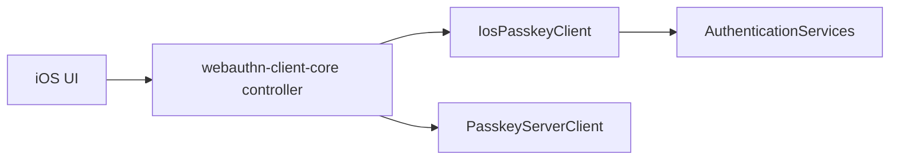

# webauthn-client-ios

iOS platform bridge for passkey operations using AuthenticationServices.

## What it provides

- `IosPasskeyClient`
- iOS `PasskeyClient` implementation for registration and authentication
- Platform integration layer intended to be used with `webauthn-client-core`
- Capabilities reporting for supported extensions (PRF on iOS 18+, largeBlob) and platform features

## When to use

Use this in iOS apps that need native passkey flows through AuthenticationServices.

## How to use

```kotlin
import dev.webauthn.client.ios.IosPasskeyClient

val client = IosPasskeyClient()
```

Real-world scenario: shared business logic drives start/finish and state management, while this module owns platform credential prompts.

## How it fits



## Limits and notes

- Platform passkey flows are supported.
- Registration request selection is explicit:
  - `authenticatorAttachment = null` or `platform` requests platform registration.
  - `authenticatorAttachment = cross-platform` requests security-key registration on iOS 15+.
- On iOS 18+ runtime APIs, assertion PRF input supports shared `prf.eval` and per-credential `prf.evalByCredential`; malformed keys are rejected as invalid options.
- `attestation` is forwarded as requested by callers; this module does not silently coerce `direct` to `none`. Apple platform behavior still determines the concrete attestation object returned at runtime.

## Status

Beta, thin iOS bridge on top of shared client orchestration.
