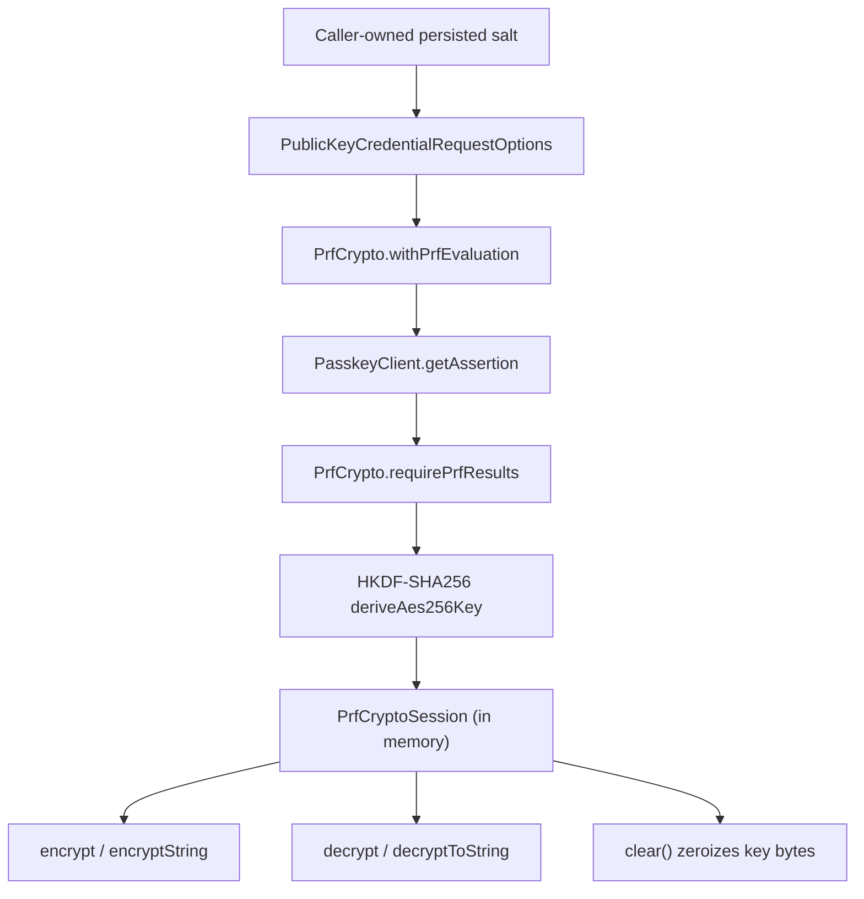

# webauthn-client-prf-crypto

Audience: teams implementing client-side encryption flows derived from WebAuthn PRF assertion outputs.

## What it provides

- PRF request wiring on `PublicKeyCredentialRequestOptions`.
- PRF result extraction from `AuthenticationResponse`.
- HKDF-SHA256 deterministic AES-256 key derivation.
- AES-GCM encrypt/decrypt helpers and zeroizable `PrfCryptoSession`.
- `PrfCryptoClient.authenticateWithPrf(...)` for assertion + session derivation in one call.



## When to use

Use this module when app data must be encrypted with a key derived from a successful user-authenticated passkey assertion and your app is responsible for salt persistence/lifecycle policy.

## How to use

This flow checks PRF capability, authenticates with PRF, encrypts payload data, and returns the full AEAD payload for later decryption.

```kotlin
import dev.webauthn.client.PasskeyCapability
import dev.webauthn.client.PasskeyClient
import dev.webauthn.client.PasskeyClientError
import dev.webauthn.client.PasskeyResult
import dev.webauthn.client.prf.PrfCiphertext
import dev.webauthn.client.prf.PrfCryptoClient
import dev.webauthn.model.AuthenticationExtensionsPRFValues
import dev.webauthn.model.Base64UrlBytes
import dev.webauthn.model.ExperimentalWebAuthnL3Api
import dev.webauthn.model.PublicKeyCredentialRequestOptions
import dev.webauthn.model.WebAuthnExtension

@OptIn(ExperimentalWebAuthnL3Api::class)
suspend fun authenticateAndEncrypt(
    passkeyClient: PasskeyClient,
    requestOptions: PublicKeyCredentialRequestOptions,
    persistedSalt: Base64UrlBytes,
    plaintext: String,
): PasskeyResult<PrfCiphertext> {
    if (!passkeyClient.capabilities().supports(PasskeyCapability.Extension(WebAuthnExtension.Prf))) {
        return PasskeyResult.Failure(PasskeyClientError.InvalidOptions("PRF is not supported on this platform/authenticator"))
    }

    val prfClient = PrfCryptoClient(passkeyClient)
    return when (
        val auth = prfClient.authenticateWithPrf(
            options = requestOptions,
            salts = AuthenticationExtensionsPRFValues(first = persistedSalt),
            context = "myapp.storage.v1",
        )
    ) {
        is PasskeyResult.Failure -> auth
        is PasskeyResult.Success -> {
            val session = auth.value.session
            try {
                val associatedData = auth.value.response.credentialId.value.bytes()
                val sealed = session.encryptString(
                    plaintext = plaintext,
                    associatedData = associatedData,
                )
                PasskeyResult.Success(sealed)
            } finally {
                session.clear()
            }
        }
    }
}
```

Important usage notes:

- Persist the full `PrfCiphertext` (`nonce`, `ciphertext`, `authTag`, optional `associatedData`), not just ciphertext bytes.
- Persist salts in caller-owned durable storage; this module does not manage storage.
- Use a stable context string per encryption domain.
- Clear sessions on logout/app background teardown/flow completion.
- Coroutine cancellation is propagated unchanged; only non-cancellation failures are mapped to `PasskeyResult.Failure`.

## How it fits in the system

- Built on top of `webauthn-client-core` (`PasskeyClient` contract).
- Uses `webauthn-runtime-core` coroutine-boundary helpers so cancellation propagation is consistent with other client adapters.
- Complements `webauthn-client-compose` and platform modules when app-level encryption is required.
- Independent from server-side crypto verification; this is client-side data protection utility.

## Pitfalls and limits

- PRF availability depends on platform/authenticator support.
- `@ExperimentalWebAuthnL3Api` applies.
- No key rotation, secure enclave policy, or salt migration framework.

## Status

Beta, Signum-backed PRF crypto utility layer.
March 2026: readability/style pass only (vertical chaining and `::` adoption where clearer); no API or behavior change.
