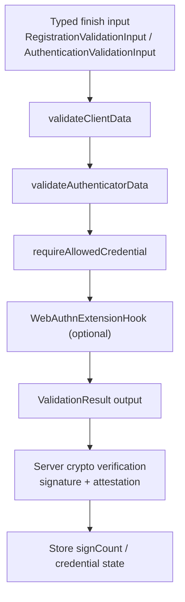

# webauthn-core

Audience: teams validating WebAuthn ceremonies before crypto verification and persistence updates.

## What it provides

- Validation for `clientData` expectations (`type`, `challenge`, `origin`, optional related origins).
- Validation for `authenticatorData` flags and signature counter progression.
- Allow-list enforcement for authentication (`allowCredentials`) via credential ID checks.
- Extension hook contracts for optional L3 extension checks.



## Where it fits in a real ceremony

Use `webauthn-core` in server finish endpoints after parsing transport payloads into model types and before signature/attestation verification. It gives you standards-aligned preconditions and typed output values (`credentialId`, `signCount`, extension outputs) for downstream steps.

## How to use

A practical authentication finish path usually chains core validation, allow-list checks, extension checks, then crypto verification and persistence.

```kotlin
import dev.webauthn.core.AuthenticationValidationInput
import dev.webauthn.core.WebAuthnCoreValidator
import dev.webauthn.core.WebAuthnExtensionHook
import dev.webauthn.core.WebAuthnExtensionValidator
import dev.webauthn.model.CredentialId
import dev.webauthn.model.ValidationResult

suspend fun validateAssertionForFinish(
    input: AuthenticationValidationInput,
    allowedCredentialIds: Set<CredentialId>,
    extensionHook: WebAuthnExtensionHook = WebAuthnExtensionValidator,
): ValidationResult<Long> {
    val core = WebAuthnCoreValidator.validateAuthentication(input)
    if (core is ValidationResult.Invalid) return core

    val output = (core as ValidationResult.Valid).value

    val allow = WebAuthnCoreValidator.requireAllowedCredential(
        response = input.response,
        allowedCredentialIds = allowedCredentialIds,
    )
    if (allow is ValidationResult.Invalid) return allow

    val ext = extensionHook.validateAuthenticationExtensions(
        inputs = input.options.extensions,
        outputs = output.extensions,
    )
    if (ext is ValidationResult.Invalid) return ext

    // Continue with crypto signature verification and then persist output.signCount.
    return ValidationResult.Valid(output.signCount)
}
```

Important API behavior:

- `validateRegistration(...)` / `validateAuthentication(...)` return typed outputs for downstream persistence.
- `allowedOrigins` only broadens origin acceptance when explicitly provided.
- `previousSignCount` must come from server-trusted credential state.
- This module does not verify signatures or attestation statements.

## Pitfalls and limits

- No storage/challenge lifecycle management.
- No JSON/CBOR parsing or transport DTO mapping.
- No crypto backend execution (delegated to `webauthn-crypto-api` implementations).

## Status

Production-leaning validation engine.
