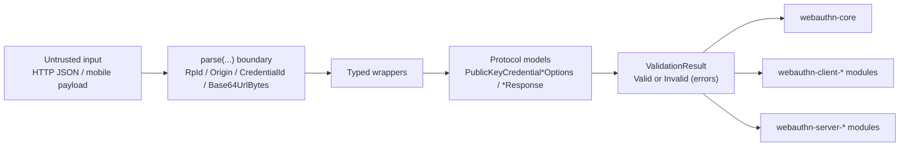

# webauthn-model

Audience: teams that need typed WebAuthn values and protocol models as the shared contract between transport, validation, and service layers.

## What it provides

- Domain wrappers for protocol-critical values (`RpId`, `Origin`, `Challenge`, `CredentialId`, `Base64UrlBytes`, fixed-size byte types).
- Typed protocol models for registration/authentication options and responses.
- Shared `ValidationResult` + `WebAuthnValidationError` contracts used across client/server orchestration.
- L3 extension model types (`prf`, `largeBlob`, related origins).



## Typical usage boundary

Use model parsing at every trust boundary (HTTP request body, local storage restore, deep-link input, remote config). Keep wrappers intact between layers instead of converting back to raw strings/bytes.

## How to use

This example shows a sign-in options builder that validates untrusted RP input and only creates typed protocol options on success.

```kotlin
import dev.webauthn.model.Challenge
import dev.webauthn.model.CredentialId
import dev.webauthn.model.PublicKeyCredentialDescriptor
import dev.webauthn.model.PublicKeyCredentialRequestOptions
import dev.webauthn.model.PublicKeyCredentialType
import dev.webauthn.model.RpId
import dev.webauthn.model.UserVerificationRequirement
import dev.webauthn.model.ValidationResult

fun buildSignInOptions(
    challengeBytes: ByteArray,
    rpIdFromRequest: String,
    storedCredentialId: String,
): ValidationResult<PublicKeyCredentialRequestOptions> {
    val rpId = RpId.parse(rpIdFromRequest)
    val credentialId = CredentialId.parse(storedCredentialId)

    if (rpId is ValidationResult.Invalid) return rpId
    if (credentialId is ValidationResult.Invalid) return credentialId

    val options = PublicKeyCredentialRequestOptions(
        challenge = Challenge.fromBytes(challengeBytes),
        rpId = (rpId as ValidationResult.Valid).value,
        allowCredentials = listOf(
            PublicKeyCredentialDescriptor(
                type = PublicKeyCredentialType.PUBLIC_KEY,
                id = (credentialId as ValidationResult.Valid).value,
            ),
        ),
        userVerification = UserVerificationRequirement.PREFERRED,
    )
    return ValidationResult.Valid(options)
}
```

API notes:

- Prefer `parse(...)` for untrusted values; it preserves structured validation errors.
- Use `parseOrThrow(...)` only for trusted bootstrap/config paths.
- `Challenge.fromBytes(...)` enforces minimum challenge length.
- Wrapper types (`CredentialId`, `RpIdHash`, `Aaguid`, etc.) are the canonical cross-module value format.
- Standard extensions are iterable via `WebAuthnExtension.Standard.entries` (and `WebAuthnExtension.standardExtensions`).
- `WebAuthnExtension.Custom` rejects reserved standard extension identifiers (for example `prf` and `largeBlob`) to prevent collisions.

## Pitfalls and limits

- No full ceremony verification (use `webauthn-core` + server crypto/services).
- No JSON/CBOR mapping by itself (use `webauthn-serialization-kotlinx` when needed).
- No RP hash/signature/attestation verification logic.

## Status

Production-leaning foundational contract module.
March 2026: readability/style pass only (vertical chaining and `::` adoption where clearer); no API or behavior change.
