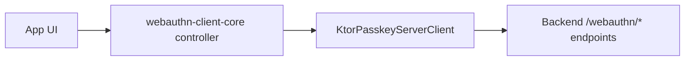

# webauthn-network-ktor-client

Default Ktor-based `PasskeyServerClient` transport for `/webauthn/*` server contracts.

## What it provides

- `KtorPasskeyServerClient`
- Start/finish HTTP call wiring for registration and authentication
- A drop-in transport module for client orchestration layers
- Public `HttpClient`-based constructor with transitive `ktor-client-core` export for consumer compile safety

## When to use

Use this when your backend follows the default `/webauthn/*` contract and your app already uses Ktor client.

## How to use

```kotlin
import dev.webauthn.network.KtorPasskeyServerClient

val serverClient = KtorPasskeyServerClient(
    httpClient = httpClient,
    endpointBase = "https://example.com",
)
```

Real-world scenario: a mobile app uses `PasskeyController` for platform ceremonies, then delegates start/finish HTTP calls to this client.

## How it fits



## Pitfalls and limits

- Contract/path assumptions are explicit; custom backend contracts need custom `PasskeyServerClient` implementations.
- You still need to choose/install an engine dependency (`ktor-client-cio`, Darwin, etc.) in your app runtime.
- Retry, timeout, auth headers, and observability remain caller-owned through the provided `HttpClient`.

## Status

Production-leaning transport helper with explicit backend contract support.
