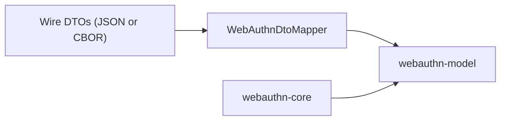

# webauthn-serialization-kotlinx

Serialization and mapping helpers between wire DTOs and typed WebAuthn domain models.

## What it provides

- `WebAuthnDtoMapper` mapping between DTO and `webauthn-model`
- `kotlinx.serialization`-based DTO support
- Authenticator data and CBOR/COSE-related conversion helpers used by higher layers

## When to use

Use this when your boundary is JSON/CBOR but your application code should stay typed.

## How to use

```kotlin
import dev.webauthn.serialization.WebAuthnDtoMapper

val model = WebAuthnDtoMapper.toModel(dto)
val dto = WebAuthnDtoMapper.fromModel(model)
```

Real-world scenario: parse backend JSON into typed model objects, run validation/business logic, then map back to DTOs for responses.

## How it fits



## Pitfalls and limits

- Mapper validation is strict by design; malformed wire data should be handled as untrusted input.
- Canonical response DTO mapping emits standards-shaped WebAuthn response JSON fields (`type = "public-key"` and `clientExtensionResults`, including empty extension objects when no outputs are present).
- `allowCredentials: null` is accepted only as a compatibility decode shim and normalized to an empty list; canonical JSON should still treat `allowCredentials` as an optional sequence (not `null`).
- Keep model and mapper versions aligned (BOM recommended).

## Status

Beta, strict mapper validation with CBOR/COSE handling.
