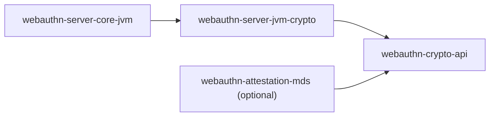

# webauthn-server-jvm-crypto

Default JVM crypto backend for the server stack.

## What it provides

- `JvmRpIdHasher`
- `JvmSignatureVerifier`
- `StrictAttestationVerifier`
- Signum-first implementation choices for hashing/signature/attestation paths

## When to use

Use this when you want production-leaning JVM defaults instead of implementing `webauthn-crypto-api` yourself.

## How to use

```kotlin
import dev.webauthn.server.crypto.JvmRpIdHasher
import dev.webauthn.server.crypto.JvmSignatureVerifier
import dev.webauthn.server.crypto.StrictAttestationVerifier

val rpIdHasher = JvmRpIdHasher()
val signatureVerifier = JvmSignatureVerifier()
val attestationVerifier = StrictAttestationVerifier(signatureVerifier = signatureVerifier)
```

Real-world scenario: wire these defaults into `RegistrationService` and `AuthenticationService` so your backend can verify assertions immediately without custom crypto plumbing.

## How it fits



## Pitfalls and limits

- This module is JVM-specific and not a multiplatform crypto abstraction.
- If you need non-default trust policy, compose with custom `TrustAnchorSource` or verifier implementations.

## Status

Beta, Signum-first JVM backend crypto.
