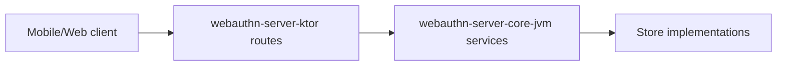

# webauthn-server-ktor

Ktor route adapters for the JVM ceremony services.

## What it provides

- `installWebAuthnRoutes(...)` route wiring
- Default `/webauthn/*` endpoint contract for start/finish flows
- Thin transport layer on top of `RegistrationService` and `AuthenticationService`

## When to use

Use this when your backend is Ktor-based and you want ready-made WebAuthn routes instead of hand-rolling each endpoint.

## How to use

```kotlin
import dev.webauthn.server.ktor.installWebAuthnRoutes

fun Application.module() {
    installWebAuthnRoutes(registrationService, authenticationService)
}
```

Real-world scenario: ship passkey backend endpoints quickly, while keeping policy and persistence in `webauthn-server-core-jvm`.

## How it fits



## Pitfalls and limits

- Route shape is opinionated; use custom routes if your API contract differs.
- Security still depends on your deployment controls (TLS, auth/session, CSRF posture).

## Status

Beta, thin Ktor transport adapter.
